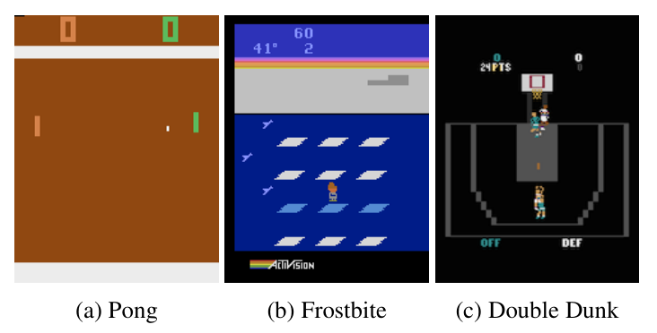
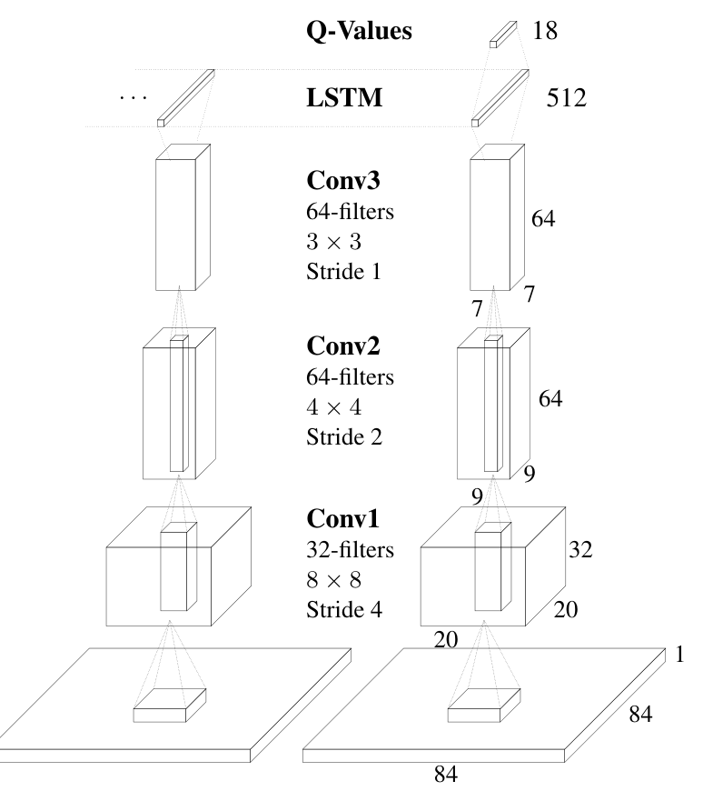
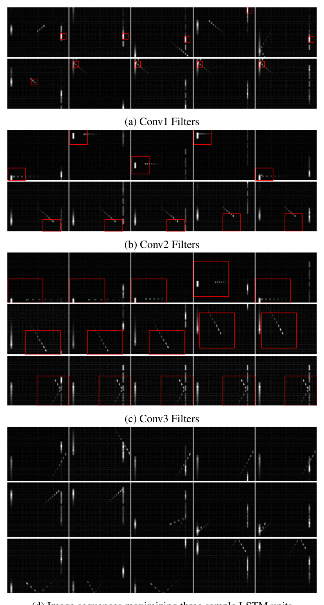
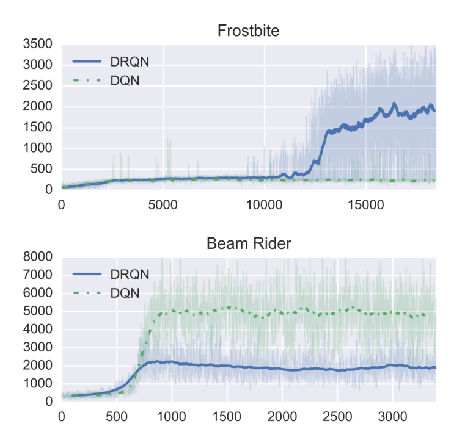
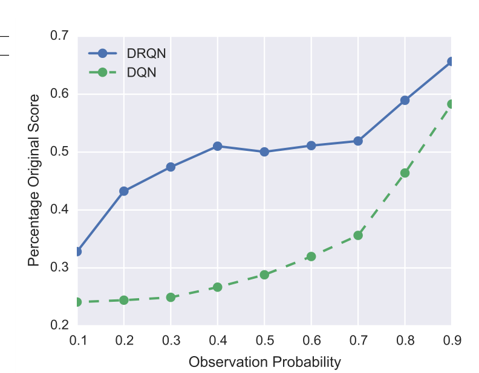

# Deep Recurrent Q-Learning for Partially Observable MDPs

## Authors

Matthew Hausknecht and Peter Stone
Department of Computer Science
The University of Texas at Austin
`{mhauskn, pstone}@cs.utexas.edu`

## Abstract

Deep Reinforcement Learning has yielded proficient controllers for
complex tasks. However, these controllers have limited memory and rely
on being able to perceive the complete game screen at each decision
point. To address these shortcomings, this article investigates the
effects of adding recurrency to a Deep Q-Network (DQN) by replacing
the first post-convolutional fully-connected layer with a recurrent
LSTM. The resulting *Deep Recurrent Q-Network* (DRQN), although
capable of seeing only a single frame at each timestep, successfully
integrates information through time and replicates DQN's performance
on standard Atari games and partially observed equivalents featuring
flickering game screens. Additionally, when trained with partial
observations and evaluated with incrementally more complete
observations, DRQN's performance scales as a function of
observability. Conversely, when trained with full observations and
evaluated with partial observations, DRQN's performance degrades less
than DQN's. Thus, given the same length of history, recurrency is a
viable alternative to stacking a history of frames in the DQN's input
layer and while recurrency confers no systematic advantage when learning
to play the game, the recurrent net can better adapt at evaluation
time if the quality of observations changes.

## Introduction

Deep Q-Networks (DQNs) have been shown to be capable of learning human-level control policies on a variety of different Atari 2600 games [mnih15]. True to their name, DQNs learn to estimate the Q-Values (or long-term discounted returns) of selecting each possible action from the current game state. Given that the network's Q-Value estimate is sufficiently accurate, a game may be played by selecting the action with the maximal Q-Value at each timestep. Learning policies mapping from raw screen pixels to actions, these networks have been shown to achieve state-of-the-art performance on many Atari 2600 games.

However, Deep Q-Networks are limited in the sense that they learn a mapping from a limited number of past states, or game screens in the case of Atari 2600. In practice, DQN is trained using an input consisting of the last four states the agent has encountered. Thus DQN will be unable to master games that require the player to remember events more distant than four screens in the past. Put differently, any game that requires a memory of more than four frames will appear non-Markovian because the future game states (and rewards) depend on more than just DQN's current input. Instead of a Markov Decision Process (MDP), the game becomes a Partially-Observable Markov Decision Process (POMDP).

Real-world tasks often feature incomplete and noisy state information resulting from partial observability. As Figure 1 shows, given only a single game screen, many Atari 2600 games are POMDPs. One example is the game of Pong in which the current screen only reveals the location of the paddles and the ball, but not the velocity of the ball. Knowing the direction of travel of the ball is a crucial component for determining the best paddle location.

**Figure 1.** Nearly all Atari 2600 games feature moving objects. Given only one frame of input, Pong, Frostbite, and Double Dunk are all POMDPs because a single observation does not reveal the velocity of the ball (Pong, Double Dunk) or the velocity of the icebergs (Frostbite).

We observe that DQN's performance declines when given incomplete state observations and hypothesize that DQN may be modified to better deal with POMDPs by leveraging advances in Recurrent Neural Networks. Therefore we introduce the *Deep Recurrent Q-Network* (DRQN), a combination of a Long Short Term Memory (LSTM) [hochreiter97] and a Deep Q-Network. Crucially, we demonstrate that DRQN is capable of handing partial observability, and that when trained with full observations and evaluated with partial observations, DRQN better handles the loss of information than does DQN. Thus, recurrency confers benefits as the quality of observations degrades.

### Deep Q-Learning

Reinforcement Learning [sutton98] is concerned with learning control policies for agents interacting with unknown environments. Such environments are often formalized as a Markov Decision Processes (MDPs), described by a 4-tuple
$(\mathcal{S},\mathcal{A},\mathcal{P},\mathcal{R})$. At each timestep
$t$ an agent interacting with the MDP observes a state
$s_t \in \mathcal{S}$, and chooses an action $a_t \in \mathcal{A}$ which determines the reward $r_t \sim \mathcal{R}(s_t,a_t)$ and next state $s_{t+1} \sim \mathcal{P}(s_t,a_t)$.

Q-Learning [watkins92] is a model-free off-policy algorithm for estimating the long-term expected return of executing an action from a given state. These estimated returns are known as Q-values. A higher Q-value indicates an action $a$ is judged to yield better long-term results in a state $s$. Q-values are learned iteratively by updating the current Q-value estimate towards the observed reward plus the max Q-value over all actions $a'$ in the resulting state $s'$:

$$
Q(s,a) := Q(s,a) + \alpha \big( r + \gamma \max_{a'} Q(s',a') - Q(s,a) \big)
$$

Many challenging domains such as Atari games feature far too many unique states to maintain a separate estimate for each
$\mathcal{S} \times \mathcal{A}$. Instead a model is used to approximate the Q-values [mnih15]. In the case of Deep Q-Learning, the model is a neural network parameterized by weights and biases collectively denoted as $\theta$. Q-values are estimated online by querying the output nodes of the network after performing a forward pass given a state input. Such Q-values are denoted
$Q(s,a|\theta)$. Instead of updating individual Q-values, updates are now made to the parameters of the network to minimize a differentiable loss function:

$$
L(s,a|\theta_i) = \big( r + \gamma \max_{a'} Q(s',a'|\theta_i) - Q(s,a|\theta_i) \big)^2
$$

$$
\theta_{i+1} = \theta_i + \alpha \nabla_\theta L(\theta_i)
$$

Since $|\theta| \ll |\mathcal{S} \times \mathcal{A}|$, the neural network model naturally generalizes beyond the states and actions it has been trained on. However, because the same network is generating the next state target Q-values that are used in updating its current Q-values, such updates can oscillate or diverge [tsitsiklis97]. Deep Q-Learning uses three techniques to restore learning stability: First, experiences $e_t = (s_t,a_t,r_t,s_{t+1})$ are recorded in a replay memory $\mathcal{D}$ and then sampled uniformly at training time. Second, a separate, target network $\hat{Q}$ provides update targets to the main network, decoupling the feedback resulting from the network generating its own targets. $\hat{Q}$ is identical to the main network except its parameters $\theta^-$ are updated to match $\theta$ every 10,000 iterations. Finally, an adaptive learning rate method such as RMSProp [tieleman12] or ADADELTA [zeiler12] maintains a per-parameter learning rate $\alpha$, and adjusts $\alpha$ according to the history of gradient updates to that parameter. This step serves to compensate for the lack of a fixed training dataset; the ever-changing nature of $\mathcal{D}$ may require certain parameters start changing again after having reached a seeming fixed point.

At each training iteration $i$, an experience $e_t = (s_t,a_t,r_t,s_{t+1})$ is sampled uniformly from the replay memory
$\mathcal{D}$. The loss of the network is determined as follows:

$$
L_i(\theta_i) = \mathbb{E}_{(s_t,a_t,r_t,s_{t+1}) \sim \mathcal{D}} \bigg[ \Big( y_i - Q(s_t,a_t;\theta_i)\Big)^2 \bigg]
$$

where $y_i = r_t + \gamma \max_{a'}\hat{Q}(s_{t+1},a';\theta^-)$ is the stale update target given by the target network $\hat{Q}$. Updates performed in this manner have been empirically shown to be tractable and stable [mnih15].

### Partial Observability

In real world environments it's rare that the full state of the system can be provided to the agent or even determined. In other words, the Markov property rarely holds in real world environments. A Partially Observable Markov Decision Process (POMDP) better captures the dynamics of many real-world environments by explicitly acknowledging that the sensations received by the agent are only partial glimpses of the underlying system state. Formally a POMDP can be described as a 6-tuple
$(\mathcal{S},\mathcal{A},\mathcal{P},\mathcal{R},\Omega,\mathcal{O})$. $\mathcal{S},\mathcal{A},\mathcal{P},\mathcal{R}$ are the states, actions, transitions, and rewards as before, except now the agent is no longer privy to the true system state and instead receives an observation $o \in \Omega$. This observation is generated from the underlying system state according to the probability distribution $o \sim \mathcal{O}(s)$. Vanilla Deep Q-Learning has no explicit mechanisms for deciphering the underlying state of the POMDP and is only effective if the observations are reflective of underlying system states. In the general case, estimating a Q-value from an observation can be arbitrarily bad since $Q(o,a|\theta) \neq Q(s,a|\theta)$.

Our experiments show that adding recurrency to Deep Q-Learning allows the Q-network network to better estimate the underlying system state, narrowing the gap between $Q(o,a|\theta)$ and $Q(s,a|\theta)$. Stated differently, recurrent deep Q-networks can better approximate actual Q-values from sequences of observations, leading to better policies in partially observed environments.

## DRQN Architecture

To isolate the effects of recurrency, we minimally modify the architecture of DQN, replacing only its first fully connected layer with a recurrent LSTM layer of the same size. Depicted in Figure 2, the architecture of DRQN takes a single
$84 \times 84$ preprocessed image. This image is processed by three convolutional layers [lecun98] and the outputs are fed to the fully connected LSTM layer [hochreiter97]. Finally, a linear layer outputs a Q-Value for each action. During training, the parameters for both the convolutional and recurrent portions of the network are learned jointly from scratch. We settled on this architecture after experimenting with several variations; see Appendix A for details.

**Figure 2.** DRQN convolves three times over a single-channel image of the game screen. The resulting activations are processed through time by an LSTM layer. The last two timesteps are shown here. LSTM outputs become Q-Values after passing through a fully-connected layer. Convolutional filters are depicted by rectangular sub-boxes with pointed tops.

## Stable Recurrent Updates

Updating a recurrent, convolutional network requires each backward pass to contain many time-steps of game screens and target values. Additionally, the LSTM's initial hidden state may either be zeroed or carried forward from its previous values. We consider two types of updates:

**Bootstrapped Sequential Updates**: Episodes are selected randomly from the replay memory and updates begin at the beginning of the episode and proceed forward through time to the conclusion of the episode. The targets at each timestep are generated from the target Q-network, $\hat{Q}$. The RNN's hidden state is carried forward throughout the episode.

**Bootstrapped Random Updates**: Episodes are selected randomly from the replay memory and updates begin at random points in the episode and proceed for only *unroll iterations* timesteps (e.g. one backward call). The targets at each timestep are generated from the target Q-network, $\hat{Q}$. The RNN's initial state is zeroed at the start of the update.

Sequential updates have the advantage of carrying the LSTM's hidden state forward from the beginning of the episode. However, by sampling experiences sequentially for a full episode, they violate DQN's random sampling policy.

Random updates better adhere to the policy of randomly sampling experience, but, as a consequence, the LSTM's hidden state must be zeroed at the start of each update. Zeroing the hidden state makes it harder for the LSTM to learn functions that span longer time scales than the number of timesteps reached by back propagation through time.

Experiments indicate that both types of updates are viable and yield convergent policies with similar performance across a set of games. Therefore, to limit complexity, all results herein use the randomized update strategy. We expect that all presented results would generalize to the case of sequential updates.

Having addressed the architecture and updating of a Deep Recurrent Q-Network, we now show how it performs on domains featuring partial observability.

## Atari Games: MDP or POMDP?

The state of an Atari 2600 game is fully described by the 128 bytes of console RAM. Humans and agents, however, observe only the console-generated game screens. For many games, a single game screen is insufficient to determine the state of the system. DQN infers the full state of an Atari game by expanding the state representation to encompass the last four game screens. Many games that were previously POMDPs now become MDPs. Of the 49 games investigated by [mnih15], the authors were unable to identify any that were partially observable given the last four frames of input. (Note: Some Atari games are undoubtedly POMDPs such as Blackjack in which the dealer's cards are hidden from view. Unfortunately, Blackjack is not supported by the ALE emulator.) Since the explored games are fully observable given four input frames, we need a way to introduce partial observability without reducing the number of input frames given to DQN.

## Flickering Atari Games

To address this problem, we introduce the *Flickering Pong* POMDP - a modification to the classic game of Pong such that at each timestep, the screen is either fully revealed or fully obscured with probability $p=0.5$. Obscuring frames in this manner probabilistically induces an incomplete memory of observations needed for Pong to become a POMDP.

In order to succeed at the game of Flickering Pong, it is necessary to integrate information across frames to estimate relevant variables such as the location and velocity of the ball and the location of the paddle. Since half of the frames are obscured in expectation, a successful player must be robust to the possibility of several potentially contiguous obscured inputs.

**Figure 3.** Sample convolution filters learned by 10-frame DQN on the game of Pong. Each row plots the input frames that trigger maximal activation of a particular convolutional filter in the specified layer. The red bounding box illustrates the portion of the input image that caused the maximal activation. Most filters in the first convolutional layer detect only the paddle. Conv2 filters begin to detect ball movement in particular directions and some jointly track the ball and the paddle. Nearly all Conv3 filters track ball and paddle interactions including deflections, ball velocity, and direction of travel. Despite seeing a single frame at a time, individual LSTM units also detect high level events, respectively: the agent missing the ball, ball reflections off of paddles, and ball reflections off the walls. Each image superimposes the last 10-frames seen by the agent, giving more luminance to the more recent frames.

Perhaps the most important opportunity presented by a history of game screens is the ability to convolutionally detect object velocity. Figure 3 visualizes the game screens maximizing the activations of different convolutional filters and confirms that the 10-frame DQN's filters do detect object velocity, though perhaps less reliably than normal unobscured Pong. (Note: [guo14] also confirms that convolutional filters learn to respond to patterns of movement seen in game objects.)

Remarkably, DRQN performs well at this task even when given only one input frame per timestep. With a single frame it is impossible for DRQN's convolutional layers to detect any type of velocity. Instead, the higher-level recurrent layer must compensate for both the flickering game screen and the lack of convolutional velocity detection. Figure 3 confirms that individual units in the LSTM layer are capable of integrating noisy single-frame information through time to detect high-level Pong events such as the player missing the ball, the ball reflecting on a paddle, or the ball reflecting off the wall.

DRQN is trained using backpropagation through time for the last ten timesteps. Thus both the non-recurrent 10-frame DQN and the recurrent 1-frame DRQN have access to the same history of game screens. (Note: However, [karpathy15] show that LSTMs can learn functions at training time over a limited set of timesteps and then generalize them at test time to longer sequences.) Thus, when dealing with partial observability, a choice exists between using a non-recurrent deep network with a long history of observations or using a recurrent network trained with a single observation at each timestep. The results in this section show that recurrent networks can integrate information through time and serve as a viable alternative to stacking frames in the input layer of a convoluational network.

## Evaluation on Standard Atari Games

We selected the following nine Atari games for evaluation: *Asteroids* and *Double Dunk* feature naturally-flickering sprites making them good potential candidates for recurrent learning. *Beam Rider*, *Centipede*, and *Chopper Command* are shooters. *Frostbite* is a platformer similar to Frogger. *Ice Hockey* and *Double Dunk* are sports games that require positioning players, passing and shooting the puck/ball, and require the player to be capable of both offense and defense. *Bowling* requires actions to be taken at a specific time in order to guide the ball. *Ms Pacman* features flickering ghosts and power pills.

Given the last four frames of input, all of these games are MDPs rather than POMDPs. Thus there is no reason to expect DRQN to outperform DQN. Indeed, results in Table 1 indicate that on average, DRQN does roughly as well DQN. Specifically, our re-implementation of DQN performs similarly to the original, outperforming the original on five out of the nine games, but achieving less than half the original score on Centipede and Chopper Command. DRQN performs outperforms our DQN on the games of Frostbite and Double Dunk, but does significantly worse on the game of Beam Rider (Figure 4). The game of Frostbite (Figure 1b) requires the player to jump across all four rows of moving icebergs and return to the top of the screen. After traversing the icebergs several times, enough ice has been collected to build an igloo at the top right of the screen. Subsequently the player can enter the igloo to advance to the next level. As shown in Figure 4, after 12,000 episodes DRQN discovers a policy that allows it to reliably advance past the first level of Frostbite. For experimental details, see Appendix B.

**Table 1.** On standard Atari games, DRQN performance parallels DQN, excelling in the games of Frostbite and Double Dunk, but struggling on Beam Rider. Bolded font indicates statistical significance between DRQN and our DQN.

| | DRQN $\pm std$ | DQN $\pm std$ | |
| --- | --- | --- | --- |
| Game | | Ours | Mnih et al. |
| Asteroids | 1020 $(\pm312)$ | 1070 $(\pm345)$ | 1629 $(\pm542)$ |
| Beam Rider | 3269 $(\pm1167)$ | **6923** $(\pm1027)$ | 6846 $(\pm1619)$ |
| Bowling | 62 $(\pm5.9)$ | 72 $(\pm11)$ | 42 $(\pm88)$ |
| Centipede | 3534 $(\pm1601)$ | 3653 $(\pm1903)$ | 8309 $(\pm5237)$ |
| Chopper Cmd | 2070 $(\pm875)$ | 1460 $(\pm976)$ | 6687 $(\pm2916)$ |
| Double Dunk | **-2** $(\pm7.8)$ | -10 $(\pm3.5)$ | -18.1 $(\pm2.6)$ |
| Frostbite | **2875** $(\pm535)$ | 519 $(\pm363)$ | 328.3 $(\pm250.5)$ |
| Ice Hockey | -4.4 $(\pm1.6)$ | -3.5 $(\pm3.5)$ | -1.6 $(\pm2.5)$ |
| Ms. Pacman | 2048 $(\pm653)$ | 2363 $(\pm735)$ | 2311 $(\pm525)$ |

Note: Statistical significance of scores determined by independent t-tests using Benjamini-Hochberg procedure and significance level $P=.05$.

**Figure 4.** Frostbite and Beam Rider represent the best and worst games for DRQN. Frostbite performance jumps as the agent learns to reliably complete the first level.

## MDP to POMDP Generalization

Can a recurrent network be trained on a standard MDP and then generalize to a POMDP at evaluation time? To address this question, we evaluate the highest-scoring policies of DRQN and DQN over the flickering equivalents of all 9 games in Table 1. Figure 5 shows that while both algorithms incur significant performance decreases on account of the missing information, DRQN captures more of its previous performance than DQN across all levels of flickering. We conclude that recurrent controllers have a certain degree of robustness against missing information, even trained with full state information.

**Figure 5.** When trained on normal games (MDPs) and then evaluated on flickering games (POMDPs), DRQN's performance degrades more gracefully than DQN's. Each data point shows the average percentage of the original game score over all 9 games in Table 1.

## Related Work

Previously, LSTM networks have been demonstrated to solve POMDPs when trained using policy gradient methods [wierstra07]. In contrast to policy gradient, our work uses temporal-difference updates to bootstrap an action-value function. Additionally, by jointly training convolutional and LSTM layers we are able to learn directly from pixels and do not require hand-engineered features.

LSTM has been used as an advantage-function approximator and shown to solve a partially observable corridor and cartpole tasks better better than comparable (non-LSTM) RNNs [bakker01]. While similar in principle, the corridor and cartpole tasks feature tiny states spaces with just a few features.

In parallel to our work, [narasimhan15] independently combined LSTM with Deep Reinforcement Learning to demonstrate that recurrency helps to better play text-based fantasy games. The approach is similar but the domains differ: despite the apparent complexity of the fantasy-generated text, the underlying MDPs feature relatively low-dimensional manifolds of underlying state space. The more complex of the two games features only 56 underlying states. Atari games, in contrast, feature a much richer state space with typical games having millions of different states. However, the action space of the text games is much larger with a branching factor of 222 versus Atari's 18.

## Discussion and Conclusion

Real-world tasks often feature incomplete and noisy state information, resulting from partial observability. We modify DQN to handle the noisy observations characteristic of POMDPs by combining a Long Short Term Memory with a Deep Q-Network. The resulting *Deep Recurrent Q-Network* (DRQN), despite seeing only a single frame at each step, is still capable integrating information across frames to detect relevant information such as velocity of on-screen objects. Additionally, on the game of Pong, DRQN is better equipped than a standard Deep Q-Network to handle the type of partial observability induced by flickering game screens.

Furthermore, when trained with partial observations, DRQN can generalize its policies to the case of complete observations. On the Flickering Pong domain, performance scales with the observability of the domain, reaching near-perfect levels when every game screen is observed. This result indicates that the recurrent network learns policies that are both robust enough to handle to missing game screens and scalable enough to improve performance as observability increases. Generalization also occurs in the opposite direction: when trained on standard Atari games and evaluated against flickering games, DRQN's performance generalizes better than DQN's at all levels of partial information.

Our experiments suggest that Pong represents an outlier among the examined games. Across a set of ten Flickering MDPs we observe no systematic improvement when employing recurrency. Similarly, across non-flickering Atari games, there are few significant differences between the recurrent and non-recurrent player. This observation leads us to conclude that while recurrency is a viable method for handling state observations, it confers no systematic benefit compared to stacking the observations in the input layer of a convolutional network. One avenue for future is identifying the relevant characteristics of the Pong and Frostbite that lead to better performance by recurrent networks.

## Acknowledgments

This work has taken place in the Learning Agents Research Group (LARG) at the Artificial Intelligence Laboratory, The University of Texas at Austin. LARG research is supported in part by grants from the National Science Foundation (CNS-1330072, CNS-1305287), ONR (21C184-01), AFRL (FA8750-14-1-0070), AFOSR (FA9550-14-1-0087), and Yujin Robot. Additional support from the Texas Advanced Computing Center, and Nvidia Corporation.

## Appendix A: Alternative Architectures

Several alternative architectures were evaluated on the game of Beam Rider. We explored the possibility of either replacing the first non-convolutional fully connected layer with an LSTM layer (LSTM replaces IP1) or adding the LSTM layer between the first and second fully connected layers (LSTM over IP1). Results strongly indicated LSTM should replace IP1. We hypothesize this allows LSTM direct access to the convolutional features. Additionally, adding a Rectifier layer after the LSTM layer consistently reduced performance.

| Description | Percent Improvement |
| --- | --- |
| LSTM replaces IP1 | 709% |
| ReLU-LSTM replaces IP1 | 533% |
| LSTM over IP1 | 418% |
| ReLU-LSTM over IP1 | 0% |

Another possible architecture combines frame stacking from DQN with the recurrency of LSTM. This architecture accepts a stack of the four latest frames at every timestep. The LSTM portion of the architecture remains the same and is unrolled over the last 10 timesteps. In theory, this modification should allow velocity detection to happen in the convolutional layers of the network, leaving the LSTM free to perform higher-order processing. This architecture has the largest number of parameters and requires the most training time. Unfortunately, results show that the additional parameters do not lead to increased performance on the set of games examined. It is possible that the network has too many parameters and is prone to overfitting the training experiences it has seen.

## Appendix B: Computational Efficiency

Computational efficiency of RNNs is an important concern. We conducted experiments by performing 1000 backwards and forwards passes and reporting the average time in milliseconds required for each pass. Experiments used a single Nvidia GTX Titan Black using CuDNN and a fully optimized version of Caffe. Results indicate that computation scales sub-linearly in both the number of frames stacked in the input layer and the number of iterations unrolled. Even so, models trained on a large number of stacked frames and unrolled for many iterations are often computationally intractable. For example a model unrolled for 30 iterations with 10 stacked frames would require over 56 days to reach 10 million iterations.

**Table 2.** Average milliseconds per backwards/forwards pass. Frames refers to the number of channels in the input image. Baseline is a non recurrent network (e.g. DQN). Unroll refers to an LSTM network backpropagated through time $1/10/30$ steps.

| | Backwards (ms) | Forwards (ms) | | | | |
| --- | --- | --- | --- | --- | --- | --- |
| Frames | 1 | 4 | 10 | 1 | 4 | 10 |
| Baseline | 8.82 | 13.6 | 26.7 | 2.0 | 4.0 | 9.0 |
| Unroll 1 | 18.2 | 22.3 | 33.7 | 2.4 | 4.4 | 9.4 |
| Unroll 10 | 77.3 | 111.3 | 180.5 | 2.5 | 4.4 | 8.3 |
| Unroll 30 | 204.5 | 263.4 | 491.1 | 2.5 | 3.8 | 9.4 |

## Appendix C: Experimental Details

Policies were evaluated every 50,000 iterations by playing 10 episodes and averaging the resulting scores. Networks were trained for 10 million iterations and used a replay memory of size 400,000. Additionally, all networks used ADADELTA [zeiler12] optimizer with a learning rate of 0.1 and momentum of 0.95. LSTM's gradients were clipped to a value of ten to ensure learning stability. All other settings were identical to those given in [mnih15].

All networks were trained using the Arcade Learning Environment ALE [bellemare13]. The following ALE options were used: color averaging, minimal action set, and death detection.

DRQN is implemented in Caffe [jia14]. The source is available at [removed for blind review].

## Appendix C: Flickering Results

**Table 3.** Each screen is obscured with probability 0.5, resulting in a partially-observable, flickering equivalent of the standard game. Bold font indicates statistical significance.

| Flickering | DRQN $\pm std$ | DQN $\pm std$ |
| --- | --- | --- |
| Asteroids | 1032 $(\pm410)$ | 1010 $(\pm535)$ |
| Beam Rider | 618 $(\pm115)$ | **1685.6** $(\pm875)$ |
| Bowling | 65.5 $(\pm13)$ | 57.3 $(\pm8)$ |
| Centipede | 4319.2 $(\pm4378)$ | 5268.1 $(\pm2052)$ |
| Chopper Cmd | 1330 $(\pm294)$ | 1450 $(\pm787.8)$ |
| Double Dunk | -14 $(\pm2.5)$ | -16.2 $(\pm2.6)$ |
| Frostbite | 414 $(\pm494)$ | 436 $(\pm462.5)$ |
| Ice Hockey | -5.4 $(\pm2.7)$ | -4.2 $(\pm1.5)$ |
| Ms. Pacman | 1739 $(\pm942)$ | 1824 $(\pm490)$ |
| Pong | **12.1** $(\pm2.2)$ | -9.9 $(\pm3.3)$ |

## References

- Bakker, B. 2001. Reinforcement learning with long short-term memory. In NIPS, 1475--1482. MIT Press.
- Bellemare, M. G.; Naddaf, Y.; Veness, J.; and Bowling, M. 2013. The arcade learning environment: An evaluation platform for general agents. Journal of Artificial Intelligence Research 47:253--279.
- Cun, Y. L. L.; Bottou, L.; Bengio, Y.; and Haffner, P. 1998. Gradient-based learning applied to document recognition. Proceedings of IEEE 86(11):2278--2324.
- Guo, X.; Singh, S.; Lee, H.; Lewis, R. L.; and Wang, X. 2014. Deep learning for real-time atari game play using offline monte-carlo tree search planning. In Ghahramani, Z.; Welling, M.; Cortes, C.; Lawrence, N.; and Weinberger, K., eds., Advances in Neural Information Processing Systems 27. Curran Associates, Inc. 3338--3346.
- Hochreiter, S., and Schmidhuber, J. 1997. Long short-term memory. Neural Comput. 9(8):1735--1780.
- Jia, Y.; Shelhamer, E.; Donahue, J.; Karayev, S.; Long, J.; Girshick, R.; Guadarrama, S.; and Darrell, T. 2014. Caffe: Convolutional architecture for fast feature embedding. arXiv preprint arXiv:1408.5093.
- Karpathy, A.; Johnson, J.; and Li, F.-F. 2015. Visualizing and understanding recurrent networks. arXiv preprint.
- Mnih, V.; Kavukcuoglu, K.; Silver, D.; Rusu, A. A.; Veness, J.; Bellemare, M. G.; Graves, A.; Riedmiller, M.; Fidjeland, A. K.; Ostrovski, G.; Petersen, S.; Beattie, C.; Sadik, A.; Antonoglou, I.; King, H.; Kumaran, D.; Wierstra, D.; Legg, S.; and Hassabis, D. 2015. Human-level control through deep reinforcement learning. Nature 518(7540):529--533.
- Narasimhan, K.; Kulkarni, T.; and Barzilay, R. 2015. Language understanding for text-based games using deep reinforcement learning. CoRR abs/1506.08941.
- Sutton, R. S., and Barto, A. G. 1998. Reinforcement Learning: An Introduction. MIT Press.
- Tieleman, T., and Hinton, G. 2012. Lecture 6.5--RmsProp: Divide the gradient by a running average of its recent magnitude. COURSERA: Neural Networks for Machine Learning.
- Tsitsiklis, J. N., and Roy, B. V. 1997. An analysis of temporal-difference learning with function approximation. IEEE Transactions on Automatic Control 42(5):674--690.
- Watkins, C. J. C. H., and Dayan, P. 1992. Q-learning. Machine Learning 8(3-4):279--292.
- Wierstra, D.; Foerster, A.; Peters, J.; and Schmidthuber, J. 2007. Solving deep memory POMDPs with recurrent policy gradients.
- Zeiler, M. D. 2012. ADADELTA: An adaptive learning rate method. CoRR abs/1212.5701.
