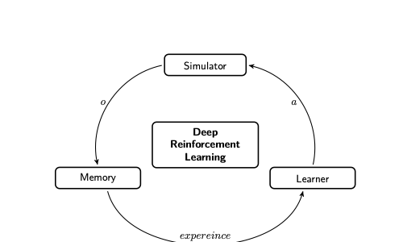
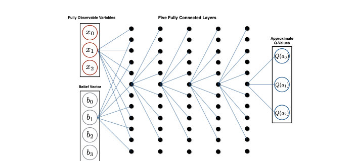
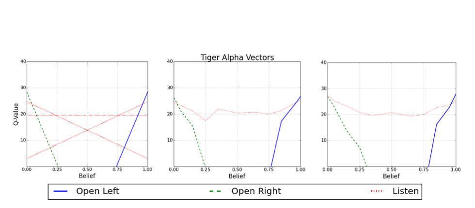
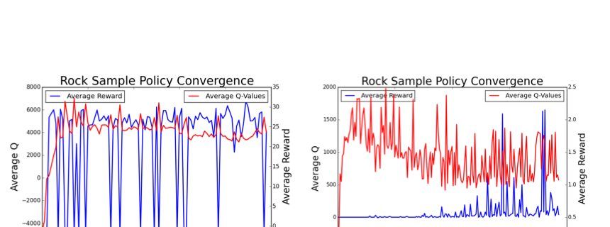

# Deep Reinforcement Learning with POMDPs

## Metadata

- Author: Maxim Egorov
- Date: December 11, 2015
- Source PDF: `papers/363_report.pdf`
- Document type: Project report

> Note: This Markdown file was reconstructed from the local PDF text layer and manual verification against rendered page images. Minor formatting differences from the PDF may remain.

## 1. Introduction

Recent work has shown that Deep Q-Networks (DQNs) can learn human-level
control policies for a variety of Atari 2600 games [1]. Other work has
treated Atari as a partially observable Markov decision process (POMDP)
by introducing imperfect state information through image flickering [2].
However, those approaches depend on convolutional architectures [3] and
assume that the state can be represented as a two-dimensional grid.
That works well when the state is naturally image-like, but it does not
generalize to broader classes of problems.

This report aims to extend DQNs to reinforcement learning with POMDPs
without requiring a two-dimensional state-space structure. Two related
approaches are considered:

1. A DQN that maps a POMDP belief state to an optimal action.
2. A DQN that maps an action-observation history to an optimal action.

## 2. Partial Observability

In many real-world problems, an agent does not observe the complete state
of the environment. Instead, it receives observations conditioned on the
underlying state and must act based on the history of what it has seen.
These problems can be modeled as POMDPs.

A POMDP is formalized as a 6-tuple $(S, A, T, R, Z, O)$, where $S, A, T,$
and $R$ are the states, actions, transitions, and rewards as in an MDP,
while $Z$ and $O$ denote the observation space and observation model.
When the model is known, the agent can update its belief $b(s)$ over
states using its action-observation history:

$$
b'(s') \propto O(s', a, o) \sum_{s \in S} T(s, a, s') b(s).
$$

Many approximate solution methods exist when the POMDP model is known.
The report uses SARSOP [4] as a benchmark. A POMDP policy can be
represented by a set of alpha-vectors $\Gamma$, each associated with an
action, and the value function is approximated by a piecewise-linear
convex surface:

$$
V(b) = \max_{\alpha \in \Gamma} (\alpha \cdot b).
$$

If the action attached to alpha-vector $\alpha$ maximizes
$\alpha \cdot b$, that action is optimal. The report also compares
against a reinforcement learning baseline for POMDPs that uses function
approximation to represent a stochastic policy [5], denoted
`POMDP RL`.

## 3. Deep Reinforcement Learning

In reinforcement learning, an agent observes a state $s$, selects an
action $a$, receives reward $r$, and transitions to a new state $s'$.
Q-learning updates action values according to:

$$
Q(s, a) = Q(s, a) + \alpha \left(r + \gamma \max_{a'} Q(s', a') - Q(s, a)\right).
$$

For POMDPs, directly storing Q-values is intractable because values
would be required for every possible belief or arbitrarily long
action-observation history. The report therefore uses a neural network
to approximate either:

- $Q(b, a \mid \theta)$ for belief-based control, or
- $Q(h, a \mid \theta)$ for history-based control.

Instead of updating individual Q-values, the network parameters are
trained by minimizing:

$$
\mathcal{L}(b, a \mid \theta_i) =
\left(r + \gamma \max_a Q(b', a \mid \theta_i) - Q(b, a \mid \theta_i)\right)^2,
$$

with parameter update

$$
\theta_{i+1} = \theta_i + \alpha \nabla_\theta \mathcal{L}(\theta_i).
$$

To stabilize learning, the report uses three standard DQN techniques:

1. Experience replay.
2. A separate target network.
3. RMSProp for adaptive parameter updates.

The framework is decomposed into three components: simulator, memory,
and learner.

**Figure 1.** Information flow in deep reinforcement learning with a generalized problem simulator.

The DQN architecture used in the report is a fully connected network.
Its inputs are the belief vector and, when available, fully observable
state variables. This generalizes the setup to mixed observability MDPs
(MOMDPs), where part of the state is known exactly.

**Figure 2.** Five layer fully connected network that maps the concatenated fully observable variable and belief vectors to Q-values.

The same general architecture is also used for the history-based DQN.

## 4. Evaluation and Results

The framework is evaluated on two benchmark problems: Tiger and Rock
Sample.

### Tiger

In Tiger, the agent chooses whether to open the left or right door. If
it opens the door hiding the tiger, it receives reward `-100`; if it
opens the safe door, it receives reward `10`. The agent may also listen
to obtain a noisy observation of the tiger's location.

The report compares the value surface induced by SARSOP alpha-vectors to
the value surface learned by the DQN.

**Figure 3.** The value function surfaces for the Tiger problem for the SARSOP alpha-vectors (left), DQN converged policy (middle), and DQN non-converged policy (right).

The converged DQN surface closely resembles the surface defined by the
alpha-vectors. A non-converged DQN is shown for comparison. Although
the differences between the surfaces can appear small, the resulting
policies can differ because the `listen` action dominates `open-right`
at low belief values.

### Rock Sample

In Rock Sample, a rover navigates a `7 x 7` grid with eight rocks. The
rover knows its own position exactly but does not know whether each rock
is good or bad, making the task a MOMDP. It can make noisy measurements
of rock quality, with accuracy depending on distance.

The report notes that Rock Sample is much larger than Tiger, with
roughly `12,000` states, `13` actions, and `2` observations. Nearly
optimal policies required about 5 minutes of training for Tiger and
about 6 hours for Rock Sample. By comparison, SARSOP required under 1
second for Tiger and about 5 minutes for Rock Sample, but it assumes
explicit access to the model.

**Figure 4.** Policy and Q-value convergence for the tiger (left) and rock sample (right) problems.

One of the main findings is that Q-values appear to converge while the
policies do not. The policy evaluations show substantial instability,
even when the average Q-values have stabilized. For Tiger, the report
attributes this behavior to small differences between action value
surfaces.

For both the belief-based and history-based DQN approaches, learned
policies are compared against SARSOP and `POMDP RL`.

### Table 1. Average rewards per time-step

| Problem | Belief DQN | History DQN | SARSOP | POMDP RL |
|---|---:|---:|---:|---:|
| Tiger | 1.08 +- 0.1 | 1.07 +- 0.1 | 1.12 +- 0.1 | 1.06 +- 0.1 |
| Rock Sample | 1.65 +- 0.1 | 1.43 +- 0.2 | 1.75 +- 0.1 | 1.14 +- 0.2 |

For Tiger, both DQN variants perform nearly as well as SARSOP. For Rock
Sample, the belief-based DQN outperforms the history-based DQN, and
both outperform the `POMDP RL` baseline.

## 5. Conclusion and Future Work

The report proposes a DQN-based approach to solving POMDPs and shows
that it can learn strong policies, though at substantially higher
computational cost than a model-based solver such as SARSOP.

It also highlights a key instability: Q-values may converge while the
induced policies remain sensitive to small perturbations and fail to
stabilize even after long training runs.

Future directions suggested in the report include:

1. Determining whether the observed policy instability is specific to
   the benchmark problems or more general across POMDPs.
2. Exploring policy-gradient methods to stabilize the effective
   alpha-vector structure of the learned policy.
3. Building a two-dimensional representation of belief space or
   action-observation history space using a self-organizing map (SOM),
   then feeding that representation into a convolutional neural network
   to exploit locality in belief space.

## 6. Acknowledgments

The author thanks Yegor Tkachenko, who implemented the deep learning
backend for the project and ran many of the experiments.

## References

1. V. Mnih, K. Kavukcuoglu, D. Silver, A. A. Rusu et al.,
   "Human-level control through deep reinforcement learning,"
   *Nature*, 518(7540), 529-533, 2015.
2. M. Hausknecht and P. Stone,
   "Deep Recurrent Q-Learning for Partially Observable MDPs,"
   *arXiv preprint*, July 2015.
3. J. Schmidhuber,
   "Deep learning in neural networks: An overview,"
   *Neural Networks*, 61, 85-117, 2015.
4. H. Kurniawati, D. Hsu, and W. S. Lee,
   "SARSOP: Efficient point-based POMDP planning by approximating
   optimally reachable belief spaces,"
   in *Robotics: Science and Systems*, Zurich, Switzerland, 2008.
5. J. Baxter and P. L. Bartlett,
   "Reinforcement learning in POMDPs via direct gradient ascent,"
   in *Proceedings of the 17th International Conference on Machine
   Learning*, 41-48, 2000.

## 7. Appendix: Deep Q-Network Hyperparameters

The hyperparameters reported for training the DQN are:

| Hyperparameter | Value | Description |
|---|---:|---|
| Max train iterations | 500000 | The maximum number of training samples generated |
| Minibatch size | 32 | Number of training samples per update in stochastic gradient descent |
| Target network update | 1000 | Frequency of updating the target network |
| Replay size | 100000 | Size of the experience replay dataset |
| Learning rate | 0.001 | Rate used by RMSProp |
| Initial exploration | 1.0 | Initial $\epsilon$ value in $\epsilon$-greedy exploration policy |
| $\epsilon$ decay | 0.0001 | Rate at which $\epsilon$ decreases |
| Max history | 20 | The maximum number of samples kept for action-observation histories |
