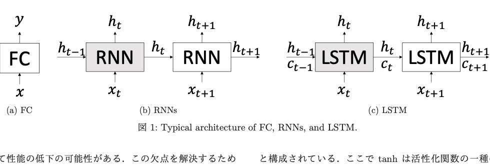
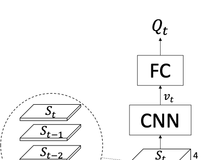
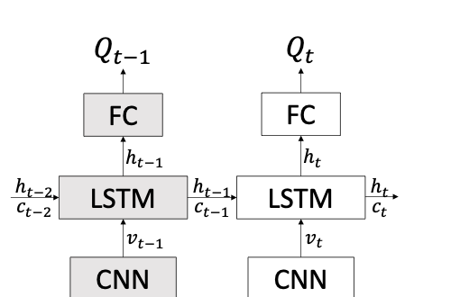
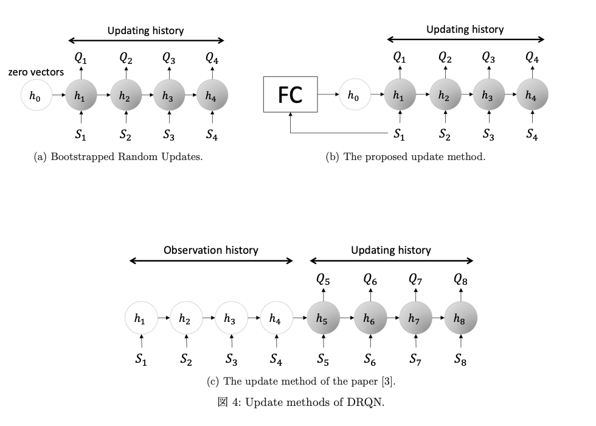
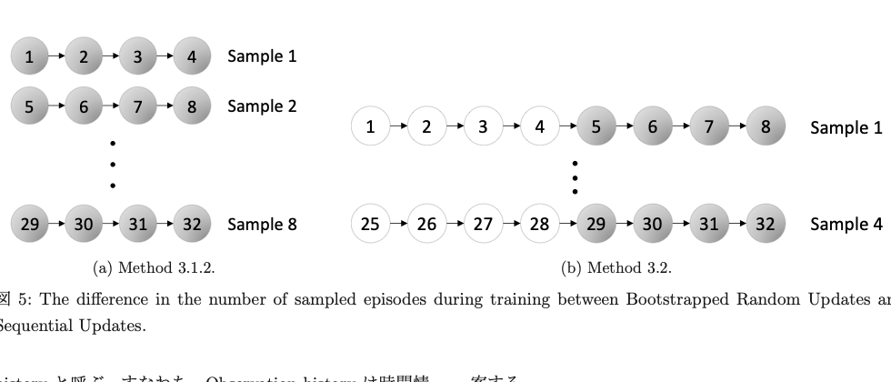
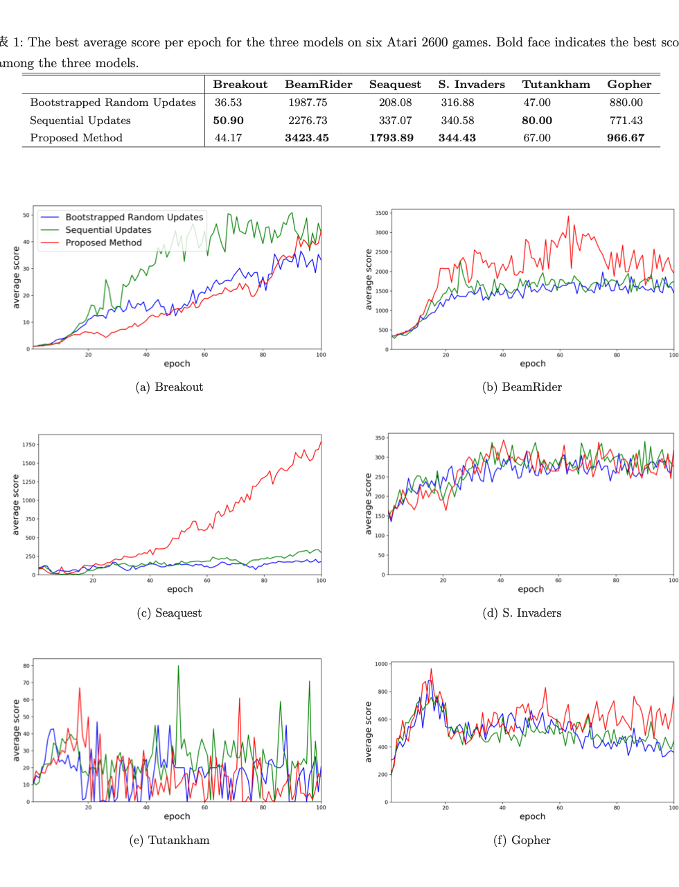

# LSTM の初期状態の学習による DRQN の改善

## Metadata

- Authors: Oh Hyunwoo, 金子 知適
- Venue: The 23rd Game Programming Workshop 2018
- Year: 2018
- Source PDF: `papers/IPSJ-GPWS2018034.pdf`

> Note: この Markdown はローカル PDF のテキストレイヤーとページ画像をもとに再構成したものです。数式・図・表の体裁には PDF との差分が残る可能性があります。

## 概要

強化学習は試行錯誤から方策を学習できるため、さまざまな
問題に適用しやすい。Deep Q-Network (DQN) は Atari 2600
の複数ゲームで高い性能を示したが、直近 4 フレームのみを
入力とするため、より長い時間依存を必要とする環境では
性能低下の可能性がある。

この問題を緩和するために Deep Recurrent Q-Network
(DRQN) が提案されている。DRQN は DQN に LSTM を導入し、
過去情報を扱えるようにした手法である。ただし、学習時に
LSTM の初期状態をゼロベクトルに固定しているため、
更新に使う時間幅より長い依存関係を学習しにくい。

本稿では、更新開始時の LSTM 初期状態を全結合層
(FC) によって生成する方法を提案し、時間的依存の学習効率
改善を目指す。Atari 2600 の 6 ゲームで従来法と比較した
結果、提案法は 4 ゲームで最良の平均スコアを達成した。

## Abstract

Reinforcement learning learns through interactions between an agent and
the environment. Deep Q-Network (DQN) achieved human-level control in
various Atari 2600 games, but its 4-frame input window makes it hard to
solve tasks requiring longer memory. Deep Recurrent Q-Network (DRQN)
introduced LSTM to address this limitation, but DRQN initializes the
hidden state to zero at each update, which makes learning longer-term
dependencies difficult.

This paper proposes learning a better initial hidden state by adding a
fully connected network that generates the LSTM state at the start of
each update. Experiments on six Atari 2600 games show that the proposed
method performs competitively and often better than existing update
schemes.

## 1. はじめに

DQN はゲーム画面の pixel 情報とスコアを入力として Atari
2600 の複数ゲームで高性能を達成した。しかし、入力に
直近 4 フレームしか使わないため、4 ステップより前の情報が
必要な環境では不利になる。

この欠点を補うため、DRQN は CNN と最終 FC 層の間に LSTM
を挿入し、過去情報を扱えるようにした。ただし、DRQN は
学習時に LSTM の初期状態をゼロベクトルで初期化しており、
長時間の依存関係学習には限界がある。本稿はこの点を改善し、
DRQN の性能向上を狙う。

## 2. 背景

### 2.1 Recurrent Neural Networks

FC や CNN は時系列でないデータに強い一方、過去情報を
明示的には扱わない。RNN は現在入力と前時刻の隠れ状態を
同時に使うことで時系列情報を扱う。

FC は次式で表される。

$$
y = Wx + b
$$

RNN は時刻 $t$ の入力 $x_t$ と前時刻の隠れ状態 $h_{t-1}$ を
用いて、

$$
h_t = \tanh(W_{xh}x_t + W_{hh}h_{t-1} + b_h)
$$

と表される。

LSTM は RNN の長期依存学習の弱さを補うため、hidden state
に加えて cell state を持つ。LSTM の典型構造を図 1 に示す。

**図1.** Typical architecture of FC, RNNs, and LSTM.

本文では、hidden state と cell state を合わせて LSTM の
状態と呼び、エピソード開始時の状態を初期状態と呼ぶ。

### 2.2 Marcov Decision Process

本文では Markov Decision Process (MDP) を
$(S, A, R, P)$ の 4 要素で定義する。各時刻 $t$ で、エージェントは
状態 $S_t \in S$ を観測し、行動 $A_t \in A$ を選び、報酬
$R_t \in R$ を受け取り、次状態 $S_{t+1}$ に遷移する。

強化学習の目的は累積報酬を最大化する行動政策の学習である。

### 2.3 Experience Replay

連続する時刻の経験は似通いやすく、そのまま順に再生すると学習が偏る。

Experience Replay では、探索中に集めた経験をリプレイメモリに保存し、学習時にはそこからランダムにサンプルを取り出して用いる。本文ではこの観点を`random sampling` と呼んでいる。

### 2.4 Deep Q-Network

Q 関数は累積報酬の最大値である Q 値を推定する。ある状態
$S_t$ と行動 $A_t$ に対し、方策 $\pi$ の Q 値は

$$
Q^\pi(S_t, A_t) = R_{t+1} + \gamma R_{t+2} + \gamma^2 R_{t+3} + \cdots
$$

で与えられる。最適方策 $\pi^\ast$ に対しては

$$
Q^{\pi^\ast}(S_t, A_t) = R_{t+1} + \gamma \max_{a'} Q^{\pi^\ast}(S_{t+1}, a')
$$

となる。

DQN はニューラルネットワークで Q 関数を近似し、損失を

$$
\left(
R_{t+1} + \gamma \max_{a'} Q(S_{t+1}, a' \mid \theta^{-})
- Q(S_t, A_t \mid \theta)
\right)^2
$$

の形で最小化する。ここで $\theta^{-}$ は target network の
パラメータであり、学習を安定させるために用いられる。

図 2 は DQN、図 3 は DRQN のネットワーク構造を示す。

**図2.** The network architecture of DQN.

**図3.** The network architectures of DRQN.

## 3. 先行研究

### 3.1 Deep Recurrent Q-Network

DRQN は CNN と最終 FC 層の間に LSTM を追加した構造であり、
現在フレームと 1 ステップ前の hidden state / memory state を
入力として用いる。これにより、DQN より長い時間依存を
扱える。

#### 3.1.1 Bootstrapped Sequential Updates

リプレイメモリからランダムに選んだエピソード全体を用いて
時系列順に学習する方法である。LSTM の hidden state を
エピソード先頭でゼロ初期化し、その後は時刻に沿って伝播する。

長所:

- エピソード全体を通じた時間的連続性を学習しやすい。

短所:

- random sampling による多様な場面学習という観点では弱い。

#### 3.1.2 Bootstrapped Random Updates

ランダムに選ばれたエピソードから、固定長の時間断片のみを
ランダムに抜き出して学習する方法である。DQN に近い random
sampling の利点を持つが、更新開始時の LSTM 初期状態は
ゼロベクトルであるため、長時間依存の学習が難しい。

### 3.2 Sequential Updates

先行研究 [3] は、学習に用いる時間断片の前半を
`Observation history`、後半を `Updating history` とし、
前半は hidden state を意味のある値にするためだけに使い、
後半だけで勾配更新を行う方法を提案した。

この方法は Bootstrapped Random Updates の弱点を補うが、
同じメモリ要素数でも実際に学習に使えるエピソードの多様性が
減少する。図 4 と図 5 は更新方法の違いを示す。

**図4.** Update methods of DRQN.

**図5.** The difference in the number of sampled episodes during training between Bootstrapped Random Updates and Sequential Updates.

## 4. 提案手法

本稿の提案は、学習サンプルの最初状態を FC に入力し、
更新開始時の LSTM 初期状態を生成することである。

着眼点は次の通りである。

1. Bootstrapped Random Updates は random sampling の観点では
   優れている。
2. しかし LSTM の初期状態をゼロベクトルに固定するため、
   長時間依存を学びにくい。
3. Sequential Updates は初期状態問題を緩和するが、
   学習に使える場面の多様性を減らす。

そこで、提案法では DRQN 本体とは別に FC 層を用いて
初期 hidden state を生成する。これにより、

- Bootstrapped Random Updates と同等の random sampling 効果を保ちつつ、
- LSTM の初期状態をデータ依存で与えられる

ことが期待される。

行動価値を出力する本体ネットワーク自体は従来 DRQN と同様で、
現在フレームと 1 ステップ前の LSTM 状態から Q 値を出力し、
行動は $\epsilon$-greedy により選択する。

## 5. 実験

### 5.1 比較手法

以下の 3 手法を比較した。

1. Bootstrapped Random Updates
2. Sequential Updates
3. Proposed Method

すべての実験で文献 [1] と同様に frame-skipping を適用し、
エージェントは 4 フレームごとに状態を取得して行動を選ぶ。

### 5.2 Network Architecture

DRQN の入力は `1 x (84 x 84 x 1)` の 1 フレームである。

3 手法で共通の本体ネットワーク:

`conv(32, 8, 4) - conv(64, 4, 2) - conv(64, 3, 1) - conv(256, 7, 1) - lstm(256) - fc(number of actions)`

提案手法で追加した初期状態生成層:

- bias なし `fc(256)`

4 行動のゲームに対する総パラメータ数:

- Bootstrapped Random Updates / Sequential Updates: `1,401,252`
- Proposed Method: `1,532,324`

### 5.3 Hyper-Parameters

- Discount factor: $\gamma = 0.99$
- Learning rate: $\alpha = 0.0001$ (`Adam`)
- Target network update: every `10,000` steps
- Episode start: `30` no-op actions
- Training steps: `50,000` to `5,000,000`
- Replay memory size: `500,000` tuples
- Replay samples per update: `32`
- Batch size: `8`
- Exploration: $\epsilon$-greedy, $\epsilon$ decreases from `1` to `0.01` over `1,000,000` steps

### 5.4 Games

文献 [7] を参考に、以下の 6 タイトルを使用した。

- Breakout
- BeamRider
- Seaquest
- Space Invaders
- Tutankham
- Gopher

### 5.5 実験結果

性能評価は `50,000` ステップを 1 エポックとし、各エポックの
平均スコアで行った。表 1 は 1 エポックごとの平均スコアの
最大値を示す。

| Method | Breakout | BeamRider | Seaquest | S. Invaders | Tutankham | Gopher |
|---|---:|---:|---:|---:|---:|---:|
| Bootstrapped Random Updates | 36.53 | 1987.75 | 208.08 | 316.88 | 47.00 | 880.00 |
| Sequential Updates | **50.90** | 2276.73 | 337.07 | 340.58 | **80.00** | 771.43 |
| Proposed Method | 44.17 | **3423.45** | **1793.89** | **344.43** | 67.00 | **966.67** |

図 6 は学習曲線を示す。

**図6.** The average score per epoch of the three models on six Atari games. One epoch consists of 50,000 steps.

結果の要点:

- 提案法は 6 ゲーム中 4 ゲームで最大平均スコアを達成した。
- Breakout では Sequential Updates が最高値を出した。
- BeamRider, Seaquest, Gopher では提案法の改善が明確だった。
- Space Invaders, Tutankham では差が小さかった。

総合すると、提案法は既存法より安定して高い性能を示す
可能性があると結論づけている。

## 6. 終わりに

本稿は、DRQN が学習時に LSTM 初期状態をゼロベクトルで
固定するため長時間依存を学習しにくいという問題に対し、
FC 層で初期状態を生成する手法を提案した。

6 つの Atari 2600 ゲームで評価した結果、提案法は
4 ゲームで既存法を上回った。改善幅はネットワーク構造にも
依存するため、今後は構造調整によるさらなる改善余地がある。

また、今後の課題として、DRQN に Attention Mechanism を
適用した DARQN に本手法を組み合わせ、性能向上を検証する
ことが挙げられている。

## 謝辞

この研究の一部は、JSPS 科研費 `16H02927` と JST さきがけの
支援を受けている。

## 参考文献

1. Volodymyr Mnih, Koray Kavukcuoglu, David Silver, Andrei A. Rusu, Joel Veness, Marc G. Bellemare, Alex Graves, Martin Riedmiller, Andreas K. Fidjeland, Georg Ostrovski, et al. Human-level control through deep reinforcement learning. *Nature*, 518(7540):529, 2015.
2. Matthew Hausknecht and Peter Stone. Deep recurrent q-learning for partially observable mdps. *CoRR*, abs/1507.06527, 2015.
3. Guillaume Lample and Devendra Singh Chaplot. Playing fps games with deep reinforcement learning. In *AAAI*, pages 2140-2146, 2017.
4. Sepp Hochreiter and Jurgen Schmidhuber. Long short-term memory. *Neural Computation*, 9(8):1735-1780, 1997.
5. Felix A. Gers, Nicol N. Schraudolph, and Jurgen Schmidhuber. Learning precise timing with lstm recurrent networks. *Journal of Machine Learning Research*, 3:115-143, 2002.
6. Greg Brockman, Vicki Cheung, Ludwig Pettersson, Jonas Schneider, John Schulman, Jie Tang, and Wojciech Zaremba. OpenAI gym. *arXiv preprint* arXiv:1606.01540, 2016.
7. Ivan Sorokin, Alexey Seleznev, Mikhail Pavlov, Aleksandr Fedorov, and Anastasiia Ignateva. Deep attention recurrent q-network. *arXiv preprint* arXiv:1512.01693, 2015.
