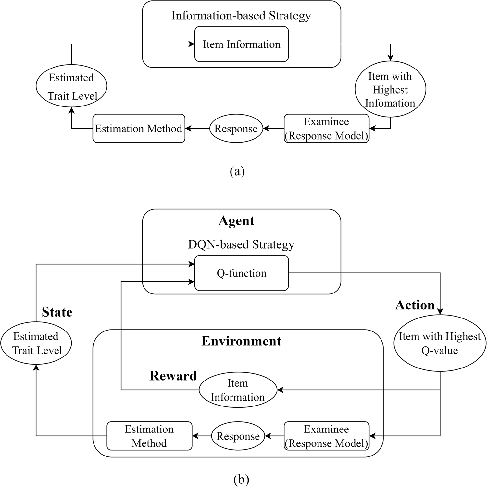
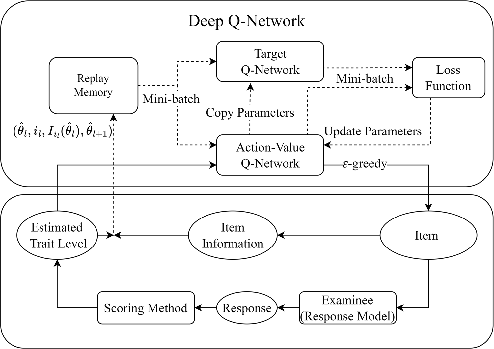
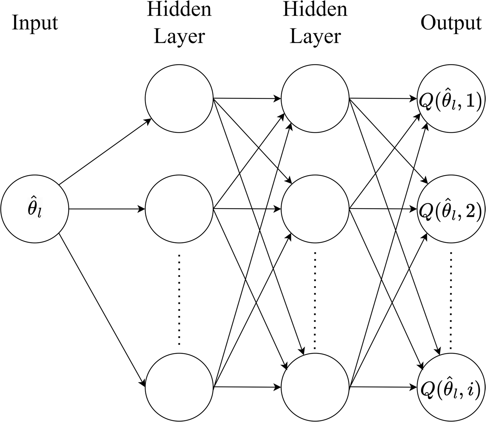
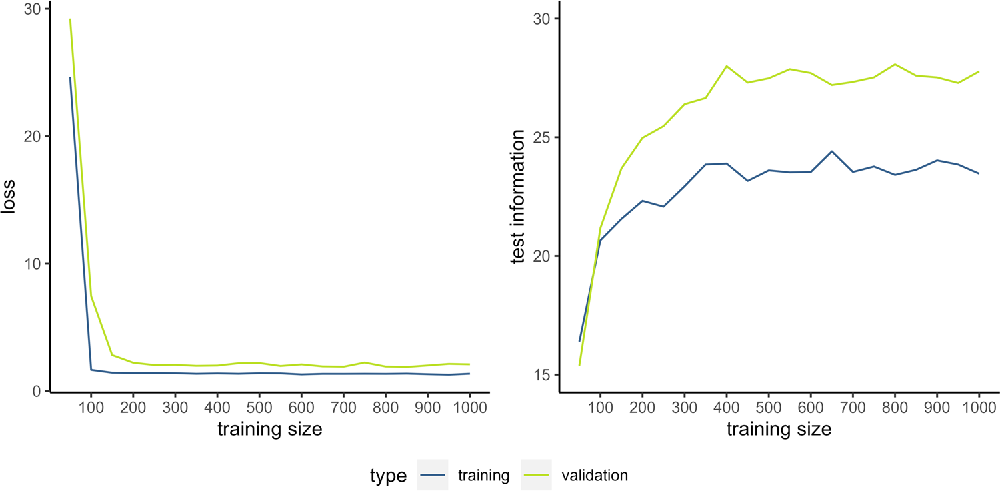
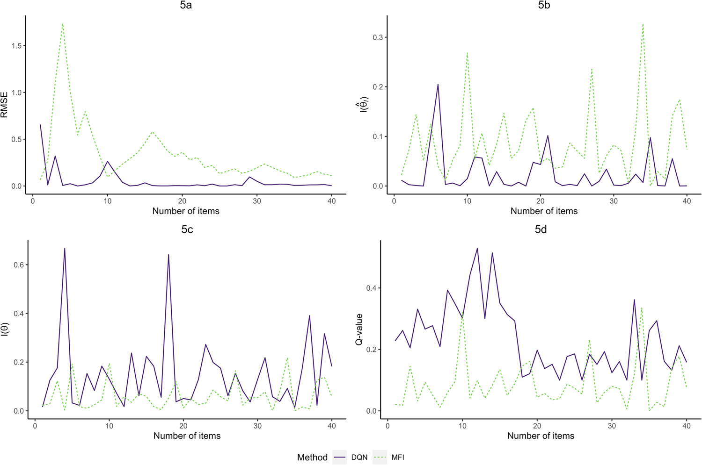
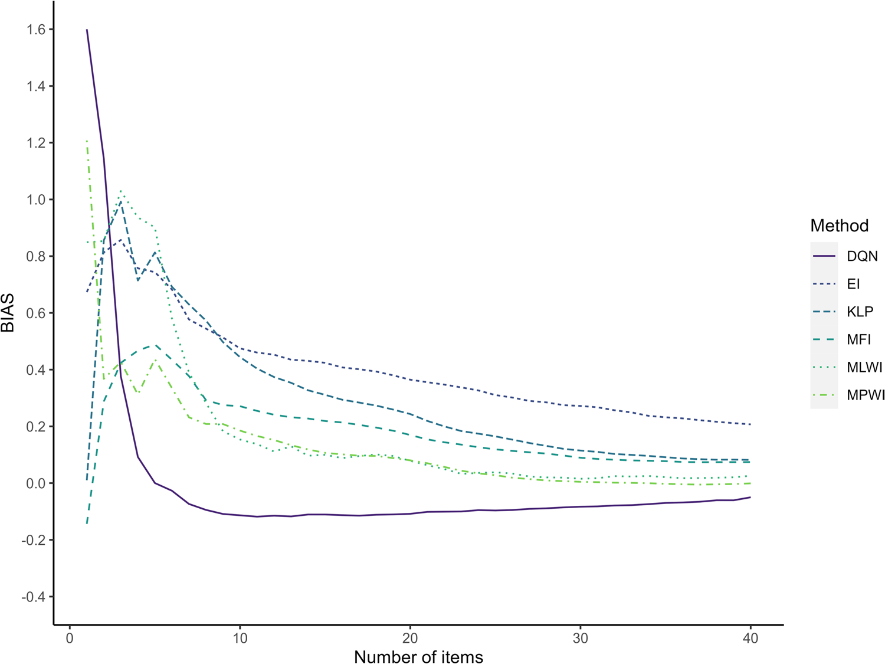
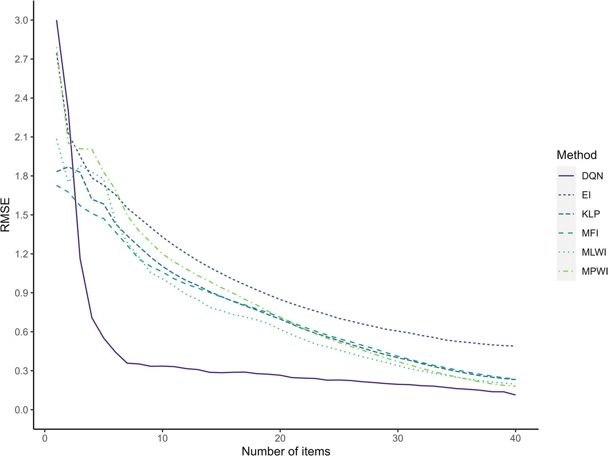

# An adaptive testing item selection strategy via a deep reinforcement learning approach

**Authors:** Pujue Wang, Hongyun Liu, Mingqi Xu

**Journal:** Behavior Research Methods (2024) 56:8695-8714  
**DOI:** https://doi.org/10.3758/s13428-024-02498-x  
**Source PDF:** `papers/s13428-024-02498-x.pdf`

> Note: This Markdown file was generated from the local PDF text layer. Equations, tables, figures, and page-flow artifacts may require manual verification against the PDF.

## Abstract

Computerized adaptive testing (CAT) aims to present items that statistically optimize the assessment process by consider -
ing the examinee’s responses and estimated trait levels. Recent developments in reinforcement learning and deep neural
networks provide CAT with the potential to select items that utilize more information across all the items on the remaining
tests, rather than just focusing on the next several items to be selected. In this study, we reformulate CAT under the reinforce-
ment learning framework and propose a new item selection strategy based on the deep Q-network (DQN) method. Through
simulated and empirical studies, we demonstrate how to monitor the training process to obtain the optimal Q-networks, and
we compare the accuracy of the DQN-based item selection strategy with that of five traditional strategies-maximum Fisher
information, Fisher information weighted by likelihood, Kullback- Leibler information weighted by likelihood, maximum
posterior weighted information, and maximum expected information-on both simulated and real item banks and responses.
We further investigate how sample size and the distribution of the trait levels of the examinees used in training affect DQN
performance. The results show that DQN achieves lower RMSE and MAE values than traditional strategies under simulated
and real banks and responses in most conditions. Suggestions for the use of DQN-based strategies are provided, as well as
their code.
Keywords Computerized adaptive testing · Item selection strategy · Reinforcement learning · Deep learning · Deep
Q-network

## Introduction

Computerized adaptive testing (CAT) is a widely used tool
of smart testing, as well as a popular research topic in psy -
chological and educational measurement (Zhang & Chang,
2016). In comparison to nonadaptive test formats such as
paper-and-pencil tests, CAT can use fewer items to offer a
more accurate estimate of the examinee's true trait levels.
This is achieved by presenting a group of the most statis-
tically informative items, considering both the examinee's
responses and constraints such as content balancing and
exposure control (Weiss, 1982; Wainer et al., 2000; Frey,
2023). Item selection, as the core process used to achieve
efficient measurement, has been an important research focus
in CAT. Traditional item selection strategies that serve as
applications are mostly proposed under the framework of
item response theory (IRT; van der Linden, 2016). The most
widely used method involves choosing items that maximize
the Fisher information (MFI; Lord, 1980). Within the con-
text of IRT, the Fisher information statistic is inversely
related to the asymptotic variance of the maximum like-
lihood estimator of the trait level. Thus, the MFI strategy
obtains a small standard error by simply choosing the item
with maximal Fisher information at the current trait level.
* Hongyun Liu
hyliu@bnu.edu.cn
1 Beijing Key Laboratory of Learning and Cognition, School
of Psychology, Capital Normal University, No. 23 Bai Dui Zi
Jia, Beijing 100048, China
2 Beijing Key Laboratory of Applied Experimental
Psychology, National Demonstration Center for Experimental
Psychology Education (Beijing Normal University), Faculty
of Psychology, Beijing Normal University, No. 19 Xin Jie
Kou Wai Street, Beijing 100875, China
3 Faculty of Psychology, Beijing Normal University, No. 19
Xin Jie Kou Wai Street, Beijing 100875, China
4 Department of Psychology, Tufts University, 419 Boston
Avenue, Medford, Massachusetts 02155, USA

<!-- Page 2 -->

The item selection strategy that maximizes Fisher infor -
mation is not a perfect tool. One of the major disadvantages
of this popular method is that Fisher information is not the
appropriate indicator when the estimated trait level is far
from the true trait level (Chang & Ying, 1996). Therefore,
MFI may not always select the most informative item given
an inaccurate trait estimator, especially in the early stage of
the test (Chen et al., 2000). On the other hand, the distribu-
tion of the estimated trait level will gradually converge as
the test proceeds, but this updated distribution is not consid-
ered in selecting the item (Samejima, 1977). The problem
of MFI has inspired abundant research on improvements in
strategies. To address the disadvantages above, some alter -
native strategies have been proposed to improve efficiency
from different perspectives. Within the framework of IRT,
researchers have improved a variety of item selection strat-
egies focusing on the item information index (see Section
"CAT item selection strategies based on IRT" for details).
As new technologies and tools have been introduced in
smart education in recent years, new directions for improv-
ing classical information-related item selection strategies
have emerged. First, most traditional IRT-based strategies
make local optimal choices rather than globally optimal
ones. Despite the multiple variants of item information, most
strategies consider only the information pertaining to the
next item. It remains difficult for classical strategies to take
into account the potential information gained by considering
a few more items. Although the shadow test (van der Linden
& Reese, 1998) aims to plan for all remaining test items,
each item is still selected based on the current estimated trait
level to maximize the information for just the next item. If
the trait level changes significantly later, these early locally
optimal choices may be suboptimal for the entire test. There
may be no items with high information for the estimated
trait levels in the middle and late stages if the global optimal
selection path is not planned in the early stage. The ideal
strategy should be forward-looking. Each item should be
selected to maximize the information that can be obtained
in the subsequent test, while considering the variations in
the estimated trait levels and the item selection sequences
that may occur later. Second, traditional strategies do not
consider mining information from other examinees’ testing
records to improve testing efficiency. IRT-based strategies
can only utilize large-scale data to update the item param -
eters in the IRT model and cannot directly learn from the
experience of other examinees due to the theoretical frame-
work. By learning from the previous testing records, the
ideal selection strategy based on a flexible framework may
predict the possible trajectories of change in the trait estima-
tion and, more importantly, the test information obtained in
the future after selecting any item.
A promising approach to addressing these shortcomings
is reinforcement learning (RL). As an interdisciplinary field
inspired by behavioral psychology, RL is adept at training an
intelligent agent to explore superior strategies for performing
complicated tasks (Sutton & Barto, 2018). As deep learn-
ing technology is rapidly developing, a group of innovative
algorithms combining RL and neural networks, referred to
as “deep reinforcement learning” (DRL), have surpassed
traditional methods and even human intelligence in vari-
ous frontier domains, such as AlphaGo (Silver et al., 2016,
2017). In recent years, RL has been preliminarily proven to
be suitable and powerful for solving problems with long-
term and adaptive objectives in education measurement,
such as learning material recommendation in adaptive learn-
ing systems (Chen et al., 2018; Han et al., 2020; Li et al.,
2021, 2023; Tan et al., 2020; Tang et al., 2019). The similar-
ity between adaptive learning and adaptive testing, namely,
that they both aim to make personalized recommendations
based on individual characteristics and to reduce the number
of materials or items to enhance efficiency, also provides the
basis for introducing RL into CAT. In fact, a few pioneering
studies have adopted RL frameworks and DRL algorithms in
different types of CAT to develop selection strategies (Nura-
khmetov, 2019; Ghosh & Lan, 2021; Shin & Bulut, 2022).
In the classification CAT, Nurakhmetov (2019) redefined
the elements of CAT under the RL framework and proposed
a sequential selection strategy based on the DRL algorithm.
This algorithm achieved classification accuracy of 89.8%
with just 10 items, surpassing the baseline strategy's 85.5%
accuracy with 15 items. Furthermore, the accuracy increased
to 92.1% with 15 items using the DRL-based approach. Shin
and Bulut (2022) adopted the RL framework and algorithm
introduced by Nurakhmetov (2019) in computerized forma-
tive assessments to select the optimal test to administer to
students based on their learning trajectories. Relatively high
accuracy (close to 90%) was achieved in significantly fewer
test administrations using this recommendation system, as
indicated by F1 scores above 0.90. Item selection strategies
under RL frameworks have also been proposed for large-
scale online education systems. Ghosh and Lan (2021) con-
structed a bilevel optimization-based framework for CAT to
simultaneously model examinees and learn selection strate-
gies from real data. The new framework had a lower trait
estimation error and reached the same accuracy while using
up to 30% fewer items than the method that matches the dif-
ficulty parameter under the Rasch model.
In summary, RL provides CAT with the possibility of
considering both current and long-term information gains in
each item selection, thus compensating for the short-sight-
edness of traditional strategies that only consider the infor -
mation of the current item. Therefore, using reinforcement
learning as the framework to design a selection strategy can
yield high measurement accuracy with fewer items. Moreo-
ver, DRL can accurately find the optimal path in complex
situations to achieve an adaptive goal without exploring all

<!-- Page 3 -->

8697Behavior Research Methods (2024) 56:8695-8714
possible paths. As each choice follows the global optimal
path, the item selection strategy based on DRL may further
reduce the measurement error with fewer items in complex
CAT scenarios.
The following gaps remain in existing research on the
incorporation of RL into CAT. First, no RL framework has
been defined and no selection strategy has been proposed for
CAT based on the most common IRT models, such as the
three-parameter logistic model (3PLM). The RL framework
used in previous studies is not suitable for common IRT
models. In Nurakhmetov’s (2019) setting, which was also
used by Ghosh and Lan (2021), the latent traits of exami-
nees were represented as latent classes rather than continu-
ums. To accord with this framework, more complex recur -
rent neural networks were used to estimate the latent class
instead of reducing the computational complexity by means
of mature psychometric models. Second, the DRL algorithm
most commonly used by existing studies to implement the
selection strategy, the actor-critic algorithm, has to train two
neural networks and often requires a substantial amount of
training data. In the studies mentioned above, the number of
examinees ranged from a thousand to hundreds of thousands.
Third, there is a lack of research that assesses whether the
RL-based item selection strategy designed for the commonly
used IRT model can improve the measurement accuracy by
accounting for long-term information as well as the factors
that can affect the performance of the new strategy. In addi-
tion, no comparison between the new RL-based strategy and
classical IRT-based CAT selection strategies has been made
under the most common CAT scenario described above.
To address these issues, this paper aims to redefine the
item selection problem using a classical and fundamental
RL framework, the Markov decision process (MDP), for the
most common unidimensional dichotomous CAT. On this
basis, some IRT concepts and methods are incorporated into
the MDP framework to reduce the difficulty of deployment
and implementation and enhance comparability with tradi-
tional strategies. Additionally, a simple and efficient DRL
algorithm, the deep Q-network (DQN; Mnih et al., 2013,
2015), is used to implement the item selection strategy. As
the representative algorithm of RL that combines deep neu-
ral networks, DQN has been successfully applied in many
fields, including video games (Mnih et al., 2013, 2015),
robotics (Gu et al., 2017), and autonomous driving (Sallab
et al., 2017). A study by Li et al. (2023) in the field of adap-
tive learning has shown that combining DQN with models
that simulate examinees’ transfer states can significantly
reduce the amount of training data needed.
The remainder of the article is organized as follows. Sec-
tion " Deep Q-network for CAT item selection " gives the
fundamental concepts of the MDP framework and its cor -
responding elements in the CAT scenario and then proposes
a new item selection strategy based on the DQN algorithm.
Sections "Simulation study" and "Empirical study based on
the real bank and responses" present two studies and cor -
responding results, which compare the accuracy of the new
strategy and five traditional IRT-related strategies in differ-
ent situations. Section "Discussion" concludes with a sum-
mary of the findings and a discussion of the use of DQN in
CAT.

## Deep Q-network for CAT item selection

### CAT item selection strategies based on IRT

Taking 3PLM as an example, the probability Pi(θ) of giving
a correct response to item i is as follows:
where θ is the trait level,1 and ai , bi , and ci correspond to the
discrimination, difficulty, and pseudo-guessing parameters
for item i , respectively.
The Fisher information function is computed as
where P'_i(θ) is the first-order derivative of Pi(θ) with respect
to θ . The item number for the l th item in CAT is denoted as
il , and the rule of MFI is described as
where θ̂_l is the trait level estimated by maximum likelihood
estimation (MLE), and B_l represents the subset of items that
have not been administered when selecting the l th item.
Veerkamp and Berger (1997) proposed a new strategy
that maximizes the Fisher information weighted by the like-
lihood over all possible trait levels (abbreviated as FIWL),
described as
where L(θ) is the likelihood function.
The Kullback-Leibler information (KL; Chang & Ying,
1996), also referred to as the global measure of information,
evaluates the item discrimination capacity by considering
a broader range of trait levels. The KL information-based
$$
P_i(\theta) = c_i + \frac{(1 - c_i)\exp[a_i(\theta - b_i)]}{1 + \exp[a_i(\theta - b_i)]}
\tag{1}
$$

$$
I_i(\theta) =
\frac{[P'_i(\theta)]^2}{P_i(\theta)[1 - P_i(\theta)]}
=
\frac{a_i^2(1 - c_i)}{\{c_i + \exp[a_i(\theta - b_i)]\}\{1 + \exp[-a_i(\theta - b_i)]\}^2}
\tag{2}
$$

$$
i_l = \arg\max_{i \in B_l} I_i(\hat{\theta}_l)
\tag{3}
$$

$$
i_l = \arg\max_{i \in B_l} \int_{-\infty}^{\infty} I_i(\theta)L(\theta)d\theta
\tag{4}
$$
1 For simplicity, the subscript that indicates the specific examinee is
omitted. It is added only when it is necessary to differentiate trait lev -
els across distinct individuals.

<!-- Page 4 -->

selection strategy is commonly weighted by the likelihood in
the application (abbreviated as KLP), which is described as
where KLi(θ||θ̂) is computed as
FIWL and KLP yield greater accuracy than MFI for a
short test length (Chen et al., 2000).
Van der Linden (1998) proposed several Bayesian
approaches using the full posterior distribution. The maxi-
mum posterior weighted information strategy (abbrevi-
ated as MPWI) aims to maximize the information over
the updated posterior distribution of the trait level and is
described as
where G(θ) is the updated posterior distribution obtained by
Bayes’ theorem.
The maximum expected information strategy (abbrevi-
ated as MEI) takes into account the information associated
with the posterior predictive distribution, which evaluates
the probabilities of correctly and incorrectly answering the
target item and is described as
where θ̂_{u_i=1} and θ̂_{u_i=0} represent the updated trait levels
if item i is selected and is answered correctly and incor -
rectly, respectively. These two estimators are obtained by
the method of maximum a posteriori (MAP) or expected
a posteriori (EAP). For short tests, Bayesian methods can
decrease the mean squared error of the trait-level estimate
(Meijer & Nering, 1999).
### MDP framework and its corresponding elements in CAT
A CAT process has six principal components: (1) an item
bank, (2) the start of the test, (3) an estimation method, (4) an
item selection strategy, (5) constraint management, and (6)
the end of the test (Weiss & Kingsbury, 1984; Frey, 2023).
The present research exclusively applies reinforcement learn-
ing (RL) to augment the item selection strategy. The other
five components can still be implemented using classical IRT
models and common methods of CAT. Item selection can be
$$
i_l = \arg\max_{i \in B_l} \int_{-\infty}^{\infty} KL_i(\theta \| \hat{\theta}_l)L(\theta)d\theta
\tag{5}
$$

$$
KL_i(\theta \| \hat{\theta})
= P_i(\hat{\theta}) \ln\left[\frac{P_i(\hat{\theta})}{P_i(\theta)}\right]
+ [1 - P_i(\hat{\theta})]\ln\left[\frac{1 - P_i(\hat{\theta})}{1 - P_i(\theta)}\right]
\tag{6}
$$

$$
i_l = \arg\max_{i \in B_l} \int_{-\infty}^{\infty} I_i(\theta)G(\theta)d\theta
\tag{7}
$$

$$
i_l = \arg\max_{i \in B_l}
\left[
P_i(\hat{\theta}_l)I_i(\hat{\theta}_{u_i=1})
+ \{1 - P_i(\hat{\theta}_l)\}I_i(\hat{\theta}_{u_i=0})
\right]
\tag{8}
$$
summarized as a cyclical interaction process between the test-
ing system and the examinees (see Fig. 1a). The information-
based strategy receives the estimated trait levels, calculates the
information index of each item from the well-calibrated item
bank based on the formula, and finally selects the item with
the maximum information index. The examinee (or simulated
response model) responds to that item. The estimation method
updates the trait level, completing one round of the interactive
cycle. Throughout multiple rounds of interaction, the objec-
tive of CAT is to maximize the cumulative item information.
Such an interaction process and task objective are closely
aligned with the paradigm of reinforcement learning.
In RL, the MDP abstracts the mathematical framework of
the sequential decision problem. The basic idea of the MDP
is simply to capture the most important aspects of a real
problem in which a virtual agent interacts with its environ-
ment to achieve an ultimate goal. When adopting the MDP
in CAT, the virtual agent is responsible for selecting items.
The input received by the agent is referred to as the state,
which is used for decision-making, and the output is referred
to as the action. In the context of CAT, the state input to the
agent is the trait level, and the action outputted by the agent
is the item. The entity interacting with the agent is generally
referred to as the environment in RL. The input that the envi-
ronment receives is the action, and it ultimately outputs the
state. The environment in CAT includes the examinee who
responds to the item (or the IRT model generating simu-
lated responses) and the estimation method, which converts
responses into trait levels. The transition of states is called
the environment model in RL. In the MDP, in addition to the
state, the environment outputs immediate feedback to the
agent, which is called the reward (see Fig. 1b). The reward
defines not only how good the action is but also the goal of
the RL problem. In CAT, it is the item information obtained
after the examinee responds to the item, which can be meas-
ured by a simple item information index such as Fisher infor-
mation. In the MDP, the Q-function serves as an objective
function for each decision in the long run. In the context of
CAT, the Q-function measures the weighted expected sum
of the item information accumulated from the selection of
the current item to the end of the test. Hence, selecting the
item with the highest value of the Q-function represents the
optimal choice from a long-term perspective.
After describing the item selection process in CAT using
the MDP framework, the role of the newly proposed strategy
in the procedure does not change compared to traditional
IRT-based strategies. The only difference lies in how to
acquire the item selection strategy based on reinforcement
learning algorithms.
The setup described above exhibits three advantages.
First, the representation of the state aligns the selection
strategy under the MDP framework with the design logic of
traditional IRT-based strategies, which select items based

<!-- Page 5 -->

8699Behavior Research Methods (2024) 56:8695-8714
on the estimated trait level in the sequence. Additionally,
taking the most frequently used information measure as the
evaluation method for each item in the MDP is in line with
most information-based strategies, which take the Fisher
information as the basis for improvement. Second, the key
elements in the MDP can be calculated efficiently and accu-
rately via IRT approaches such as MLE and IRT models
for the environment and Fisher information for the reward,
instead of adding complex modules to the MDP and increas-
ing the computational complexity. Third, the objective of
the agent in the MDP in making every decision is to pur -
sue the maximization of cumulative rewards throughout the
entire sequence, which is consistent with maximizing the
test information.
The item selection strategy in CAT corresponds to the pol-
icy in the MDP. The policy, denoted as π , represents a set of
rules for choosing actions in response to any kind of input
state. That is, the policy π determines which item should be
chosen for any given trait level in CAT. To utilize RL to maxi-
mize the sum of the information obtainable from the selection
of this item through to the end of the test, it is necessary to
employ the Q-function. Suppose fixed-length CAT with L
items is used. The estimated trait level when selecting item il
is denoted as θ̂_l . The Fisher information brought by item il is
I_{i_l}
(
θ̂_l
)
. After selecting the remaining L - l items according to
strategy π , the expectation of the weighted sum of the item
information is measured by the Q-function. The Q-function
theoretically considers all subsequent possibilities of item
sequences based on policy π; that is,
where γ is called the discount factor. Its value range is (0,1).
The discount factor controls how much our agent discounts
future rewards when making a decision. Larger γ values cor-
respond to greater importance of future rewards. In CAT,
the Q-function not only evaluates the efficacy of selecting
$$
\begin{aligned}
Q^\pi(\hat{\theta}_l, i_l)
&= \mathbb{E}_\pi\left[
I_{i_l}(\hat{\theta}_l)
+ \sum_{k=l+1}^{L}\gamma^{k-l} I_{i_k}(\hat{\theta}_k)
\mid \hat{\theta}_l, i_l
\right] \\
&= \mathbb{E}_\pi\left[
I_{i_l}(\hat{\theta}_l)
+ \gamma \max_{i \in B_{l+1}} Q^\pi(\hat{\theta}_{l+1}, i)
\mid \hat{\theta}_l, i_l
\right]
\end{aligned}
\tag{9}
$$

Fig. 1 Flowchart of the IRT-based item selection strategy and the RL-based item selection strategy in the MDP framework

<!-- Page 6 -->

items for a given trait level, that is, the cumulative informa-
tion obtained in subsequent testing for each choice, but also
assesses the quality of the strategy π , as each subsequent test
sequence will proceed in accordance with π . To obtain the
ideal item selection strategy, it becomes essential to identify
the optimal policy. The optimal policy, denoted as π* , should
always have the highest Q-value among all the policies cor-
responding to the pair of θ̂_l and i_l . The Q-function of π* is
defined as
Once the optimal policy π* is obtained, for any trait level,
π* can select the item with the highest Q-value, thus theoreti-
cally finding the optimal item selection strategy in CAT. The
ideal strategy under the MDP is to always select the item
with the largest Q-value of Q^{π*} , described as
Next, there are two issues to address. First, the Q-values
for all possible trait levels and items must be accurately
determined. Second, the maximum Q-values must be identi-
fied for all trait levels and items, which represent the optimal
item selection strategy.
Because θ̂ is a continuous variable that can take on an
infinite number of values and because the size of B_l can
also be large, the Q-function is likely a high-dimensional
nonlinear function with infinite inputs and outputs. A simple
linear model cannot fit this complex function with sufficient
precision. In sequential tests such as CAT, it is impractical
to collect all the sequences to find the optimal policy for all
situations, as there is a substantial number of possibilities
for the trajectory of the estimated trait levels. To solve such
a problem, a well-designed training algorithm is needed,
in addition to a neural network structure that can find the
optimal policy π* and fit its Q-function Q^{π*} with a limited
amount of data.
### New item selection strategy based on the DQN algorithm
Similar to IRT-based strategies, a Q-function is employed for
item selection in CAT, which takes continuous variables θ̂
as inputs and outputs the Q-values for each available item in
the item bank. The relationship between the input and out-
put in this scenario is a complex nonlinear function. DQN
is especially suitable for discrete action spaces and complex
Q-functions (Mnih et al., 2013, 2015). The new strategy
based on DQN needs to fit the Q-function of the optimal
strategy, which calculates the expectation of the sum of the
information of all possible subsequent sequences given any
$$
Q^{\pi^*}(\hat{\theta}_l, i_l) = \max_\pi Q^\pi(\hat{\theta}_l, i_l)
\tag{10}
$$

$$
i_l = \arg\max_{i \in B_l} Q^{\pi^*}(\hat{\theta}_l, i)
\tag{11}
$$
pair of θ̂_l and i_l and finds the sequence with the most informa-
tion under each combination. If every possibility is calculated
to the end of the test according to an exhaustive method, such
as MEI, the amount of calculation is too large, and the time
and memory consumption are unacceptable. Therefore, DQN
uses a neural network to explore and learn the Q-function
for the optimal strategy from limited item selection records.
DQN training is divided into two parts: policy selection
and policy evaluation, corresponding to exploring the opti-
mal strategy and fitting the Q-function of this optimal strat-
egy, respectively. During policy selection, DQN employs
the ϵ-greedy method, selecting items randomly with a prob-
ability ϵ of exploring potentially better strategies, while
selecting the item with the highest Q-value with a prob -
ability of 1 - ϵ to make the optimal choice. DQN gradually
builds its knowledge from scratch, accumulating experience
to learn the most effective ways of selecting items. The ϵ
-greedy method in DQN mirrors the balance between explo-
ration and exploitation, akin to the process of acquiring new
knowledge and consolidating existing knowledge. As long as
there is adequate exploration of the state space and signifi-
cant accumulation of data regarding item selections for dif-
ferent trait levels, the accuracy estimation of the Q-function
for the optimal strategy will not be compromised, even if
the data come from a random strategy (Zai & Brown, 2020,
pp. 87). During policy evaluation, DQN adopts two tech-
niques to make the Q-network better converge to the opti-
mal Q-function: the target network and experience replay
(Mnih et al., 2013, 2015). DQN designs two networks with
the same structure: the action-value Q-network (denoted as
Q_action ) to fit the optimal Q-function and take the actions,
and the target Q-network (denoted as Q_target ) to compute the
prediction target of Q_action . Utilizing a separate Q_target to gen-
erate predictive targets and periodically copying Q_action to
the target network can make the Q-function converge more
steadily and make the predictions more accurate, as well as
reducing the complexity of training. From a psychometric
perspective, the Q_target can be viewed as a stable, reliable
validation test, while the Q_action resembles a new version of
the test that is being calibrated against this benchmark. The
relationship between two Q-networks in the CAT scenario
is described as
where Θ are the parameters of Q_action and Θ′ are the param-
eters of Q_target . The parameters of Q_target (i.e., Θ′) are copied
from Q_action (i.e., Θ) after Q_action has been updated several
times. To efficiently and accurately train Q_action , another
important ingredient of the DQN algorithm is experience
replay. The item selection data accumulated in policy selec-
tion are integrated in the form e_l = { θ̂_l, i_l, I_{i_l}
(θ̂_l), θ̂_{l+1} } and
$$
Q_{\mathrm{action}}(\hat{\theta}_l, i_l; \Theta)
\equiv
I_{i_l}(\hat{\theta}_l)
+ \gamma \max_{i \in B_{l+1}} Q_{\mathrm{target}}(\hat{\theta}_{l+1}, i; \Theta')
\tag{12}
$$

<!-- Page 7 -->

8701Behavior Research Methods (2024) 56:8695-8714
stored in a memory bank D = { e_1, …, e_{N_D} }, which can hold
N_D records. The data in the replay memory with limited
capacity are continuously refreshed, thereby stabilizing the
training process of DQN by disrupting temporal correlations
and leveraging past experiences. Then, a mini-batch of m
records { θ̂_l, i_l, I_{i_l}
(θ̂_l), θ̂_{l+1} } are sampled from memory bank
D and used to update Q_action . Employing mini-batches not
only reduces the dependency among records but also accel-
erates the updating process of Q_action , aligning with standard
practices for optimizing neural networks. Experience replay
acts as a teacher in planning the learning material by updat-
ing and randomly drawing the material learned by Q_action .
In summary, the algorithm for training DQN is as follows:
Initialize the action-value network Q_action with random
weights Θ , the target network Q_target with random weights Θ′ = Θ , and the replay memory D with size ND . For the N_training
examinees, repeat the following cycle (all elements within a
single cycle belong to the same examinee n = 1, 2, …, N):
(0) Generate the initial trait level θ̂_1.
For test sequence l = 1, 2, …, L:
(1) Input θ̂_l into Q_action to obtain the Q-values of all items,
and retain only those corresponding to B_l.
(2) Select item i_l randomly from B_l with probability ϵ; otherwise, select
item i_l = argmax_{i ∈ B_l} Q_action(θ̂_l, i; Θ).
(3) Calculate the Fisher information I_{i_l}(θ̂_l) and obtain the
updated trait level θ̂_{l+1} by the estimation method.
(4) Store { θ̂_l, i_l, I_{i_l}(θ̂_l), θ̂_{l+1} } in D.
When the number of records stored in D is greater than
the batch size m, do the following:
(5) Sample a mini-batch of m records { θ̂_l, i_l, I_{i_l}(θ̂_l), θ̂_{l+1} }
from D.
(6) Update parameters Θ of Q_action by optimizing the loss
function
(7) For every τ times Q_action updates, copy weights Θ′ = Θ.
The MDP proposed in this study combines the con-
cepts of IRT that allow the DQN to learn from real data or
simulated data. The former type of data means that θ̂_{l+1} in
step (3) is estimated from a human-generated response or
a past response record generated by real people. The latter
refers to responses generated through IRT models or other
$$
\mathcal{L}(\Theta)=
\begin{cases}
\left[I_{i_l}(\hat{\theta}_l) - Q_{\mathrm{action}}(\hat{\theta}_l, i_l; \Theta)\right]^2,
& l = L, \\
\left[
I_{i_l}(\hat{\theta}_l)
+ \gamma \max_{i \in B_{l+1}} Q_{\mathrm{target}}(\hat{\theta}_{l+1}, i; \Theta')
- Q_{\mathrm{action}}(\hat{\theta}_l, i_l; \Theta)
\right]^2,
& \text{otherwise.}
\end{cases}
\tag{13}
$$
simulation methods. Both types of data or examinees are
available, with their own fidelity and cost advantages, and
they can be used separately or in combination for training
DQN. As seen in step (4), the records for training DQN only
contain the i_l labeling the item numbers in the bank and not
the item parameters, so each Q-network only corresponds to
the item bank from which the records originate. If the item
bank changes, the optimal choice for the same trait level may
change. Therefore, it is recommended to modify the optimal
Q_action that was initially developed for the original item bank.
Such adjustments entail integrating new data corresponding
to the newly added items in combination with the response
data from the items that are retained. Then Q_action is fine-
tuned or retrained using the same training algorithm, but
now applied to the newly incorporated data. In step (6), there
are two versions of the loss function for updating Q_action :
the first is used when the CAT reaches the fixed-length L,
and the second occurs while the testing is still in progress.
Inside the loop from steps (1) to (7), all elements belong
to examinee n . Only the elements in the mini-batch during
steps (5) to (6) are randomly drawn from memory, and they
may come from any examinee at any length. Moreover, this
study assumes that the CAT is fixed-length. For variable-
length CAT, we only need to adjust the termination rule
for the loop, along with the termination criteria in the first
version of the loss function in step (6).
According to Fig. 2, it can be observed that, compared
with using DQN for item selection after training (as shown
in Fig. 1b), the role of the environment implemented by
IRT methods remains unchanged during the training of the
DQN item selection strategy. This implies that the training
of the DQN-based item selection strategy can be conducted
by either an IRT model or real responses, with the training
process being entirely consistent.

## Simulation study

### Designs

The new DQN-based item selection strategy was compared
with five traditional IRT-based strategies (MFI, FIWL, KLP,
MPWI, and MEI) regarding selection accuracy through
a simulation study. 3PLM was used to simulate the item
parameters and calculate the Fisher information. Consider -
ing that parameters a and b of the items are usually cor -
related (Wingersky & Lord, 1984; Chang et al., 2001), two
types of item banks were generated, one with uncorrelated
a and b parameters ( r_ab = 0) and the other with correlated
parameters ( r_ab = 0.5). The distribution of item parameters,
the number of item banks, and the number of items refer to
the existing research (Barrada, Abad, & Veldkamp, 2009a,
Barrada, Olea, et al., 2009b, 2010; Sorrel et al., 2020). Each

<!-- Page 8 -->

Fig. 2 Flowchart of the training process for the DQN-based item selection strategy

Fig. 3 The structure of the Q-network

<!-- Page 9 -->

8703Behavior Research Methods (2024) 56:8695-8714
type consisted of 10 item banks, with each bank compris-
ing 500 items. The parameter distributions were a ~ N(1.2,
0.25), b ~ N(0, 1) and c ~ N(0.25, 0.02). For each item bank,
the trait levels of 5000 examinees were randomly gener -
ated from the distribution N (0, 1). The initial trait level
was randomly chosen from a uniform interval [-0.5, 0.5].
Dodd’s (1990) method was used until correct and incorrect
responses were produced for each examinee. If all responses
were correct, θ̂_{l+1} was increased by (bmax - θ̂_l)∕2 ; alterna-
tively, if all responses were incorrect, θ̂_{l+1} was decreased by
(θ̂_l - bmin)∕2 , where bmax and bmin represent the maximum
and minimum values of the difficulty parameter within the
item bank, respectively. Then, MLE was applied to estimate
trait levels within the range [-4,4]. Four different test lengths,
10, 20, 30, and 40 items, were used. The prior involved in
the two Bayesian strategies was the standard normal distri-
bution, and MAP was used to estimate the predictive trait
levels for MEI. The selection of items for the five IRT-based
strategies, generation of responses, and estimation of abili-
ties were implemented by the functions provided in the R
package catR (Magis & Barrada, 2017).

### Evaluation criteria

Four commonly used metrics in CAT were used to evaluate
the recovery of the examinees’ true trait levels (He et al.,
2014). The evaluation metrics are defined as follows:
(1) BIAS
where N is the number of examinees, and θ̂_n and θ_n are the
estimated trait level and true trait level of the n th examinee,
respectively.
(2) Mean absolute error (MAE)
(3) Root mean square error (RMSE)
The smaller the values of the three indicators above, the
more accurate the strategy is.
(4) The correlation between the true trait level and the final
estimated value is
$$
\mathrm{BIAS} = \frac{1}{N}\sum_{n=1}^{N}(\hat{\theta}_n - \theta_n)
\tag{14}
$$

$$
\mathrm{MAE} = \frac{1}{N}\sum_{n=1}^{N}\left|\hat{\theta}_n - \theta_n\right|
\tag{15}
$$

$$
\mathrm{RMSE} =
\sqrt{\frac{1}{N}\sum_{n=1}^{N}(\hat{\theta}_n - \theta_n)^2}
\tag{16}
$$
where θ and Sθ are the mean and standard deviation of the
true trait levels of all n examinees, and θ̂ and Sθ̂ are the mean
and variance of the estimated trait levels of all n exami-
nees. A larger value of this indicator corresponds to a better
strategy.

### Implementation of the DQN algorithm

The same network structure and training process were used
to train the optimal Q-network for each of the 20 simulated
item banks. DQN puts no requirements on the structure of
Q-networks. In this study, a multilayer fully connected net-
work with a nonlinear activation function is used. There are
two hidden layers between the input and output, and each
hidden layer uses a nonlinear activation function called the
rectified linear unit (ReLU), where ReLU(x)= max(0,x) .
The structure of the Q-network is presented in Fig. 3 (same
as in Tan et al., 2019). The dimension of the Q-network’s
input equals 1 (for θ̂ ), and that of the output equals 500 (the
size of the item bank). The two hidden layers have 50 and
30 neurons. This Q-network has 2 × 50 + 51 × 30 + 31 × 5
00 = 17,130 parameters in total (each layer adds a neuron
before connecting with the next layer, which can be seen as
the intercept in regression). To ensure that the information
calculated by the Q-network is positive, all network param-
eters are constrained to be positive.
In the simulation study, the training of DQN using simu-
lated response data will be demonstrated. Consistent with
the IRT model for calibrating item parameters, the 3PLM
is used to generate response data for training DQN. Based
on deep learning training experience, the quantity of data
contributes to the performance of the neural networks: the
larger the scale of data in training the DQN, the greater the
likelihood of performance improvement (Goodfellow et al.,
2016, pp. 19-20). Both human examinees and real response
records are difficult and expensive to obtain in real-world
applications of CAT, especially if the size is as large as the
one used to compare the strategies in the above simula-
tion (5000 examinees, denoted as Ntesting ). Furthermore,
using real response records requires a large quantity of data
to ensure that responses or updated traits for all available
items selected by DQN can be found in the dataset.
Another factor that may impact the performance of DQN
is the distribution of the true trait levels of examinees in
the training phase. This determines the distribution of θ̂ in
the training data and further influences whether the optimal
strategy learned by the DQN during training can be general-
ized to the testing phase. To enhance the generalizability of
deep learning models, it is recommended that the training
$$
r_{\theta,\hat{\theta}} =
\frac{\sum_{n=1}^{N}(\theta_n - \bar{\theta})(\hat{\theta}_n - \bar{\hat{\theta}})}
{S_{\theta}S_{\hat{\theta}}}
\tag{17}
$$

<!-- Page 10 -->

and testing data have identical distributions (Goodfellow
et al., 2016, pp. 109-116). To simulate scenarios where the
abilities of target examinees are known, the distribution of
trait levels for generating training data was set to match the
standard normal distribution used in the testing phase. How-
ever, in practical scenarios, determining the exact distribu-
tion of the target examinees' trait levels might be challeng-
ing. To ensure that DQN encounters training data across the
full spectrum of trait levels, a uniform distribution ranging
from -3 to 3 was specified for generating examinees for
DQN training. In summary, using the same standard normal
distribution as in the testing phase can be considered the
ideal training situation, while a uniform distribution serves
as a remedial approach for cases where little is known about
the trait levels of the testing examinees.
To avoid overfitting and to obtain a DQN model with good
generalizability, a validation phase was designed during the
training process. For the purpose of differentiation, the phase
in which the Q-network is updated following the algorithm
described above is called the training phase. Every time N_interval
examinees’ records (where N_interval is a divisor of N_training )
are used to update the network Q_action in the training phase,
N_validation examinees with the same distribution of trait levels
as in the test phase interact with the current optimal Q_action to
complete the L-item CAT. The loss and reward of DQN and the
RMSE of selection were recorded throughout the training and
validation phases to monitor the convergence of the Q-network
and explore the effect of the quantity of data. In addition, the
discount factor γ also has a positive effect on model conver-
gence and generalization performance (Schulman et al., 2015;
Amit et al., 2020). Improper values of γ make it difficult for the
Q-network to converge, and the policy learned is not globally
optimal. Different item banks and groups of examinees may
lead to different γ values in the optimal Q-function. For each
bank and type of distribution, four values of γ (0.1, 0.3, 0.6,
and 0.9) were taken to obtain the optimal Q_action . To quickly
find the best value and prevent overfitting, the early-stopping
technique was used in the training phase. If the loss was high
and did not decrease or was very different for the training and
validation, training was halted to adjust the value of γ . After
the best value of γ was determined, the training continued until
1000 examinees had completed the 40-item test.
The replay memory size was 1000 (N_D). Every 40 times
(τ) that Q_action was updated, Q_target was updated once, which
means that Q_target was updated once after each examinee
completed the 40-item test. The mini-batch size ( m) was
set as 128. The optimization algorithm used for training the
network was Adam (Kingma & Ba, 2014), and the learn-
ing rate was 0.001. The trait distribution of examinees for
the validation phases was the standard normal distribution.
Each examinee finished the 40-item (L) test in both phases.
N_interval was 50, and N_validation was 200. A new optimal Q_action
was saved if it had lower BIAS and RMSE scores on average
and higher rewards during the 40-item tests than the previ-
ous optimal network. The item selection strategy based on
DQN takes the action with the maximal Q-value calculated
by the optimal Q_action , as described in Eq. (11). Then, 5000
examinees were tested by DQN in the testing stage and com-
pared with the traditional strategies. The ϵ-greedy value was
set to 0.1 in the training phase and 0 in the validation and
testing phases. All training and testing related to DQN were
implemented using the Python deep learning programming
framework PyTorch (Paszke et al., 2019), run on a GPU
and accelerated by CUDA and cuDNN. 2 The CPU was an
Intel Core i7-7700 @3.60 GHz, and the GPU was an Nvidia
GeForce GTX 1080Ti with memory size of 8192 MB.

Fig. 4 Changes in the loss and test information during the training and validation phases with increasing sample size
2 The Python code for training and testing DQN and the R code of
CAT based on the traditional strategies for both studies are shared on
the OSF platform.

<!-- Page 11 -->

8705Behavior Research Methods (2024) 56:8695-8714

### Results

The effects of the correlation of parameters a and b and the
distribution of trait levels for training DQN are so small
that the lines separated by r_ab = 0∕0.5 and the type of dis-
tribution almost overlap (these two factors are not shown
separately in Fig. 4). For the optimal Q-networks of all item
banks, the loss of the training phase reduces quickly and is
maintained at a very low level when training on only 100
examinees. After the Q-network interacts with another 100
examinees, the loss of the validation phase also drops to a
very low level and does not increase. Since the two phases
are very close, there is no overfitting.
Under these two phases, the unweighted cumulative
reward (test information of the 40-item test) rises rapidly
when training on the first 200 examinees and then grows
gradually as the amount of training data increases. This
is evidence that DQN will continue to search for a better
policy with increasing amounts of training data. The low
loss throughout the training phase indicates that whenever
a new optimal policy is found, the Q-network converges to
the Q-function of that policy quickly and accurately. The test
information of the validation phase is always higher than that
of the training phase because a 10% probability of random
selection (ϵ= 0.1) is set during the training phase, while
items with the largest Q-values calculated by the optimal
**Table 1. Recovery of trait levels for different item selection strategies under banks with uncorrelated a and b parameters**

Note. DQN (normal): Deep Q-network trained with a standard normal distribution. DQN (uniform): Deep Q-network trained with a uniform distribution. MFI: Maximize the Fisher information. KLP: Maximize the Kullback-Leibler information weighted by the likelihood. FIWL: Maximize the Fisher information weighted by the likelihood. MPWI: Maximize the posterior weighted information. MEI: Maximize the expected information.

| Test length | Method | BIAS | RMSE | MAE | r_{θ,θ̂} |
| --- | --- | --- | --- | --- | --- |
| 10 | DQN (normal) | -0.038 | 0.415 | 0.313 | 0.950 |
| 10 | DQN (uniform) | -0.014 | 0.348 | 0.276 | 0.964 |
| 10 | MFI | 0.037 | 0.493 | 0.371 | 0.899 |
| 10 | KLP | 0.018 | 0.443 | 0.343 | 0.914 |
| 10 | FIWL | 0.021 | 0.459 | 0.354 | 0.909 |
| 10 | MPWI | 0.020 | 0.456 | 0.347 | 0.912 |
| 10 | MEI | 0.025 | 0.455 | 0.347 | 0.911 |
| 20 | DQN (normal) | -0.074 | 0.278 | 0.208 | 0.977 |
| 20 | DQN (uniform) | -0.061 | 0.254 | 0.204 | 0.981 |
| 20 | MFI | 0.012 | 0.331 | 0.257 | 0.950 |
| 20 | KLP | 0.012 | 0.322 | 0.250 | 0.952 |
| 20 | FIWL | 0.011 | 0.324 | 0.253 | 0.952 |
| 20 | MPWI | 0.011 | 0.320 | 0.250 | 0.953 |
| 20 | MEI | 0.012 | 0.324 | 0.253 | 0.952 |
| 30 | DQN (normal) | -0.034 | 0.244 | 0.187 | 0.982 |
| 30 | DQN (uniform) | -0.001 | 0.207 | 0.167 | 0.987 |
| 30 | MFI | 0.007 | 0.277 | 0.216 | 0.965 |
| 30 | KLP | 0.007 | 0.272 | 0.212 | 0.965 |
| 30 | FIWL | 0.008 | 0.274 | 0.214 | 0.965 |
| 30 | MPWI | 0.006 | 0.272 | 0.213 | 0.966 |
| 30 | MEI | 0.007 | 0.273 | 0.213 | 0.965 |
| 40 | DQN (normal) | -0.008 | 0.227 | 0.176 | 0.986 |
| 40 | DQN (uniform) | -0.004 | 0.207 | 0.169 | 0.989 |
| 40 | MFI | 0.005 | 0.245 | 0.191 | 0.972 |
| 40 | KLP | 0.006 | 0.243 | 0.190 | 0.972 |
| 40 | FIWL | 0.006 | 0.245 | 0.191 | 0.972 |
| 40 | MPWI | 0.006 | 0.243 | 0.190 | 0.972 |
| 40 | MEI | 0.005 | 0.244 | 0.191 | 0.972 |

**Table 2. Recovery of trait levels for different item selection strategies under banks with correlated a and b parameters**

Note. DQN (normal): Deep Q-network trained with a standard normal distribution. DQN (uniform): Deep Q-network trained with a uniform distribution. MFI: Maximize the Fisher information. KLP: Maximize the Kullback-Leibler information weighted by the likelihood. FIWL: Maximize the Fisher information weighted by the likelihood. MPWI: Maximize the posterior weighted information. MEI: Maximize the expected information.

| Test length | Method | BIAS | RMSE | MAE | r_{θ,θ̂} |
| --- | --- | --- | --- | --- | --- |
| 10 | DQN (normal) | 0.003 | 0.450 | 0.375 | 0.961 |
| 10 | DQN (uniform) | 0.015 | 0.438 | 0.347 | 0.947 |
| 10 | MFI | 0.018 | 0.554 | 0.404 | 0.878 |
| 10 | KLP | -0.003 | 0.493 | 0.371 | 0.898 |
| 10 | FIWL | 0.011 | 0.541 | 0.398 | 0.881 |
| 10 | MPWI | -0.006 | 0.507 | 0.374 | 0.893 |
| 10 | MEI | 0.003 | 0.512 | 0.377 | 0.890 |
| 20 | DQN (normal) | -0.013 | 0.299 | 0.239 | 0.978 |
| 20 | DQN (uniform) | 0.012 | 0.301 | 0.242 | 0.973 |
| 20 | MFI | 0.002 | 0.368 | 0.277 | 0.940 |
| 20 | KLP | -0.001 | 0.349 | 0.268 | 0.945 |
| 20 | FIWL | 0.004 | 0.361 | 0.275 | 0.942 |
| 20 | MPWI | -0.003 | 0.352 | 0.267 | 0.944 |
| 20 | MEI | 0.001 | 0.356 | 0.271 | 0.942 |
| 30 | DQN (normal) | -0.011 | 0.238 | 0.180 | 0.984 |
| 30 | DQN (uniform) | -0.005 | 0.237 | 0.175 | 0.977 |
| 30 | MFI | -0.001 | 0.301 | 0.229 | 0.959 |
| 30 | KLP | -0.001 | 0.291 | 0.225 | 0.961 |
| 30 | FIWL | 0.000 | 0.299 | 0.229 | 0.959 |
| 30 | MPWI | -0.003 | 0.296 | 0.225 | 0.959 |
| 30 | MEI | -0.001 | 0.296 | 0.227 | 0.959 |
| 40 | DQN (normal) | -0.037 | 0.250 | 0.190 | 0.986 |
| 40 | DQN (uniform) | -0.004 | 0.224 | 0.168 | 0.982 |
| 40 | MFI | -0.002 | 0.266 | 0.203 | 0.967 |
| 40 | KLP | -0.002 | 0.259 | 0.200 | 0.968 |
| 40 | FIWL | -0.001 | 0.263 | 0.203 | 0.968 |
| 40 | MPWI | -0.004 | 0.264 | 0.201 | 0.967 |
| 40 | MEI | -0.001 | 0.263 | 0.201 | 0.967 |

<!-- Page 12 -->

Q_action are definitively selected (ϵ= 0) during validation.
When the values of γ are set to 0.1, 0.3, 0.6, and 0.9, the
proportions of achieving the best model are 40%, 45%, 15%,
and 0%, respectively.
In the simulation study, the results are presented by type
of item bank ( r_ab = 0 / 0.5), and all evaluation metrics are
calculated as the average values across the 10 item banks for
each type. Compared to the five classical IRT-based selec-
tion strategies, the DQN-based strategy (hereinafter abbre-
viated as DQN) in the testing phase shows lower RMSE
and MAE values and a higher r_{θ,θ̂} at all four test lengths
under the two kinds of item banks (shown in Tables 1 and 2).
More importantly, the DQN trained with a uniform distribu-
tion performs better than the model with a standard normal
distribution. In terms of RMSE and MAE, DQN with both
types of distributions can reach the measurement accuracy
using only 20 items, whereas traditional strategies need 30
items. The traditional strategies tend to select the same items
when the test length increases, which makes the test accu-
racy of a long test very similar (Meijer & Nering, 1999).
When CAT increases the number of items from 30 to 40, the
DQN continues to reduce the RMSE, while the RMSE under
the traditional strategies hardly changes. In terms of BIAS,
DQN has slightly larger values within the acceptable range
for short test lengths, and maintains the same level of BIAS
as the traditional strategy in a longer 40-item test.
In the testing phase, examinees are categorized into
five groups based on their trait levels. This classification
**Table 3. RMSE values of trait levels for different item selection strategies and examinees with different true trait levels under banks with uncorrelated a and b parameters**

Note. DQN (normal): Deep Q-network trained with a standard normal distribution. DQN (uniform): Deep Q-network trained with a uniform distribution. MFI: Maximize the Fisher information. KLP: Maximize the Kullback-Leibler information weighted by the likelihood. FIWL: Maximize the Fisher information weighted by the likelihood. MPWI: Maximize the posterior weighted information. MEI: Maximize the expected information.

| Test length | Method | (-3, -1) | (-1, -0.5) | (-0.5, 0.5) | (0.5, 1) | (1, 3) |
| --- | --- | --- | --- | --- | --- | --- |
| 10 | DQN (normal) | 0.527 | 0.400 | 0.304 | 0.303 | 0.468 |
| 10 | DQN (uniform) | 0.399 | 0.316 | 0.323 | 0.302 | 0.342 |
| 10 | MFI | 0.574 | 0.493 | 0.469 | 0.467 | 0.484 |
| 10 | KLP | 0.528 | 0.423 | 0.408 | 0.416 | 0.471 |
| 10 | FIWL | 0.520 | 0.445 | 0.438 | 0.436 | 0.475 |
| 10 | MPWI | 0.568 | 0.430 | 0.397 | 0.416 | 0.515 |
| 10 | MEI | 0.572 | 0.445 | 0.407 | 0.412 | 0.480 |
| 20 | DQN (normal) | 0.406 | 0.231 | 0.207 | 0.200 | 0.314 |
| 20 | DQN (uniform) | 0.290 | 0.247 | 0.244 | 0.206 | 0.252 |
| 20 | MFI | 0.381 | 0.321 | 0.308 | 0.315 | 0.358 |
| 20 | KLP | 0.378 | 0.307 | 0.297 | 0.305 | 0.346 |
| 20 | FIWL | 0.375 | 0.314 | 0.302 | 0.304 | 0.348 |
| 20 | MPWI | 0.380 | 0.307 | 0.295 | 0.298 | 0.348 |
| 20 | MEI | 0.392 | 0.311 | 0.295 | 0.301 | 0.350 |
| 30 | DQN (normal) | 0.349 | 0.205 | 0.188 | 0.198 | 0.267 |
| 30 | DQN (uniform) | 0.217 | 0.211 | 0.202 | 0.164 | 0.215 |
| 30 | MFI | 0.321 | 0.267 | 0.255 | 0.261 | 0.302 |
| 30 | KLP | 0.323 | 0.260 | 0.250 | 0.254 | 0.293 |
| 30 | FIWL | 0.318 | 0.265 | 0.253 | 0.258 | 0.295 |
| 30 | MPWI | 0.322 | 0.258 | 0.250 | 0.253 | 0.297 |
| 30 | MEI | 0.328 | 0.262 | 0.250 | 0.250 | 0.296 |
| 40 | DQN (normal) | 0.293 | 0.203 | 0.183 | 0.197 | 0.252 |
| 40 | DQN (uniform) | 0.222 | 0.209 | 0.198 | 0.168 | 0.219 |
| 40 | MFI | 0.290 | 0.236 | 0.223 | 0.229 | 0.270 |
| 40 | KLP | 0.290 | 0.233 | 0.223 | 0.226 | 0.261 |
| 40 | FIWL | 0.287 | 0.235 | 0.227 | 0.229 | 0.264 |
| 40 | MPWI | 0.289 | 0.232 | 0.222 | 0.225 | 0.265 |
| 40 | MEI | 0.296 | 0.235 | 0.223 | 0.222 | 0.261 |

<!-- Page 13 -->

8707Behavior Research Methods (2024) 56:8695-8714
aims to assess the test accuracy of all strategies for exami -
nees within each group. The results in Tables 3 and 4
indicate that regardless of which distributions are used
in the training phase, DQN has a lower RMSE than the
other five IRT-based strategies for most groups under all
test lengths and bank types. Training with the normal
distribution decreases the RMSE of DQN, especially for
examinees whose trait levels are close to the average.
DQN trained with a uniform distribution has the low -
est RMSE, especially for examinees with very high or
low trait levels, compared to all other strategies including
DQN trained with the normal distribution. For the BIAS
for each group (see Tables 5 and 6), DQNs trained under
both distributions are generally higher overall than tradi-
tional strategies. This is because DQN may show a certain
direction of BIAS under several item banks. For those
banks where DQN produces a larger BIAS, the proportion
of examinees with an absolute BIAS value between 0.1
and 0.3 averaged 30% to 35% for DQN, which is lower
than that for MFI. However, the larger BIAS values for
MFI have an equal probability of being either positive or
negative, whereas for DQN, they are predominantly on
one side of zero. This leads to a directional BIAS among
the total 5000 examinees in that bank, and synthesizing
the results from 10 item banks cannot completely offset
this BIAS to zero.
To demonstrate the differences in performance for a par-
ticular examinee using MFI and DQN trained with a stand-
ard normal distribution, the item selections of a simulated
examinee in the 40-item test under an item bank with r_ab = 0
**Table 4. RMSE values of trait levels for different item selection strategies and examinees with different true trait levels under banks with correlated a and b parameters**

Note. DQN (normal): Deep Q-network trained with a standard normal distribution. DQN (uniform): Deep Q-network trained with a uniform distribution. MFI: Maximize the Fisher information. KLP: Maximize the Kullback-Leibler information weighted by the likelihood. FIWL: Maximize the Fisher information weighted by the likelihood. MPWI: Maximize the posterior weighted information. MEI: Maximize the expected information.

| Test length | Method | (-3, -1) | (-1, -0.5) | (-0.5, 0.5) | (0.5, 1) | (1, 3) |
| --- | --- | --- | --- | --- | --- | --- |
| 10 | DQN (normal) | 0.624 | 0.429 | 0.384 | 0.355 | 0.412 |
| 10 | DQN (uniform) | 0.578 | 0.372 | 0.424 | 0.371 | 0.350 |
| 10 | MFI | 0.777 | 0.606 | 0.495 | 0.446 | 0.447 |
| 10 | KLP | 0.690 | 0.512 | 0.433 | 0.406 | 0.434 |
| 10 | FIWL | 0.744 | 0.574 | 0.494 | 0.448 | 0.442 |
| 10 | MPWI | 0.754 | 0.543 | 0.425 | 0.407 | 0.423 |
| 10 | MEI | 0.752 | 0.547 | 0.440 | 0.405 | 0.424 |
| 20 | DQN (normal) | 0.443 | 0.261 | 0.248 | 0.244 | 0.280 |
| 20 | DQN (uniform) | 0.398 | 0.303 | 0.254 | 0.268 | 0.285 |
| 20 | MFI | 0.520 | 0.379 | 0.327 | 0.300 | 0.321 |
| 20 | KLP | 0.482 | 0.353 | 0.310 | 0.293 | 0.318 |
| 20 | FIWL | 0.499 | 0.373 | 0.325 | 0.298 | 0.322 |
| 20 | MPWI | 0.503 | 0.356 | 0.307 | 0.293 | 0.316 |
| 20 | MEI | 0.506 | 0.372 | 0.310 | 0.291 | 0.316 |
| 30 | DQN (normal) | 0.370 | 0.187 | 0.179 | 0.181 | 0.256 |
| 30 | DQN (uniform) | 0.362 | 0.213 | 0.194 | 0.185 | 0.199 |
| 30 | MFI | 0.425 | 0.304 | 0.267 | 0.249 | 0.270 |
| 30 | KLP | 0.400 | 0.294 | 0.261 | 0.243 | 0.267 |
| 30 | FIWL | 0.416 | 0.305 | 0.266 | 0.246 | 0.272 |
| 30 | MPWI | 0.424 | 0.296 | 0.259 | 0.244 | 0.268 |
| 30 | MEI | 0.417 | 0.308 | 0.259 | 0.247 | 0.265 |
| 40 | DQN (normal) | 0.417 | 0.210 | 0.185 | 0.175 | 0.211 |
| 40 | DQN (uniform) | 0.346 | 0.213 | 0.176 | 0.181 | 0.180 |
| 40 | MFI | 0.376 | 0.267 | 0.234 | 0.218 | 0.241 |
| 40 | KLP | 0.357 | 0.264 | 0.232 | 0.214 | 0.236 |
| 40 | FIWL | 0.365 | 0.269 | 0.234 | 0.217 | 0.244 |
| 40 | MPWI | 0.378 | 0.263 | 0.231 | 0.217 | 0.239 |
| 40 | MEI | 0.369 | 0.272 | 0.229 | 0.218 | 0.239 |

<!-- Page 14 -->

were analyzed. The true trait level of this simulated exami-
nee is -1.361. As depicted in Fig. 5, DQN rapidly reduces
RMSE within the first five items, and consistently presents a
lower RMSE compared to MFI from the 10th item onwards
(see Fig. 5a). According to the calculation of Fisher item
information based on the current estimated trait levels, MFI
mostly selects items with higher Fisher information (see
Fig. 5b). However, when calculating Fisher information
based on the true trait level, the items selected by DQN had
significantly higher Fisher information (see Fig. 5c). When
all items selected by both strategies were input into the opti-
mal Q-network of the item bank (see Fig. 5d), it was found
that the items chosen by DQN had higher Q-values than
those selected by MFI. Only 5 out of the 40 items selected
by the two strategies overlapped. These results indicate that
the Q-values calculated by the optimal Q-network can iden-
tify items that are suitable to the true trait level; thus the
DQN-based strategy can plan a globally optimal sequence
of the entire test.
## Empirical study based on the real bank and responses
The simulation study assessed the feasibility and effective-
ness of the proposed DQN-based item selection strategy.
In this section, we demonstrate how to train a DQN-based
strategy using response data generated by real examinees
**Table 5. BIAS values of trait levels for different item selection strategies and examinees with different true trait levels under banks with uncorrelated a and b parameters**

Note. DQN (normal): Deep Q-network trained with a standard normal distribution. DQN (uniform): Deep Q-network trained with a uniform distribution. MFI: Maximize the Fisher information. KLP: Maximize the Kullback-Leibler information weighted by the likelihood. FIWL: Maximize the Fisher information weighted by the likelihood. MPWI: Maximize the posterior weighted information. MEI: Maximize the expected information.

| Test length | Method | (-3, -1) | (-1, -0.5) | (-0.5, 0.5) | (0.5, 1) | (1, 3) |
| --- | --- | --- | --- | --- | --- | --- |
| 10 | DQN (normal) | -0.145 | -0.127 | 0.031 | -0.023 | -0.028 |
| 10 | DQN (uniform) | -0.003 | 0.010 | -0.051 | 0.001 | 0.032 |
| 10 | MFI | 0.018 | 0.035 | 0.034 | 0.052 | 0.055 |
| 10 | KLP | 0.016 | 0.016 | 0.015 | 0.016 | 0.029 |
| 10 | FIWL | 0.016 | 0.017 | 0.021 | 0.020 | 0.028 |
| 10 | MPWI | 0.001 | 0.018 | 0.014 | 0.022 | 0.054 |
| 10 | MEI | 0.012 | 0.032 | 0.023 | 0.018 | 0.043 |
| 20 | DQN (normal) | -0.179 | -0.094 | -0.055 | -0.045 | -0.023 |
| 20 | DQN (uniform) | -0.066 | -0.078 | -0.067 | -0.053 | -0.034 |
| 20 | MFI | -0.006 | 0.006 | 0.010 | 0.022 | 0.034 |
| 20 | KLP | 0.002 | 0.007 | 0.011 | 0.015 | 0.025 |
| 20 | FIWL | 0.004 | 0.006 | 0.011 | 0.013 | 0.024 |
| 20 | MPWI | -0.004 | 0.017 | 0.008 | 0.019 | 0.023 |
| 20 | MEI | -0.004 | 0.016 | 0.012 | 0.013 | 0.025 |
| 30 | DQN (normal) | -0.133 | -0.047 | -0.008 | -0.013 | -0.008 |
| 30 | DQN (uniform) | 0.008 | -0.006 | -0.008 | 0.008 | 0.005 |
| 30 | MFI | -0.009 | 0.005 | 0.005 | 0.015 | 0.026 |
| 30 | KLP | -0.003 | 0.001 | 0.007 | 0.011 | 0.018 |
| 30 | FIWL | 0.000 | 0.002 | 0.008 | 0.012 | 0.021 |
| 30 | MPWI | -0.011 | 0.009 | 0.005 | 0.013 | 0.018 |
| 30 | MEI | -0.008 | 0.007 | 0.007 | 0.009 | 0.020 |
| 40 | DQN (normal) | -0.088 | -0.030 | 0.009 | 0.019 | 0.023 |
| 40 | DQN (uniform) | -0.041 | -0.044 | -0.044 | -0.033 | -0.032 |
| 40 | MFI | -0.010 | 0.002 | 0.003 | 0.011 | 0.021 |
| 40 | KLP | -0.005 | -0.001 | 0.006 | 0.010 | 0.018 |
| 40 | FIWL | -0.003 | 0.001 | 0.007 | 0.011 | 0.016 |
| 40 | MPWI | -0.008 | 0.008 | 0.005 | 0.012 | 0.014 |
| 40 | MEI | -0.009 | 0.005 | 0.004 | 0.007 | 0.016 |

<!-- Page 15 -->

8709Behavior Research Methods (2024) 56:8695-8714
while also comparing the accuracy of traditional strategies
and the new strategy.

### Designs

The data are from a large-scale medical test in China. The
item bank consists of 371 multiple-choice items, each with
four options, calibrated using the 3PLM. The descriptive
statistics of item parameters are shown in Table 7. Train-
ing the DQN with real response data also requires a large
amount of e_l = { θ̂_l, i_l, I_{i_l}
(θ̂_l), θ̂_{l+1} }, meaning that for any item
il selected by the current optimal DQN-based strategy at
any trait level θ̂_l, there must be a corresponding response
for estimating θ̂_{l+1}. Therefore, we used examinees who had
responses for all items (excluding those with all correct
or incorrect answers). To maintain consistency with the
number of examinees in the training and testing phases of
the simulation study, we utilized response data from 5000
examinees for training the DQN. Another 5000 examinees
were used to test the accuracy of DQN and compare its
performance with traditional strategies. The trait levels
estimated from responses to all items were treated as the
true values. The four metrics described in Section "Evalu-
ation criteria" (BIAS, RMSE, MAE, and r_{θ,θ̂}) were used to
evaluate the trait levels of each strategy across four lengths
of CAT (10, 20, 30, and 40). During both the training and
testing phases, real response data were used rather than
responses generated by the 3PLM model. The initial trait
**Table 6. BIAS values of trait levels for different item selection strategies and examinees with different true trait levels under banks with correlated a and b parameters**

Note. DQN (normal): Deep Q-network trained with a standard normal distribution. DQN (uniform): Deep Q-network trained with a uniform distribution. MFI: Maximize the Fisher information. KLP: Maximize the Kullback-Leibler information weighted by the likelihood. FIWL: Maximize the Fisher information weighted by the likelihood. MPWI: Maximize the posterior weighted information. MEI: Maximize the expected information.

| Test length | Method | (-3, -1) | (-1, -0.5) | (-0.5, 0.5) | (0.5, 1) | (1, 3) |
| --- | --- | --- | --- | --- | --- | --- |
| 10 | DQN (normal) | -0.088 | -0.025 | -0.040 | -0.033 | 0.054 |
| 10 | DQN (uniform) | -0.003 | 0.010 | -0.051 | 0.001 | 0.032 |
| 10 | MFI | -0.024 | 0.001 | 0.029 | 0.032 | 0.035 |
| 10 | KLP | -0.025 | -0.010 | 0.003 | 0.001 | 0.005 |
| 10 | FIWL | -0.018 | 0.002 | 0.018 | 0.024 | 0.020 |
| 10 | MPWI | -0.040 | -0.014 | 0.004 | 0.007 | -0.003 |
| 10 | MEI | -0.015 | 0.012 | 0.007 | 0.001 | 0.005 |
| 20 | DQN (normal) | -0.052 | 0.011 | -0.015 | -0.029 | 0.028 |
| 20 | DQN (uniform) | -0.066 | -0.078 | -0.067 | -0.053 | -0.034 |
| 20 | MFI | -0.040 | -0.002 | 0.009 | 0.013 | 0.020 |
| 20 | KLP | -0.019 | -0.007 | 0.004 | 0.005 | 0.008 |
| 20 | FIWL | -0.032 | 0.002 | 0.011 | 0.010 | 0.017 |
| 20 | MPWI | -0.023 | -0.002 | -0.001 | 0.000 | 0.007 |
| 20 | MEI | -0.012 | 0.010 | 0.001 | 0.000 | 0.006 |
| 30 | DQN (normal) | -0.043 | 0.012 | -0.008 | -0.018 | 0.060 |
| 30 | DQN (uniform) | 0.008 | -0.006 | -0.008 | 0.008 | 0.005 |
| 30 | MFI | -0.029 | -0.006 | 0.004 | 0.006 | 0.014 |
| 30 | KLP | -0.016 | -0.006 | 0.002 | 0.001 | 0.007 |
| 30 | FIWL | -0.030 | -0.003 | 0.005 | 0.005 | 0.013 |
| 30 | MPWI | -0.022 | -0.001 | -0.001 | -0.002 | 0.008 |
| 30 | MEI | -0.014 | 0.004 | 0.000 | -0.001 | 0.007 |
| 40 | DQN (normal) | -0.057 | -0.001 | 0.006 | 0.003 | 0.065 |
| 40 | DQN (uniform) | -0.041 | -0.044 | -0.044 | -0.033 | -0.032 |
| 40 | MFI | -0.026 | -0.006 | 0.003 | 0.004 | 0.012 |
| 40 | KLP | -0.015 | -0.007 | 0.001 | 0.000 | 0.008 |
| 40 | FIWL | -0.022 | -0.004 | 0.002 | 0.004 | 0.010 |
| 40 | MPWI | -0.022 | -0.002 | -0.002 | -0.002 | 0.007 |
| 40 | MEI | -0.014 | 0.003 | -0.001 | 0.002 | 0.006 |

<!-- Page 16 -->

level (random sample from [-0.5, 0.5]), along with the
ability estimation methods (Dodd's method and MLE), and
the prior (standard normal distribution) and the estimation
method (MAP for MEI) for the Bayesian item selection
strategies, were in line with those used in the simulation
study. Since one advantage of DQN lies in its ability to
utilize the same network structure and hyper-parameters
across similar problem scenarios (Mnih et al., 2015), the
hyper-parameters and training process for DQN (details in
Section "Implementation of the DQN algorithm") were kept
the same as in the simulation.

### Results

Figure 6 shows that the DQN strategy outperformed the
other five strategies in terms of being unbiased under the
real item bank and responses. In the initial five items of
the test, the BIAS of the DQN strategy swiftly decreases to
a level very close to 0 and then remains near 0 during the
subsequent test. Traditional methods gradually reduce BIAS
as the test progresses, with only MLWI and MPWI having
similar BIAS to DQN after 10 items.
Figure 7 shows that DQN had higher test accuracy and
efficiency than the traditional strategies. The DQN strategy
rapidly reduced the RMSE to a very low level within the first
10 items, a benchmark that traditional methods obtained after
approximately 30 items. The DQN strategy then achieved a
level of RMSE after selecting 20 items that traditional methods
approximately reached after 40 items. Subsequently, the DQN
consistently maintained the strategy with the lowest RMSE,
which aligned with the results from the simulation study.

## Discussion

In this paper, the reinforcement learning framework of the
MDP was adopted in the context of CAT to calculate the
long-run information of item selection, and the DQN method
that could make full use of others’ records was proposed
to obtain the ideal item selection strategy. In addition, a
detailed training algorithm was provided, and a simulation
study was conducted to demonstrate the setup and processes
used to obtain the best DQN models. The results of the two
studies also showed that the new selection strategy based on
DQN could achieve a lower test error on shorter tests and
continuously improve measurement accuracy on longer tests
for different kinds of item banks and groups of examinees; it
demonstrated higher testing efficiency than traditional IRT-
based strategies.

Fig. 5 RMSE, Fisher information calculated by estimated and true trait level, and Q-value of items selected by MFI and DQN for a specific
examinee
**Table 7. Descriptive statistics of the item parameters in the real item bank**

| Parameter | M | SD | Maximum | Minimum |
| --- | --- | --- | --- | --- |
| a | 1.045 | 0.379 | 0.486 | 2.351 |
| b | 0.383 | 1.751 | -3.891 | 5.161 |
| c | 0.146 | 0.121 | 0.000 | 0.401 |

<!-- Page 17 -->

8711Behavior Research Methods (2024) 56:8695-8714

Fig. 6 BIAS of CAT employing DQN- and IRT-based strategies under the scenario in which the item bank and responses are real
Several factors are crucial when applying the DQN-based
strategy in practice: the amount of data required to train
the best Q-network, the distribution of abilities among the
examinees, and the time consumed in training and imple-
menting the DQN for item selection. The number of train-
ing examinees needed to acquire the final best Q-network

Fig. 7 RMSE of CAT employing DQN- and IRT-based strategies under the scenario where the item bank and responses are real

<!-- Page 18 -->

is 500 ± 300, which was surprisingly small compared to
N_training (1000, which is also the minimal sample size for the
actor-critic algorithm used in CAT; see Nurakhmetov, 2019)
and Ntesting (5000, a common sample size in CAT studies;
see, e.g., Barrada, Abad, & Veldkamp, 2009a, Barrada, Olea,
et al., 2009b, 2010; Sorrel et al., 2020). This suggests that an
efficient DQN-based selection strategy can be obtained with
a small amount of data and can be generalized to a larger
number of new examinees. These findings are aligned with
previous research in adaptive learning, suggesting that the
combination of DQN and a simulated environment model
can produce excellent performance with a limited amount
of data (Li et al., 2023).
Consistent with the principle of deep learning, the DQN
trained by simulated responses generated by the standard
normal distribution achieves higher accuracy than the tradi-
tional strategies for testing examinees with the same distri-
bution of trait levels. It is worth noting that the DQN trained
under uniform distribution is not affected by the inconsistent
distribution of training and testing examinees but has higher
test accuracy, especially for those with very high and very
low trait levels. The reasons may be that the uniform distri-
bution covers almost all possible trait levels of examinees
in the training phase and that the training size is sufficiently
large, which allows the DQN to fully interact with the exam-
inees of each trait level and learn from their records. As a
result, the overall performance of DQN with a uniform dis-
tribution is still better than that of the traditional strategies.
Owing to this broad distribution, DQN significantly reduces
the measurement error for examinees whose traits are at both
ends of the distribution. In scenarios where the distribution
of the testing data is uncertain, thereby precluding an exact
match with the distribution of training data, this approach
serves as a practical alternative.
In two studies, the training and employment of DQN to
select each item is a speedy process. It takes only 200 sec-
onds to conduct the 40-item test for 1000 examinees one
by one to train the Q-network. In the validation and testing
phases, it takes only 20 and 600 seconds for 200 and 5000
examinees to complete the 40-item test in parallel, respec-
tively. If DQN is used for item selection, it takes less than
one hundredth of a second on average to select an item for
one examinee. The use of computational resources is also
minimal. If Q-networks are trained on the GPU, the memory
usage is 1000 MB, and the CPU utilization is 20% on aver -
age. If Q-networks are trained completely on the CPU, the
speed and memory usage change slightly, and the CPU uti-
lization only rises to 50%. This means that training can be
performed equally quickly on a desktop or laptop without
a GPU.
In the simulation study, we implicitly assumed that the
3PLM perfectly represented the examinees for generating
responses, which is also important for a well-performing
DQN-based strategy. Using the simulated response model
has two main advantages: it reduces the time and economic
costs when there is a lack of a sufficient amount of real
response data with a wide range of trait levels, and it facili-
tates the exploration of various factors affecting the perfor -
mance of DQN such as the distribution of trait levels and
the number of examinees in the training phase. However, if
the response model cannot accurately represent the exami-
nees, the simulated responses and the trait levels based on
them might be distorted, impairing the accurate estimation
of the optimal strategy by DQN. Since the DQN algorithm
directly estimates the Q-function without fitting an environ-
mental model (Mnih et al., 2015), if sufficient and diverse
real response data are available, the algorithm in Section
"New item selection strategy based on the DQN algorithm"
can be applied directly for training and testing DQN without
the need to fit a student model to real data as the empirical
study demonstrates. To summarize, based on the advantages
and limitations of the DQN-based item selection strategy
compared with traditional strategies, recommendations for
different scenarios are outlined in Table 8.
This article is the first exploration of combining RL with
CAT, and the feasibility of this strategy is proven. How -
ever, there remain practical issues worthy of discussion and
innovation. First, the primary intention of the new selection
**Table 8. Recommendations for using DQN-based and traditional IRT-based item selection strategies in different situations**

| Category | Criterion | Use DQN-based strategy if | Use IRT-based strategy if |
| --- | --- | --- | --- |
| Desired outcome | Trait accuracy | Emphasis on lower RMSE or MAE | Emphasis on unbiased estimation |
| Desired outcome | Test objective | Aiming for higher test efficiency with accurate estimates in shorter tests | Aiming for precision along with other aspects such as exposure control and content balance |
| Implementation | Data at hand | Substantial response data for all items or accurate response simulation across abilities | Limited response data for all items |
| Implementation | Algorithm proficiency | Expertise in deep reinforcement learning | Familiarity with traditional methodologies |

<!-- Page 19 -->

8713Behavior Research Methods (2024) 56:8695-8714
strategy proposed in this study is to increase the amount
of test information, and satisfactory results were achieved
on three indicators of the recovery of trait estimation. The
problems of imperfect unbiased estimation, as well as other
important targets of CAT such as exposure control and con-
tent balance, need further research. Second, elements of
the MDP framework, such as the environment, the state,
the reward, the MDP itself, and the DQN algorithm, can be
adjusted or replaced with more advanced and implementa-
ble methods using RL or psychometric methods according
to different types of CAT. We mainly followed the routines
in IRT to define the reward and state. Future studies are
encouraged so that better representations of these concepts
can be explored and identified. For example, 3PLM and
MLE were used for generating simulated records since the
state is defined as a one-dimensional trait level. A variety of
IRT and cognitive diagnostic models could also be adopted
for multidimensional CAT and cognitive diagnostic CAT,
which may warrant modification of the definitions of ele-
ments in the RL framework and the algorithm accordingly.
In addition, the correct selection of models and coping with
misfitting are also worthy of further study.

## Conclusion

The Markov decision process framework of reinforcement
learning is a powerful tool in item selection for computer -
ized adaptive testing (CAT), as it corresponds to key con-
cepts in CAT and IRT. This framework allows the definition
of the Q-function as the expected item information to be
obtained for all items in the bank at any given trait level,
which can be calculated using DQN. The proposed strategy
then selects the item with the highest expected accumulated
weighted information. Two realistic studies demonstrated
that the DQN-based item selection strategy outperforms
traditional IRT-based methods for different item banks, test
lengths, and examinees, with remarkable accuracy achieved
using only a small number of simulated examinees and
appropriate distribution settings to train the Q-networks. In
conclusion, DQN provides a highly accurate and effective
method for item selection in both simulated and real test-
ing scenarios, outperforming traditional methods in terms
of estimation accuracy.
Authors’ contributions Pujue Wang: Conceptualization (equal); Data
curation (equal); Formal analysis (equal); Methodology (equal); Soft-
ware (equal); Visualization (equal); Writing - original draft (equal);
Writing - review & editing (equal). Hongyun Liu: Funding acquisition
(equal); Project administration (equal); Resources (equal); Supervision
(equal); Validation (equal); Writing - review & editing (equal). Mingqi
Xu: Visualization (equal); Writing - original draft (equal); Writing -
review & editing (equal).
Funding This work was supported by Grant 32071091 from the
National Natural Science Foundation of China.
Data availability The datasets generated during the current study are
available from the corresponding author upon reasonable request.
Code availability The code for all experiments is available on this
project’s Open Science Framework (OSF) page: https:// osf. io/ nv3e4/.
Declarations
Conflict of interest/Competing interests No authors report any finan-
cial or other conflicts of interest in relation to the work described.
Ethics approval Not applicable.
Consent to participate Not applicable.
Consent for publication Not applicable.

## References

Amit, R., Meir, R., & Ciosek, K. (2020, November 21). Discount factor
as a regularizer in reinforcement learning. PMLR. https:// proce
edings. mlr. press/ v119/ amit2 0a. html
Barrada, J. R., Abad, F. J., & Veldkamp, B. P. (2009a). Comparison of
methods for controlling maximun exposure rates in computerized
adaptive testing. Psicothema, 21(2), 313-320.
Barrada, J. R., Olea, J., Ponsoda, V., & Abad, F. J. (2009b). Item selec-
tion rules in computerized adaptive testing: Accuracy and secu-
rity. Methodology, 5(1), 7-17.
Barrada, J. R., Olea, J., Ponsoda, V., & Abad, F. J. (2010). A method
for the comparison of item selection rules in computerized adap-
tive testing. Applied Psychological Measurement, 34(6), 438-452.
Chang, H. H., & Ying, Z. (1996). A global information approach to
computerized adaptive testing. Applied Psychological Measure-
ment, 20(3), 213-229.
Chang, H. H., Qian, J., & Ying, Z. (2001). a-Stratified multistage
computerized adaptive testing with b blocking. Applied Psy -
chological Measurement, 25(4), 333-341.
Chen, Y., Li, X., Liu, J., & Ying, Z. (2018). Recommendation sys-
tem for adaptive learning. Applied Psychological Measurement,
42(1), 24-41.
Chen, S. Y., Ankenmann, R. D., & Chang, H. H. (2000). A compari-
son of item selection rules at the early stages of computerized
adaptive testing. Applied Psychological Measurement, 24(3),
241-255.
Dodd, B. G. (1990). The effect of item selection procedure and step -
size on computerized adaptive attitude measurement using the
rating scale model. Applied Psychological Measurement, 14(4),
355-366.
Frey, A. (2023). Computerized adaptive testing and multistage test-
ing. In R. J. Tierney, F. Rizvi, & K. Erkican (Eds.), Interna-
tional Encyclopedia of Education (4th ed., pp. 209-216). Else-
vier. https:// doi. org/ 10. 1016/ B978-0- 12- 818630- 5. 10028-4
Ghosh, A., & Lan, A. (2021, August 17). BOBCAT: Bilevel optimi-
zation-based computerized adaptive testing. arXiv.org. https://
arxiv. org/ abs/ 2108. 07386
Goodfellow, I., Bengio, Y., & Courville, A. (2016). Deep learning.
MIT press.
Gu, S., Holly, E., Lillicrap, T., & Levine, S. (2017). Deep reinforce-
ment learning for robotic manipulation with asynchronous

<!-- Page 20 -->

off-policy updates. 2017 IEEE international conference on
robotics and automation (ICRA) (pp. 3389-3396). IEEE.
Han, R., Chen, K., & Tan, C. (2020). Curiosity-driven recommenda-
tion strategy for adaptive learning via deep reinforcement learn -
ing. British Journal of Mathematical and Statistical Psychology,
73(3), 522-540.
He, W., Diao, Q., & Hauser, C. (2014). A comparison of four item-
selection methods for severely constrained CATs. Educational
and Psychological Measurement, 74(4), 677-696.
Kingma, D. P., & Ba, J. (2014, December 22). Adam: A method for
stochastic optimization. arXiv.org. https:// arxiv. org/ abs/ 1412.
6980
Li, X., Xu, H., Zhang, J., & Chang, H. H. (2021). Optimal hierarchi-
cal learning path design with reinforcement learning. Applied
psychological measurement, 45(1), 54-70.
Li, X., Xu, H., Zhang, J., & Chang, H. H. (2023). Deep reinforcement
learning for adaptive learning systems. Journal of Educational
and Behavioral Statistics, 48(2), 220-243.
Lord, F. M. (1980). Applications of item response theory to practical
testing problems. Erlbaum.
Magis, D., & Barrada, J. R. (2017). Computerized adaptive testing
with R: Recent updates of the package catR. Journal of Statisti-
cal Software, Code Snippets, 76(1), 1-18.
Meijer, R. R., & Nering, M. L. (1999). Computerized adaptive test-
ing: Overview and introduction. Applied Psychological Meas-
urement, 23(3), 187-194.
Mnih, V., Kavukcuoglu, K., Silver, D., Graves, A., Antonoglou, I.,
Wierstra, D., & Riedmiller, M. (2013, December 19). Playing
atari with deep reinforcement learning . arXiv.org. https:// arxiv.
org/ abs/ 1312. 5602
Mnih, V., Kavukcuoglu, K., Silver, D., Rusu, A. A., Veness, J., Bel-
lemare, M. G., ..., & Hassabis, D. (2015). Human-level con-
trol through deep reinforcement learning. Nature, 518(7540),
529-533.
Nurakhmetov, D. (2019). Reinforcement learning applied to adaptive
classification testing. In B. P. Veldkamp & C. Sluijter (Eds.),
Theoretical and Practical Advances in Computer-based Educa-
tional Measurement (pp. 325-336). Springer. https:// doi. org/ 10.
1007/ 978-3- 030- 18480-3
Paszke, A., Gross, S., Massa, F., Lerer, A., Bradbury, J., Chanan,
G., ..., & Chintala, S. (2019). PyTorch: An imperative style,
high-performance deep learning library. In Advances in 33rd
Conference on Neural Information Processing Systems (pp.
8024-8035). MIT Press.
Sallab, A. E., Abdou, M., Perot, E., & Yogamani, S. (2017). Deep
reinforcement learning framework for autonomous driving.
Electronic Imaging, 2017(19), 70-76.
Samejima, F. (1977). A use of the information function in tailored
testing. Applied Psychological Measurement, 1(2), 233-247.
Schulman, J., Moritz, P., Levine, S., Jordan, M., & Abbeel, P. (2015,
June 8). High-Dimensional continuous control using general-
ized advantage estimation. arXiv.org. https:// arxiv. org/ abs/ 1506.
02438
Shin, J., & Bulut, O. (2022). Building an intelligent recommendation
system for personalized test scheduling in computerized assess-
ments: A reinforcement learning approach. Behavior Research
Methods, 54(1), 216-232.
Silver, D., Huang, A., Maddison, C. J., Guez, A., Sifre, L., Van
Den Driessche, G., ..., & Hassabis, D. (2016). Master -
ing the game of Go with deep neural networks and tree
search. Nature, 529(7587), 484-489.
Silver, D., Schrittwieser, J., Simonyan, K., Antonoglou, I., Huang,
A., Guez, A., ..., & Hassabis, D. (2017). Mastering the game
of go without human knowledge. Nature, 550(7676), 354-359.
Sorrel, M. A., Barrada, J. R., de la Torre, J., & Abad, F. J. (2020).
Adapting cognitive diagnosis computerized adaptive testing
item selection rules to traditional item response theory. Plos
one, 15(1), e0227196.
Sutton, R. S., & Barto, A. G. (2018). Reinforcement learning: An
introduction (2nd ed.). MIT Press.
Tan, C., Han, R., Ye, R., & Chen, K. (2020). Adaptive learning
recommendation strategy based on deep Q-learning. Applied
psychological Measurement, 44(4), 251-266.
Tang, X., Chen, Y., Li, X., Liu, J., & Ying, Z. (2019). A reinforce-
ment learning approach to personalized learning recommenda-
tion systems. British Journal of Mathematical and Statistical
Psychology, 72(1), 108-135.
van der Linden, W. J. (1998). Bayesian item selection criteria for
adaptive testing. Psychometrika, 63(2), 201-216.
van der Linden, W. J. (2016). Handbook of Item Response Theory,
Volume One: Models. Chapman & Hall/CRC.
van der Linden, W. J., & Reese, L. M. (1998). A model for optimal
constrained adaptive testing. Applied Psychological Measure-
ment, 22(3), 259-270.
Veerkamp, W. J. J., & Berger, M. P. F. (1997). Some new item selec-
tion criteria for adaptive testing. Journal of Educational and
Behavioral Statistics, 22(2), 203-226.
Wainer, H., Dorans, N. J., Flaugher, R., Green, B. F., & Mislevy, R.
J. (2000). Computerized adaptive testing: A primer. Routledge.
Weiss, D. J. (1982). Improving measurement quality and efficiency
with adaptive testing. Applied Psychological Measurement,
6(4), 473-492.
Weiss, D. J., & Kingsbury, G. G. (1984). Application of computer -
ized adaptive testing to educational problems. Journal of Edu-
cational Measurement, 21(4), 361-374.
Wingersky, M. S., & Lord, F. M. (1984). An investigation of methods
for reducing sampling error in certain IRT procedures. Applied
Psychological Measurement, 8(3), 347-364.
Zai, A., & Brown, B. (2020). Deep reinforcement learning in action.
Manning Publications.
Zhang, S., & Chang, H. H. (2016). From smart testing to smart
learning: How testing technology can assist the new generation
of education. International Journal of Smart Technology and
Learning, 1(1), 67-92.
Publisher's Note Springer Nature remains neutral with regard to
jurisdictional claims in published maps and institutional affiliations.
Springer Nature or its licensor (e.g. a society or other partner) holds
exclusive rights to this article under a publishing agreement with the
author(s) or other rightsholder(s); author self-archiving of the accepted
manuscript version of this article is solely governed by the terms of
such publishing agreement and applicable law.
