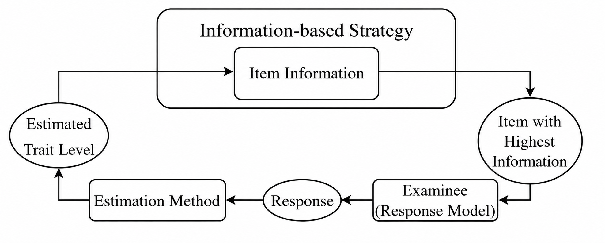
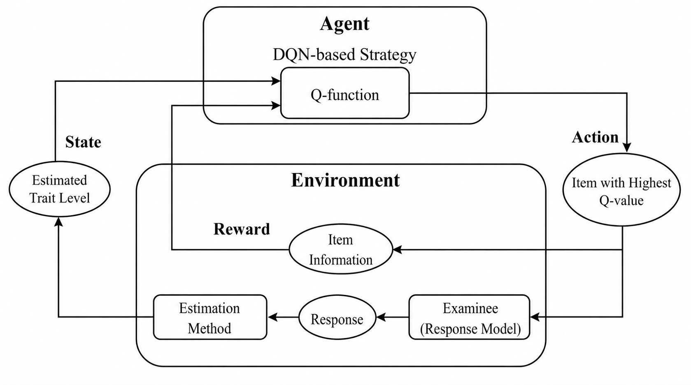
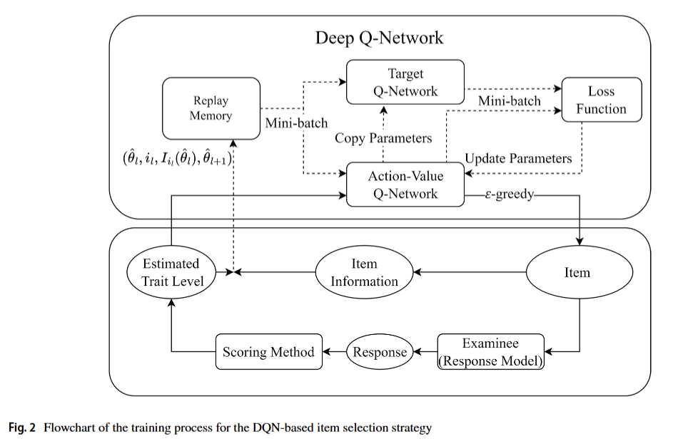
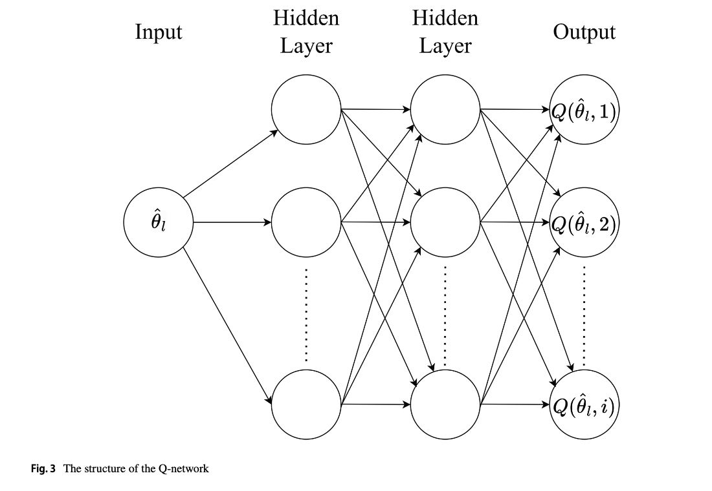
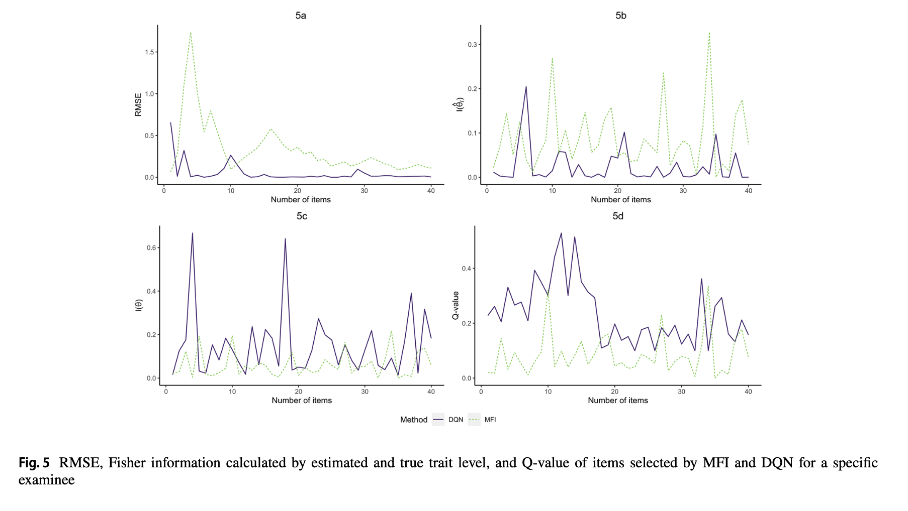
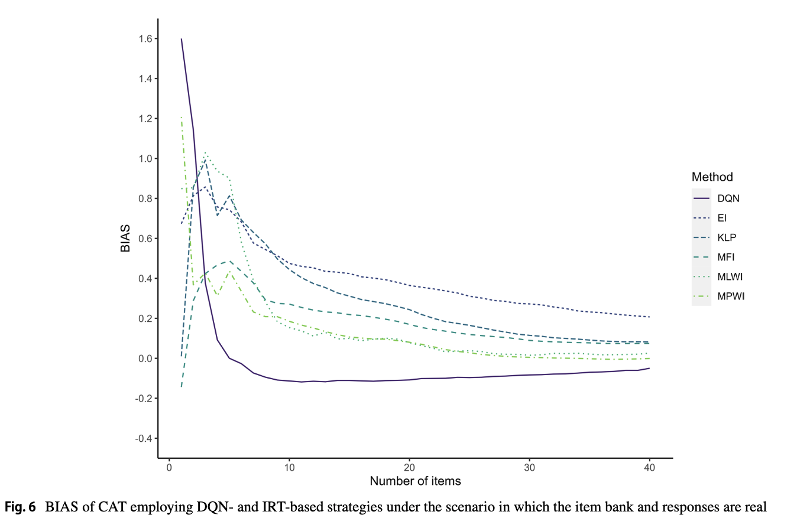
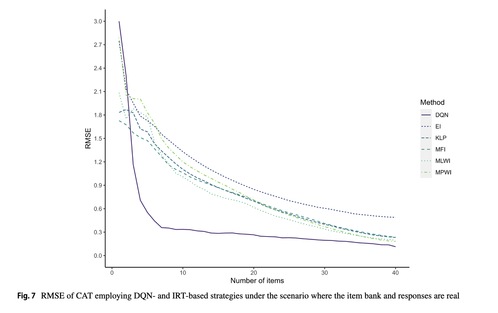
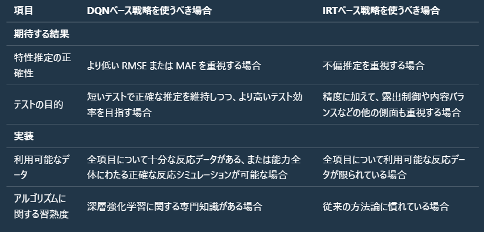

<!--
headingDivider: 1
-->

# An adaptive testing item selection strategy via a deep reinforcement learning approach

# Abstract

コンピュータ適応型テスト（Computerized Adaptive Testing: CAT）は、受検者の反応と推定された特性値を考慮しながら、測定過程を統計的に最適化するよう項目を提示することを目的とする。

近年の強化学習および深層ニューラルネットワークの発展により、CATは次に選ぶ数項目だけに注目するのではなく、残りのテスト全体にわたる情報をより広く活用して項目を選択できる可能性がある。

本研究では、CATを強化学習の枠組みで再定式化し、深層Qネットワーク（Deep Q-Network: DQN）法に基づく新たな項目選択戦略を提案する。
シミュレーション研究および実証研究を通じて、最適なQネットワークを得るために学習過程をどのようにモニタリングするかを示すとともに、DQNに基づく項目選択戦略の精度を、従来の5つの戦略（最大フィッシャー情報量、尤度で重み付けしたフィッシャー情報量、尤度で重み付けしたKullback–Leibler情報量、最大事後重み付け情報量、最大期待情報量）と比較する。

さらに、学習に用いるサンプルサイズや、学習用受検者の特性値分布がDQNの性能に与える影響を検討する。
 
その結果、多くの条件において、DQNはシミュレーションおよび実データの項目バンク・反応データの双方で、従来戦略よりもRMSEおよびMAEが小さいことが示された。DQNに基づく戦略の利用に関する提案と、コードも提示する。

# Introduction

コンピュータ適応型テスト（Computerized Adaptive Testing: CAT）は、スマート・テスティングの広く用いられる手法であり、心理・教育測定における主要な研究テーマでもある（Zhang & Chang, 2016）。

紙筆式テストのような非適応型の形式と比べ、CATはより少ない項目数で、受検者の真の特性値をより正確に推定できる。

これは、受検者の反応に加え、内容バランスや露出制御といった制約も考慮しつつ、統計的に最も情報量の高い項目群を提示することで達成される（Weiss, 1982; Wainer et al., 2000; Frey, 2023）。

効率的な測定を実現する中核過程である項目選択は、CATにおける重要な研究焦点である。実務で用いられてきた従来の項目選択戦略の多くは、項目反応理論（Item Response Theory: IRT; van der Linden, 2016）の枠組みの下で提案されている。

---

最も広く使われる方法は、フィッシャー情報量を最大化する項目を選ぶ最大フィッシャー情報量（Maximum Fisher Information: MFI; Lord, 1980）である。

IRTの文脈では、フィッシャー情報量は特性値の最尤推定量の漸近分散と反比例の関係にある。そのためMFIは、現在の特性値推定値におけるフィッシャー情報量が最大の項目を選ぶだけで、小さな標準誤差を得る。

しかし、フィッシャー情報量を最大化する戦略は完全な手法ではない。

この一般的な方法の主要な欠点の1つは、推定された特性値が真の特性値から大きく外れている場合、フィッシャー情報量が適切な指標にならないことである（Chang & Ying, 1996）。

---

したがって、特にテスト初期の段階では、特性値推定が不正確であるために、MFIが必ずしも最も情報量の高い項目を選べない場合がある（Chen et al., 2000）。一方で、テストが進むにつれて特性値推定の分布は徐々に収束していくが、項目選択においてこの更新された分布は考慮されない（Samejima, 1977）。

このMFIの問題は、戦略改善に関する多くの研究を促してきた。

上記の欠点に対処するため、効率向上を異なる観点から目指す代替戦略が提案されている。IRTの枠組みの中では、情報量指標に焦点を当てた多様な項目選択戦略が改良されてきた（詳細は「CAT item selection strategies based on IRT」節を参照）。

近年、スマート教育に新しい技術やツールが導入されるにつれ、古典的な情報量関連の項目選択戦略を改善する新たな方向性が現れている。

---

第一に、従来のIRTに基づく戦略の多くは、全体最適ではなく局所最適の選択を行う。

項目情報量の複数の変種があるとはいえ、ほとんどの戦略は次の1項目に関する情報のみを考慮するため、さらに数項目先まで見越して得られる潜在的情報を取り込むことが難しい。

シャドー・テスト（van der Linden & Reese, 1998）は残りのテスト全体を計画することを目的とするが、それでも各項目は現在の特性値推定に基づき、次の1項目についての情報量最大化として選ばれる。

もし後に特性値が大きく変化すれば、初期の局所最適な選択はテスト全体としては最適でない可能性がある。

初期段階で全体最適な選択経路が計画されていない場合、中盤・終盤で推定特性値に対して高い情報量をもつ項目が残らないこともありうる。理想的な戦略は先を見通す必要がある。

---

すなわち、推定特性値の変動や後に起こりうる項目選択系列を考慮しつつ、後続のテストで得られる情報を最大化するように各項目を選ぶべきである。

第二に、従来戦略は、他の受検者の受検記録から情報を掘り起こして効率を高めることを考慮しない。

IRTに基づく戦略は、IRTモデルの項目パラメータ更新のために大規模データを利用できるものの、理論枠組み上、他受検者の経験から直接学習することはできない。

過去の受検記録から学習できる柔軟な枠組みに基づく理想的な選択戦略であれば、特性値推定の変化の軌跡、そしてより重要には、ある項目を選んだ後に将来得られるテスト情報を予測できる可能性がある。

これらの短所に対処する有望なアプローチが強化学習（Reinforcement Learning: RL）である。

---

行動心理学に着想を得た学際領域として、RLは複雑な課題を遂行するための優れた方策を探索する知的エージェントを訓練するのに適している（Sutton & Barto, 2018）。

深層学習技術の急速な発展に伴い、RLとニューラルネットワークを組み合わせた革新的アルゴリズム群は「深層強化学習（Deep Reinforcement Learning: DRL）」と呼ばれ、AlphaGo（Silver et al., 2016, 2017）のように、さまざまな先端領域で従来手法や人間の能力を上回ってきた。

近年、RLは、適応学習システムにおける学習教材推薦など、教育測定における長期的かつ適応的な目的をもつ問題の解決に適合し強力であることが、予備的に示されている（Chen et al., 2018; Han et al., 2020; Li et al., 2021, 2023; Tan et al., 2020; Tang et al., 2019）。

---

適応学習と適応型テストは、個人特性に基づいてパーソナライズされた推薦を行い、教材や項目の数を減らして効率を高めるという点で類似しており、この類似性はCATへのRL導入の基盤となる。

実際、先駆的研究のいくつかは、異なる種類のCATにRL枠組みやDRLアルゴリズムを採用し、選択戦略を開発している（Nurakhmetov, 2019; Ghosh & Lan, 2021; Shin & Bulut, 2022）。

分類型CATでは、Nurakhmetov（2019）がCATの要素をRL枠組みの下で再定義し、DRLアルゴリズムに基づく逐次選択戦略を提案した。

このアルゴリズムは、10項目で89.8%の分類精度を達成し、15項目で85.5%であったベースライン戦略を上回った。

---

さらにDRLに基づく手法では、15項目で92.1%まで精度が向上した。Shin and Bulut（2022）は、Nurakhmetov（2019）で導入されたRL枠組みとアルゴリズムをコンピュータ化された形成的評価に適用し、学習軌跡に基づいて学生に提示すべき最適なテストを選択した。

その結果、F1スコア0.90超に示されるように、テスト実施回数を大幅に減らしつつ、比較的高い精度（90%近傍）を達成した。

RL枠組みに基づく項目選択戦略は、大規模オンライン教育システム向けにも提案されている。

Ghosh and Lan（2021）は、受検者をモデル化すると同時に実データから選択戦略を学習するため、CATに対して二段階最適化（bilevel optimization）に基づく枠組みを構築した。

この新枠組みは特性値推定誤差が小さく、Raschモデルで困難度パラメータを一致させる方法と同等の精度に、最大30%少ない項目数で到達した。

---

以上のように、RLは各項目選択において現在だけでなく長期的な情報獲得も考慮する可能性をCATにもたらし、現項目の情報だけを考える従来戦略の近視眼性を補う。

そのため、強化学習を枠組みとして選択戦略を設計することで、より少ない項目数で高い測定精度を実現できる可能性がある。さらにDRLは、すべての経路を網羅的に探索することなく、複雑な状況における適応目標を達成するための最適経路を高精度に見つけられる。

各選択が全体最適経路に沿うなら、DRLに基づく項目選択戦略は、複雑なCAT場面において、より少ない項目数で測定誤差をさらに低減できるかもしれない。

---

一方で、CATへのRL導入に関する既存研究には次のギャップが残る。第一に、3母数ロジスティックモデル（3PLM）のような最も一般的なIRTモデルに基づくCATについて、RL枠組みの定義や選択戦略の提案がなされていない。

既存研究で用いられたRL枠組みは一般的なIRTモデルに適合しない。

Nurakhmetov（2019）の設定（Ghosh & Lan, 2021でも使用）では、受検者の潜在特性は連続体ではなく潜在クラスとして表現されていた。

この枠組みに合わせるため、計算複雑性を成熟した心理測定モデルで抑える代わりに、より複雑なリカレント・ニューラルネットワークが潜在クラス推定に用いられた。

---

第二に、既存研究が戦略実装に用いることの多いDRLアルゴリズムであるアクター・クリティック法は、2つのニューラルネットワークの学習が必要で、しばしば大量の学習データを要する。

上述の研究では受検者数が千人規模から数十万人規模まで及んでいた。第三に、一般的に用いられるIRTモデル向けに設計されたRLベースの項目選択戦略が、長期的情報を考慮することで測定精度を改善できるかどうか、また新戦略の性能に影響する要因を評価する研究が不足している。加えて、上で述べた最も一般的なCATシナリオの下で、新たなRLベース戦略と古典的IRTベース戦略との比較も行われていない。

---

これらの課題に対応するため、本論文は、最も一般的な一次元二値反応のCATに対して、古典的かつ基本的なRL枠組みであるマルコフ決定過程（Markov Decision Process: MDP）を用いて、項目選択問題を再定義することを目的とする。

その上で、導入・実装の困難さを下げ、従来戦略との比較可能性を高めるために、いくつかのIRT概念と手法をMDP枠組みに取り込む。

さらに、単純で効率的なDRLアルゴリズムである深層Qネットワーク（Deep Q-Network: DQN; Mnih et al., 2013, 2015）を用いて項目選択戦略を実装する。

DQNは深層ニューラルネットワークを組み合わせたRLの代表的アルゴリズムとして、ビデオゲーム（Mnih et al., 2013, 2015）、ロボティクス（Gu et al., 2017）、自動運転（Sallab et al., 2017）など多くの分野で成功裏に適用されている。適応学習分野におけるLi et al.（2023）の研究は、DQNを受検者の遷移状態を模擬するモデルと組み合わせることで、必要な学習データ量を大幅に削減できることを示した。

本論文の残りの構成は以下の通りである。

「Deep Q-network for CAT item selection」節では、MDP枠組みの基礎概念と、CATシナリオにおける対応要素を示した上で、DQNアルゴリズムに基づく新しい項目選択戦略を提案する。

「Simulation study」節および「Empirical study based on the real bank and responses」節では、新戦略と5つの従来IRT関連戦略の精度を、さまざまな状況で比較する2つの研究とその結果を提示する。「Discussion」節では、知見の要約と、CATにおけるDQN利用についての議論を行う。

# CAT item selection strategies based on IRT

本節では3母数ロジスティックモデル（3PLM）を例に、IRTに基づく代表的なCATの項目選択戦略を概説する。項目 $i$ に正答する確率 $P_i(\theta)$ は次式で表される。

$(1)\quad P_i(\theta)=c_i+\frac{1-c_i}{1+\exp\{-a_i(\theta-b_i)\}}$

ここで $\theta$ は特性値であり、$a_i,b_i,c_i$ はそれぞれ識別力・困難度・疑似当て推量パラメータである。

フィッシャー情報量は次式で計算される。

$(2)\quad I_i(\theta)=\frac{[P'_i(\theta)]^2}{P_i(\theta)\{1-P_i(\theta)\}}$

ここで $P'_i(\theta)$ は $P_i(\theta)$ の $\theta$ に関する一次導関数である。

CATの $l$ 番目に提示する項目番号を $i_l$ とし、選択時点で未提示の項目集合を $B_l$ とする。

最大フィッシャー情報量（MFI）は、現在の推定特性値 $\hat{\theta}_l$（最尤推定：MLE）において情報量が最大の項目を選ぶ。

$(3)\quad i_l=\arg\max_{i\in B_l} I_i(\hat{\theta}_l)$

Veerkamp and Berger（1997）は、尤度 $L(\theta)$ で重み付けしたフィッシャー情報量を全ての $\theta$ にわたって最大化する戦略（FIWL）を提案した。

$(4)\quad i_l=\arg\max_{i\in B_l}\int_{-\infty}^{\infty} I_i(\theta)\,L(\theta)\,d\theta$

Kullback–Leibler情報量（KL；Chang & Ying, 1996）は、より広い能力域を考慮して項目の識別（弁別）力を評価する「グローバルな情報量尺度」である。KLに基づく項目選択は、応用上は尤度で重み付けして用いられることが多く（KLP）、次式で表される。

$(5)\quad i_l=\arg\max_{i\in B_l}\int_{-\infty}^{\infty} KL_i(\theta\mid \hat{\theta}_l)\,L(\theta)\,d\theta$

ここで $KL_i(\theta\mid \hat{\theta})$ は次式で計算される。

$(6)\quad KL_i(\theta\mid \hat{\theta})=
P_i(\hat{\theta})\ln\!\left(\frac{P_i(\hat{\theta})}{P_i(\theta)}\right)
\;+\;\{1-P_i(\hat{\theta})\}\ln\!\left(\frac{1-P_i(\hat{\theta})}{1-P_i(\theta)}\right)$

FIWLおよびKLPは、短いテスト長ではMFIより高精度になりうる（Chen et al., 2000）。

van der Linden（1998）は、事後分布全体を利用するベイズ的アプローチを提案した。最大事後重み付け情報量（MPWI）は、更新された特性値の事後分布 $G(\theta)$（ベイズの定理で得られる）にわたって情報量を最大化する。

$(7)\quad i_l=\arg\max_{i\in B_l}\int_{-\infty}^{\infty} I_i(\theta)\,G(\theta)\,d\theta$

最大期待情報量（MEI）は、事後予測分布に基づき、対象項目に正答／誤答する確率を考慮して期待情報量を評価する。

$(8)\quad i_l=\arg\max_{i\in B_l}\Bigl[P_i(\hat{\theta}_l)I_i(\hat{\theta}_{u,i=1})+\{1-P_i(\hat{\theta}_l)\}I_i(\hat{\theta}_{u,i=0})\Bigr]$

ここで $\hat{\theta}_{u,i=1}$ と $\hat{\theta}_{u,i=0}$ は、項目 $i$ を選択して正答／誤答した場合に更新される特性値推定であり、MAP（最大事後）やEAP（事後期待）により得られる。短いテストではベイズ法が推定の平均二乗誤差を低下させうる（Meijer & Nering, 1999）。

# MDP(マルコフ決定過程) framework and its corresponding elements in CAT

CATプロセスは主に、(1) 項目バンク、(2) テスト開始、(3) 推定法、(4) 項目選択戦略、(5) 制約管理、(6) テスト終了、の6要素から構成される（Weiss & Kingsbury, 1984; Frey, 2023）。

本研究で強化学習（RL）を導入する対象は、このうち項目選択戦略のみである。残り5要素は、従来どおり古典的IRTモデルと一般的CAT手法で実装できる。

項目選択は、テストシステムと受検者の循環的相互作用として捉えられる。

情報量ベース戦略は、推定特性値を受け取り、較正済み項目バンクから各項目の情報量指標を計算し、最大の項目を選ぶ。

図1(a)　IRT に基づく項目選択戦略のフローチャート

図1(b)　MDP 枠組みにおける RL ベースの項目選択戦略のフローチャート

受検者（またはシミュレーション反応モデル）が応答し、推定法が特性値を更新して1サイクルが完了する。

複数サイクルを通じたCATの目的は、累積項目情報量の最大化であり、この構図はRLの枠組みと整合的である。

RLでは、MDPは逐次意思決定問題の数理的抽象化である。

CATへ適用した場合、仮想エージェントは項目選択を担当し、入力（状態）は特性値、出力（行動）は項目となる。

エージェントと相互作用する「環境」は、項目へ応答する受検者（または反応を生成するIRTモデル）と、反応を特性値へ変換する推定法を含む。

状態遷移は環境モデルに対応する。

MDPでは環境が状態に加えて即時フィードバック（報酬）を返すが、CATではこれは項目応答後に得られる項目情報量（例：フィッシャー情報量）に相当する。

さらに、長期的意思決定の目的関数としてQ関数を用い、現在選択からテスト終了までに蓄積される項目情報量の重み付き期待和を評価する。

したがって、Q値最大の項目を選ぶことが長期最適選択となる。

このMDP記述において、新戦略の役割は従来IRT戦略と変わらず、違いは「RLアルゴリズムで項目選択戦略をどう獲得するか」にある。

著者らはこの定式化の利点として次の3点を挙げる。

第一に、状態を特性値とすることで、従来IRT戦略の設計論理（推定特性値に基づく選択）と整合する。

第二に、環境（IRTモデル・MLE）や報酬（フィッシャー情報量）を使うことで、複雑な追加モジュールを導入せずにMDP要素を効率的・高精度に計算できる。

第三に、MDPエージェントの目的（系列全体で累積報酬最大化）が、テスト情報量最大化と一致する。

CATの項目選択戦略は、MDPにおける方策 $\pi$ に対応する。方策とは任意の状態入力に対して行動を選ぶ規則集合であり、CATでは「任意の特性値に対してどの項目を選ぶか」を定める。

固定長 $L$ 項目のCATを仮定し、$l$ 番目で項目 $i_l$ を選ぶときの推定特性値を $\hat{\theta}_l$、その項目のフィッシャー情報量を $I_{i_l}(\hat{\theta}_l)$ とする。

以降の $L-l$ 項目を方策 $\pi$ に従って選ぶとき、重み付き情報量和の期待値はQ関数で表される。

$(9)\quad Q_{\pi}(\hat{\theta}_l,i_l)=\mathbb{E}_{\pi}\!\left[I_{i_l}(\hat{\theta}_l)+\sum_{k=l+1}^{L}\gamma^{k-l}I_{i_k}(\hat{\theta}_k)\,\middle|\,\hat{\theta}_l,i_l\right]$

ここで $\gamma\in(0,1)$ は割引率であり、将来報酬をどれだけ重視するかを制御する（大きいほど将来重視）。

CAT文脈では、Q関数は「現在の選択の良さ」だけでなく、「その後の系列が方策 $\pi$ に従うことを前提とした方策自体の質」も評価する。

理想的な項目選択戦略を得るには最適方策 $\pi^\*$ を特定する必要がある。$\pi^\*$ は任意の $(\hat{\theta}_l,i_l)$ に対して全方策中で最大Q値を与える方策であり、

$(10)\quad Q_{\pi^\*}(\hat{\theta}_l,i_l)=\max_{\pi}Q_{\pi}(\hat{\theta}_l,i_l)$

と定義される。

最適方策が得られれば、各特性値で最大Q値の項目を選ぶことで理論上の最適戦略が得られる。

$(11)\quad i_l=\arg\max_{i\in B_l}Q_{\pi^\*}(\hat{\theta}_l,i)$

一方で実装上の課題は2つある。第一に、あらゆる特性値と項目に対するQ値を精度よく求めること。

第二に、それらから最大Q値を同定することである。$\hat{\theta}$ は連続変数で取りうる値が無限にあり、$B_l$ も大きくなり得るため、Q関数は高次元・非線形で入出力空間が非常に大きい。

単純な線形モデルでは十分に近似できない。CATのような逐次テストで全系列を網羅して最適方策を探索するのも現実的ではない。

したがって、限られたデータで最適方策 $pi$ を探索し、対応するQ関数 $Q_{\pi^\*}$ を近似できるニューラルネットワーク構造と、適切に設計された学習アルゴリズムが必要となる。

# New item selection strategy based on the DQN algorithm

IRTベース戦略と同様に、CATの項目選択ではQ関数を用いる。

入力は連続変数 $\hat{\theta}$、出力は項目バンク内で選択可能な各項目のQ値である。

この入出力関係は複雑な非線形関数であり、DQNは離散行動空間と複雑なQ関数に適している（Mnih et al., 2013, 2015）。

DQNベースの新戦略では、任意の $(\hat{\theta}_l,i_l)$ に対して、その後に起こりうる全系列の情報量和の期待値を与える最適方策のQ関数を近似する。

全可能性をMEIのように終端まで総当たりで計算すると、計算量・時間・メモリ消費が実用的でない。そこでDQNは、限られた項目選択記録からニューラルネットワークで最適方策のQ関数を探索・学習する。

DQN学習は、(1) 方策選択（最適方策の探索）と、(2) 方策評価（その方策Q関数の近似）に分かれる。

方策選択では $\epsilon$-greedy を用い、確率 $\epsilon$ でランダム選択（探索）、確率 $1-\epsilon$ でQ値最大項目を選択（活用）する。

十分な状態空間探索と、異なる特性値に対する項目選択データの蓄積があれば、データがランダム方策由来でも最適方策Q関数の推定精度は損なわれにくい（Zai & Brown, 2020）。

方策評価では、Qネットワークをより安定に最適Q関数へ収束させるため、ターゲットネットワークと経験再生を用いる（Mnih et al., 2013, 2015）。

同一構造の2ネットワークを用意し、行動価値ネットワーク $Q_{\text{action}}$ は行動選択とQ関数近似を担い、ターゲットネットワーク $Q_{\text{target}}$ は $Q_{\text{action}}$ の学習目標値を計算する。

$Q_{\text{target}}$ を別に置き、一定間隔で $Q_{\text{action}}$ の重みをコピーすることで、学習の安定化と予測精度向上が得られる。

CATにおける2つのQネットワークの関係は次式で与えられる（$\omega$ は $Q_{\text{action}}$、$\omega'$ は $Q_{\text{target}}$ のパラメータ）。

$(12)\quad Q_{\text{action}}(\hat{\theta}_l,i_l;\omega)\equiv I_{i_l}(\hat{\theta}_l)+\gamma\cdot\max_{i\in B_{l+1}}Q_{\text{target}}(\hat{\theta}_{l+1},i;\omega')$

経験再生では、方策選択で得た記録 $e_l=\{\hat{\theta}_l,i_l,I_{i_l}(\hat{\theta}_l),\hat{\theta}_{l+1}\}$ をメモリ $D=\{e_1,\dots,e_{N_D}\}$ に格納し、容量制限下で更新し続ける。ミニバッチ $m$ 件をランダム抽出して $Q_{\text{action}}$ を更新することで、時間相関を弱め、学習を安定化・高速化する。

著者らのDQN学習アルゴリズムは次の通りである。まず $Q_{\text{action}}$ をランダム重み $\omega$、$Q_{\text{target}}$ を $\omega'=\omega$ で初期化し、メモリサイズ $N_D$ の経験再生バッファ $D$ を用意する。つぎに $N_{\text{training}}$ 人について、各受検者ごとに以下を反復する。

- (0) 初期特性値 $\hat{\theta}_1$ を生成
- テスト系列 $l=1,\dots,L$ で:
- (1) $\hat{\theta}_l$ を $Q_{\text{action}}$ に入力し、$B_l$ の項目Q値を取得
- (2) 確率 $\epsilon$ で $B_l$ からランダム選択、そうでなければ $i_l=\arg\max_{i\in B_l}Q_{\text{action}}(\hat{\theta}_l,i;\omega)$
- (3) $I_{i_l}(\hat{\theta}_l)$ を計算し、推定法で $\hat{\theta}_{l+1}$ を得る
- (4) $\{\hat{\theta}_l,i_l,I_{i_l}(\hat{\theta}_l),\hat{\theta}_{l+1}\}$ を $D$ に格納
- $|D|>m$ なら:
- (5) $D$ から $m$ 件のミニバッチを抽出
- (6) 損失関数最小化で $Q_{\text{action}}$ の $\omega$ を更新
- (7) $Q_{\text{action}}$ 更新を $\tau$ 回行うごとに $\omega'=\omega$ をコピー

$Q_{\text{action}}$ 更新に用いる損失関数は、固定長CATの終端か途中かで次の2形をとる。

$(13)\quad
\mathcal{L}=
\begin{cases}
\left[I_{i_l}(\hat{\theta}_l)-Q_{\text{action}}(\hat{\theta}_l,i_l;\omega)\right]^2, & l=L \\
\left[I_{i_l}(\hat{\theta}_l)+\gamma\max_{i\in B_{l+1}}Q_{\text{target}}(\hat{\theta}_{l+1},i;\omega')-Q_{\text{action}}(\hat{\theta}_l,i_l;\omega)\right]^2, & \text{otherwise}
\end{cases}
$

本研究のMDPはIRT概念を組み込み、DQNが実データ・シミュレーションデータの双方から学習できる。実データの場合、手順(3)の $\hat{\theta}_{l+1}$ は実受検者の反応（または過去反応記録）から推定される。シミュレーションデータの場合はIRTモデル等で反応を生成する。両者はそれぞれ精度・コストの利点があり、単独でも併用でも学習可能である。

手順(4)の記録は項目番号 $i_l$ を含むが項目パラメータ自体は含まないため、各Qネットワークは学習元の項目バンクに固有となる。したがって項目バンクが変わると同じ特性値でも最適項目が変わりうる。実務上は、新規項目に対応するデータと残存項目の反応データを統合し、同じ学習手順で $Q_{\text{action}}$ を微調整または再学習することが推奨される。

また、手順(1)〜(7)のループ内要素は同一受検者 $n$ に属し、手順(5)〜(6)のミニバッチだけがメモリからランダム抽出されるため、任意受検者・任意テスト長の記録が混在しうる。本研究は固定長CATを仮定しているが、可変長CATではループ終了条件と、手順(6)の終端用損失条件を調整すればよい。

Fig. 2 が示す通り、学習後にDQNで項目選択を行う場合（Fig. 1b）と比べても、DQN戦略の学習時にIRT法で実装された環境の役割は変わらない。

これは、DQNベース戦略の学習がIRTモデルでも実反応でも同じ学習過程で実施可能であることを意味する。

# Simulation study

## Designs

新たに提案したDQNベースの項目選択戦略について、選択精度の観点から、5つの従来IRTベース戦略（MFI, FIWL, KLP, MPWI, MEI）とシミュレーション研究で比較した。項目パラメータの生成とフィッシャー情報量の計算には3PLMを用いた。

項目の $a$ と $b$ パラメータは通常相関をもつことが知られているため（Wingersky & Lord, 1984; Chang et al., 2001）、2種類の項目バンクを生成した。ひとつは $a$ と $b$ が無相関（$r_{ab}=0$）、もうひとつは相関あり（$r_{ab}=0.5$）である。項目パラメータ分布、項目バンク数、項目数の設定は既存研究（Barrada, Abad, & Veldkamp, 2009a; Barrada, Olea, et al., 2009b, 2010; Sorrel et al., 2020）に準拠した。

各タイプは10個の項目バンクからなり、各バンクは500項目で構成した。項目パラメータ分布は $a\sim N(1.2,0.25)$, $b\sim N(0,1)$, $c\sim N(0.25,0.02)$ とした。各項目バンクについて、5000人の受検者の特性値を $N(0,1)$ からランダム生成した。初期特性値は区間 $[-0.5,0.5]$ の一様分布からランダムに与えた。

Dodd（1990）の方法を、各受検者で正答と誤答の双方が出るまで適用した。全問正答の場合は $\hat{\theta}_{l+1}$ を $(b_{\max}-\hat{\theta}_l)/2$ だけ増加させ、全問誤答の場合は $\hat{\theta}_{l+1}$ を $(\hat{\theta}_l-b_{\min})/2$ だけ減少させた。ここで $b_{\max}$ と $b_{\min}$ は、それぞれ項目バンク内の困難度パラメータの最大値と最小値である。

その後、特性値は範囲 $[-4,4]$ でMLEにより推定した。

テスト長は10, 20, 30, 40項目の4条件を用いた。2つのベイズ戦略で用いる事前分布は標準正規分布とし、MEIで必要な予測特性値の推定にはMAPを用いた。5つのIRTベース戦略による項目選択、反応生成、能力推定は、Rパッケージ `catR`（Magis & Barrada, 2017）の関数で実装した。

# Evaluation criteria

CATで広く用いられる4つの指標を用いて、受検者の真の特性値の回復精度を評価した（He et al., 2014）。評価指標は以下のとおりである。

- BIAS
- 平均絶対誤差（MAE）
- 二乗平均平方根誤差（RMSE）
- 真の特性値と最終推定値の相関

まず、BIASは次式で定義される。

$(14)\quad \mathrm{BIAS}=\frac{1}{N}\sum_{n=1}^{N}(\hat{\theta}_n-\theta_n)$

ここで $N$ は受検者数、$\hat{\theta}_n$ と $\theta_n$ はそれぞれ $n$ 番目受検者の推定特性値と真の特性値である。

MAEは次式で与えられる。

$(15)\quad \mathrm{MAE}=\frac{1}{N}\sum_{n=1}^{N}\left|\hat{\theta}_n-\theta_n\right|$

RMSEは次式で与えられる。

$(16)\quad \mathrm{RMSE}=\sqrt{\frac{1}{N}\sum_{n=1}^{N}(\hat{\theta}_n-\theta_n)^2}$

上記3指標（BIAS, MAE, RMSE）は値が小さいほど戦略の推定精度が高い。

真の特性値と最終推定値の相関は次式で定義される。

$(17)\quad r_{\theta,\hat{\theta}}=\frac{\sum_{n=1}^{N}(\theta_n-\bar{\theta})(\hat{\theta}_n-\bar{\hat{\theta}})}{S_{\theta}S_{\hat{\theta}}}$

ここで $\bar{\theta}$ と $S_{\theta}$ は全受検者の真の特性値の平均と標準偏差、$\bar{\hat{\theta}}$ と $S_{\hat{\theta}}$ は全受検者の推定特性値の平均と標準偏差である。この相関は値が大きいほど戦略が優れていることを示す。

# Implementation of the DQN algorithm

20個のシミュレーション項目バンクそれぞれについて、同一のネットワーク構造と学習手順で最適Qネットワークを学習した。

DQN自体はQネットワークの構造に制約を課さないが、本研究では非線形活性化関数をもつ多層全結合ネットワークを採用した。

入力層と出力層の間に2つの隠れ層を置き、各隠れ層にはReLU（Rectified Linear Unit）を用いた（ReLU(x)=max(0,x)）。

Qネットワークの構造はFig. 3（Tan et al., 2019と同様）で示される。

入力次元は1（`θ̂`）、出力次元は500（項目バンクサイズ）である。2つの隠れ層のユニット数はそれぞれ50と30であり、総パラメータ数は17,130となる（各層接続の前に切片相当のユニットを加える）。Qネットワークが算出する情報量を正に保つため、ネットワークパラメータには正値制約を課した。

シミュレーション研究では、シミュレーション反応データを用いたDQN学習を示す。項目パラメータ較正に用いるIRTモデルとの整合性のため、DQN学習用反応生成には3PLMを用いた。深層学習の一般則として、学習データ量が大きいほど性能向上の可能性は高い（Goodfellow et al., 2016）。ただし、実運用のCATで人間受検者や実反応記録を大量に収集することは困難かつ高コストであり、特に戦略比較で用いた規模（`Ntesting=5000`）ではその負担が大きい。さらに、実反応記録を使う場合は、DQNが選択しうる全項目について、反応または更新後能力値をデータ内で参照できるよう十分な記録数が必要となる。

DQN性能に影響しうるもう一つの要因は、学習段階における受検者真の能力分布である。

これは学習データ中の`θ̂`の分布を規定し、学習された最適戦略がテスト段階へ一般化できるかに関わる。

一般に汎化性能を高めるには学習・テスト分布の一致が望ましい（Goodfellow et al., 2016）。

そこで、対象受検者の能力分布が既知とみなせる条件を模擬するため、学習データ生成の能力分布をテスト段階と同じ標準正規分布に設定した。

一方、実務では対象集団の能力分布を正確に事前把握できない場合がある。

このため、DQNが全能力域のデータに触れられるよう、`-3`〜`3`の一様分布でも学習用受検者を生成した。要するに、標準正規分布での学習を理想条件、一様分布での学習を分布情報が乏しい場合の補完的アプローチとして扱っている。

過学習を避け、汎化性の高いDQNを得るため、学習過程に検証フェーズを設けた。

上記アルゴリズムでQネットワークを更新する段階を「学習フェーズ」と呼ぶ。

学習フェーズで $N_{interval}$ 人分（`Ninterval`は`Ntraining`の約数）の記録を用いて`Qaction`を更新するたびに、テスト段階と同一能力分布の`Nvalidation`人が、その時点の最適`Qaction`と相互作用して`L`項目CATを完了する。

学習・検証の両フェーズで、DQNの損失、報酬、選択精度RMSEを記録し、Qネットワークの収束とデータ量効果をモニタした。

加えて、割引率`γ`は収束性・汎化性能に正の影響を与える（Schulman et al., 2015; Amit et al., 2020）。

`γ`が不適切だとQネットワークは収束しにくく、学習方策も全体最適にならない。

項目バンクや受検者集団により最適`γ`は異なりうるため、各バンク・各分布条件で`γ=0.1, 0.3, 0.6, 0.9`を試して最適 $Q_{action}$ を探索した。

最適値を迅速に見つけ過学習を防ぐため、学習には早期終了を用いた。損失が高止まりする、減少しない、または学習・検証で大きく乖離する場合は学習を停止して`γ`を調整した。

最適`γ`決定後は、1000人が40項目テストを完了するまで学習を継続した。

経験再生メモリサイズは $N_D = 1000$ とした。

$Q_{action}$ を40回（`τ`）更新するごとに $Q_{target}$ を1回更新した。

すなわち、各受検者が40項目を完了するたびに $Q_{target}$ を更新する設定である。

ミニバッチサイズ $m$ は128、最適化はAdam（Kingma & Ba, 2014）、学習率は0.001とした。

検証フェーズの能力分布は標準正規分布であり、各受検者は学習・検証の両フェーズで40項目（`L`）を受けた。

$N_{interval}=50$、$N_{validation}=200$とした。

40項目テストにおいて、平均BIASとRMSEが低く、報酬が高い場合に、新しい $Q_{action}$ を最適モデルとして保存した。

DQNに基づく項目選択戦略は、この最適`Qaction`が算出するQ値最大の行動（式(11)）を採用する。その後テスト段階で5000人にDQNを適用し、従来戦略と比較した。

`ε`-greedyの`ε`は、学習フェーズで0.1、検証・テストフェーズで0に設定した。

DQNに関わる学習と評価はPythonの深層学習フレームワークPyTorch（Paszke et al., 2019）で実装し、GPU上でCUDA/cuDNNにより高速化した。

計算環境は、CPUがIntel Core i7-7700 @3.60GHz、GPUがNvidia GeForce GTX 1080Ti（メモリ8192MB）である。

# Results

Fig. 4 は、学習サンプルサイズの増加に伴う、学習フェーズ・検証フェーズの損失とテスト情報量の変化を示している。

この図では、項目パラメータ $a$ と $b$ の相関（$r_{ab}=0/0.5$）および DQN 学習用受検者の特性値分布（標準正規分布／一様分布）の効果は小さく、線はほぼ重なっていたため、条件別には表示されていない。

全項目バンクの最適 Q ネットワークについて、学習フェーズの損失は100名程度の学習で急速に低下し、その後も低い水準で維持された。

さらに100名程度との相互作用後には、検証フェーズの損失も非常に低い水準まで低下し、増加しなかった。学習フェーズと検証フェーズが近い値を示したため、過学習は確認されなかった。

一方、重み付けしない累積報酬、すなわち40項目テストのテスト情報量は、最初の200名で急速に増加し、その後も学習データ量の増加に伴って緩やかに増加した。

これは、DQN が学習データの増加に応じてより良い方策を探索し続けることを示している。学習フェーズで損失が一貫して低かったことは、新たな最適方策が見つかった場合でも、Q ネットワークがその方策の Q 関数へ迅速かつ正確に収束することを示す。

検証フェーズのテスト情報量は学習フェーズより常に高かった。これは、学習フェーズでは $\epsilon=0.1$ による10%のランダム選択を含む一方、検証フェーズでは $\epsilon=0$ とし、最適 $Q_{action}$ が算出する最大 Q 値の項目だけを選ぶためである。

割引率 $\gamma=0.1, 0.3, 0.6, 0.9$ のうち、最良モデルが得られた割合はそれぞれ40%、45%、15%、0%であった。

Table 1　$a$ と $b$ が無相関の項目バンクにおける各項目選択戦略の特性値回復

| テスト長 | 手法 | BIAS | RMSE | MAE | $r_{\theta,\hat{\theta}}$ |
|---:|---|---:|---:|---:|---:|
| 10 | DQN (normal) | -0.038 | 0.415 | 0.313 | 0.950 |
| 10 | DQN (uniform) | -0.014 | 0.348 | 0.276 | 0.964 |
| 10 | MFI | 0.037 | 0.493 | 0.371 | 0.899 |
| 10 | KLP | 0.018 | 0.443 | 0.343 | 0.914 |
| 10 | FIWL | 0.021 | 0.459 | 0.354 | 0.909 |
| 10 | MPWI | 0.020 | 0.456 | 0.347 | 0.912 |
| 10 | MEI | 0.025 | 0.455 | 0.347 | 0.911 |
| 20 | DQN (normal) | -0.074 | 0.278 | 0.208 | 0.977 |
| 20 | DQN (uniform) | -0.061 | 0.254 | 0.204 | 0.981 |
| 20 | MFI | 0.012 | 0.331 | 0.257 | 0.950 |
| 20 | KLP | 0.012 | 0.322 | 0.250 | 0.952 |
| 20 | FIWL | 0.011 | 0.324 | 0.253 | 0.952 |
| 20 | MPWI | 0.011 | 0.320 | 0.250 | 0.953 |
| 20 | MEI | 0.012 | 0.324 | 0.253 | 0.952 |
| 30 | DQN (normal) | -0.034 | 0.244 | 0.187 | 0.982 |
| 30 | DQN (uniform) | -0.001 | 0.207 | 0.167 | 0.987 |
| 30 | MFI | 0.007 | 0.277 | 0.216 | 0.965 |
| 30 | KLP | 0.007 | 0.272 | 0.212 | 0.965 |
| 30 | FIWL | 0.008 | 0.274 | 0.214 | 0.965 |
| 30 | MPWI | 0.006 | 0.272 | 0.213 | 0.966 |
| 30 | MEI | 0.007 | 0.273 | 0.213 | 0.965 |
| 40 | DQN (normal) | -0.008 | 0.227 | 0.176 | 0.986 |
| 40 | DQN (uniform) | -0.004 | 0.207 | 0.169 | 0.989 |
| 40 | MFI | 0.005 | 0.245 | 0.191 | 0.972 |
| 40 | KLP | 0.006 | 0.243 | 0.190 | 0.972 |
| 40 | FIWL | 0.006 | 0.245 | 0.191 | 0.972 |
| 40 | MPWI | 0.006 | 0.243 | 0.190 | 0.972 |
| 40 | MEI | 0.005 | 0.244 | 0.191 | 0.972 |

Table 2　$a$ と $b$ が相関する項目バンクにおける各項目選択戦略の特性値回復

| テスト長 | 手法 | BIAS | RMSE | MAE | $r_{\theta,\hat{\theta}}$ |
|---:|---|---:|---:|---:|---:|
| 10 | DQN (normal) | 0.003 | 0.450 | 0.375 | 0.961 |
| 10 | DQN (uniform) | 0.015 | 0.438 | 0.347 | 0.947 |
| 10 | MFI | 0.018 | 0.554 | 0.404 | 0.878 |
| 10 | KLP | -0.003 | 0.493 | 0.371 | 0.898 |
| 10 | FIWL | 0.011 | 0.541 | 0.398 | 0.881 |
| 10 | MPWI | -0.006 | 0.507 | 0.374 | 0.893 |
| 10 | MEI | 0.003 | 0.512 | 0.377 | 0.890 |
| 20 | DQN (normal) | -0.013 | 0.299 | 0.239 | 0.978 |
| 20 | DQN (uniform) | 0.012 | 0.301 | 0.242 | 0.973 |
| 20 | MFI | 0.002 | 0.368 | 0.277 | 0.940 |
| 20 | KLP | -0.001 | 0.349 | 0.268 | 0.945 |
| 20 | FIWL | 0.004 | 0.361 | 0.275 | 0.942 |
| 20 | MPWI | -0.003 | 0.352 | 0.267 | 0.944 |
| 20 | MEI | 0.001 | 0.356 | 0.271 | 0.942 |
| 30 | DQN (normal) | -0.011 | 0.238 | 0.180 | 0.984 |
| 30 | DQN (uniform) | -0.005 | 0.237 | 0.175 | 0.977 |
| 30 | MFI | -0.001 | 0.301 | 0.229 | 0.959 |
| 30 | KLP | -0.001 | 0.291 | 0.225 | 0.961 |
| 30 | FIWL | 0.000 | 0.299 | 0.229 | 0.959 |
| 30 | MPWI | -0.003 | 0.296 | 0.225 | 0.959 |
| 30 | MEI | -0.001 | 0.296 | 0.227 | 0.959 |
| 40 | DQN (normal) | -0.037 | 0.250 | 0.190 | 0.986 |
| 40 | DQN (uniform) | -0.004 | 0.224 | 0.168 | 0.982 |
| 40 | MFI | -0.002 | 0.266 | 0.203 | 0.967 |
| 40 | KLP | -0.002 | 0.259 | 0.200 | 0.968 |
| 40 | FIWL | -0.001 | 0.263 | 0.203 | 0.968 |
| 40 | MPWI | -0.004 | 0.264 | 0.201 | 0.967 |
| 40 | MEI | -0.001 | 0.263 | 0.201 | 0.967 |

シミュレーション研究の結果は項目バンクの種類（$r_{ab}=0/0.5$）別に提示され、各評価指標は各種類10バンクの平均値として計算された。

Table 1およびTable 2に示されるように、テスト段階におけるDQNベース戦略は、2種類の項目バンク、4種類のテスト長のすべてで、5つの古典的IRTベース戦略より低いRMSE・MAEと高い相関を示した。

特に一様分布で学習したDQNは、標準正規分布で学習したDQNより良好な傾向を示した。RMSEとMAEの観点では、DQNは20項目で、従来戦略が30項目を必要とする程度の測定精度に到達した。

従来戦略ではテスト長が伸びても同じ項目を選びやすく、長いテストでの精度が類似しやすい。30項目から40項目へ増やした場合、従来戦略のRMSEはほとんど変化しなかったのに対し、DQNはRMSEをさらに低下させた。

BIASについては、DQNは短いテスト長では従来戦略よりやや大きい値を示したが、許容範囲内であり、40項目の長いテストでは従来戦略と同程度の水準であった。

Table 3およびTable 4では、受検者を真の特性値に基づいて5群（$(-3,-1)$, $(-1,-0.5)$, $(-0.5,0.5)$, $(0.5,1)$, $(1,3)$）に分け、各群のRMSEを示している。

これらの結果から、どちらの分布で学習した場合でも、DQNはほとんどの群・テスト長・バンク種類で5つのIRTベース戦略より低いRMSEを示した。標準正規分布で学習したDQNは平均付近の受検者でRMSEを下げやすく、一様分布で学習したDQNは非常に高いまたは低い特性値をもつ受検者で特に低いRMSEを示した。

Table 5およびTable 6では、同じ5群に対するBIASを示している。

従来戦略は群ごとのBIASが正負に分かれやすい一方、DQNでは多くの場合、BIASがゼロの片側に偏る傾向があった。そのため、1つの項目バンク内の5000名全体で方向性をもつBIASが生じ、10バンクの結果を統合しても完全にはゼロにならなかった。

Fig. 5 は、$r_{ab}=0$ の項目バンクにおいて、真の特性値が $-1.361$ である1名のシミュレーション受検者について、MFIと標準正規分布で学習したDQNの40項目テストにおける項目選択を比較したものである。

DQNは最初の5項目でRMSEを急速に低下させ、10項目目以降はMFIより一貫して低いRMSEを示した。

現在の推定特性値に基づいてフィッシャー情報量を計算すると、MFIは多くの場合、より高いフィッシャー情報量をもつ項目を選んでいた。

しかし真の特性値に基づいてフィッシャー情報量を計算すると、DQNが選択した項目の方が有意に高いフィッシャー情報量をもっていた。

さらに両戦略が選択した全項目を最適Qネットワークへ入力すると、DQNが選んだ項目はMFIが選んだ項目より高いQ値を示した。40項目中、両戦略で重複した項目は5項目のみであった。

これらの結果は、最適Qネットワークが算出するQ値が、真の特性値に適した項目を識別できること、そしてDQNベース戦略がテスト全体の大域的に最適な系列を計画できることを示している。

# Empirical study based on the real bank and responses

シミュレーション研究では、提案するDQNベース項目選択戦略の実現可能性と有効性を評価した。

本節では、実受検者の反応データを用いてDQNベース戦略を学習する方法を示し、従来戦略と新戦略の精度を比較する。

## Designs

データは中国の大規模医学試験に由来する。

項目バンクは4選択肢の多肢選択式371項目で構成され、3PLMにより較正されている。項目パラメータの記述統計はTable 7に示す。

Table 7　実項目バンクにおける項目パラメータの記述統計

| パラメータ | 平均 | 標準偏差 | 最大値 | 最小値 |
|---|---:|---:|---:|---:|
| $a$ | 1.045 | 0.379 | 0.486 | 2.351 |
| $b$ | 0.383 | 1.751 | -3.891 | 5.161 |
| $c$ | 0.146 | 0.121 | 0.000 | 0.401 |

実反応データでDQNを学習する場合も、多数の経験記録 $e_l=\{\hat{\theta}_l,i_l,I_{i_l}(\hat{\theta}_l),\hat{\theta}_{l+1}\}$ が必要となる。

つまり、現在の最適DQNベース戦略が任意の特性値 $\hat{\theta}_l$ で選択する任意の項目 $i_l$ について、$\hat{\theta}_{l+1}$ を推定するための対応反応がデータ内に存在する必要がある。

そのため、全項目に反応した受検者を用い、全問正答または全問誤答の受検者は除外した。

シミュレーション研究の学習・テスト段階と人数をそろえるため、DQN学習に5000名分の反応データを用い、別の5000名をDQNの精度評価と従来戦略との比較に用いた。

全項目への反応から推定した特性値を真値として扱った。

評価指標には、前節で述べたBIAS、RMSE、MAE、相関を用い、10、20、30、40項目の4つのCAT長で各戦略の特性値推定を評価した。

学習段階・テスト段階とも、3PLMによる生成反応ではなく実反応データを用いた。

初期特性値、能力推定法、ベイズ項目選択戦略の事前分布およびMEIで用いる推定法は、シミュレーション研究と同じ設定とした。

DQNは類似の問題設定に対して同じネットワーク構造とハイパーパラメータを利用できるため、DQNのハイパーパラメータと学習過程もシミュレーション研究と同じ設定とした。

## Results

Fig. 6は、実項目バンク・実反応データの条件における各戦略のBIASを示している。

DQN戦略は、実項目バンク・実反応データにおいて、5つの従来戦略より不偏性の点で優れていた。

テスト開始後5項目以内にDQNのBIASは急速に0に近づき、その後も0付近に維持された。

従来手法ではテストが進むにつれてBIASが徐々に低下し、10項目以降にはFIWLとMPWIだけがDQNと近いBIASを示した。

Fig. 7は、実項目バンク・実反応データの条件における各戦略のRMSEを示している。

DQNは従来戦略より高い測定精度とテスト効率を示した。DQN戦略は最初の10項目以内にRMSEを非常に低い水準まで急速に低下させたが、従来手法が同程度に達するには約30項目を必要とした。

さらにDQNは、20項目選択後の時点で、従来手法がおおよそ40項目後に到達するRMSE水準を達成した。その後もDQNは最も低いRMSEを一貫して維持し、この傾向はシミュレーション研究の結果と整合していた。

# Discussion

本研究では、CATの文脈において、項目選択の長期的情報を計算するためにMDPに基づく強化学習(the reinforcement learning)枠組みを採用し、さらに他受検者の受検記録を十分に活用できるDQN法を用いて、望ましい項目選択戦略を得る方法を提案した。

加えて、詳細な学習アルゴリズムを提示し、最適なDQNモデルを得るための設定と手順をシミュレーション研究で示した。

2つの研究結果は、DQNに基づく新しい戦略が、短いテストでより小さい誤差を達成し、長いテストでは測定精度を継続的に改善できること、また異なる項目バンクと受検者集団において従来のIRTベース戦略より高いテスト効率を示すことを示した。

実運用でDQNベース戦略を適用する際に重要な要因は、最良のQネットワークを学習するのに必要なデータ量、受検者能力分布、そして学習・運用時間である。

最終的な最良Qネットワーク獲得に必要な学習受検者数は500±300であり、CATで用いられるアクター・クリティック法の最小サンプルサイズとされる $N_{training}=1000$ や、CAT研究で一般的な $N_{testing}=5000$ と比べて小さい。

これは、少量データでも効率的なDQN戦略を獲得でき、より多くの新規受検者へ一般化可能であることを示唆する。これは、シミュレーション環境モデルとDQNの組合せが限られたデータでも高性能を示すという先行研究とも整合的である。

深層学習の原理と整合的に、標準正規分布で生成したシミュレーション反応で学習したDQNは、同じ能力分布をもつ受検者に対して従来戦略より高精度であった。

加えて、一様分布で学習したDQNは、学習データとテストデータの分布不一致の影響を受けにくく、特に高能力・低能力の受検者で高精度であった。

これは、一様分布が学習段階でほぼ全能力域を覆い、十分な学習規模により各能力水準との相互作用を通じて学習できたためと考えられる。

したがって、テストデータ分布が不確実で学習分布と厳密一致できない場面では、一様分布で学習したDQNは実用的代替となる。

2つの研究で、DQNの学習と項目選択の実行は高速であった。Qネットワーク学習では、1000名に40項目テストを逐次実施しても200秒、検証・テスト段階では200名と5000名が40項目を並列実施してそれぞれ20秒と600秒で完了した。

項目選択1回あたりの推論時間は受検者1名あたり平均0.01秒未満である。計算資源使用量も小さく、GPU学習時はメモリ1000MB・CPU使用率平均20%、CPUのみ学習でも速度とメモリはほぼ同等でCPU使用率は50%程度にとどまる。

GPUのないデスクトップ／ノートPCでも十分高速に学習できる。

シミュレーション研究では、反応生成において3PLMが受検者を完全に表現することを暗黙に仮定した。

これはDQN戦略の性能にも重要である。シミュレーション反応モデルには、（1）広い能力範囲の実反応データが不足する場合に時間・経済コストを抑えられる、（2）能力分布や学習受検者数など、DQN性能に影響する要因を検討しやすい、という利点がある。

一方で、反応モデルの表現が不正確だと、生成反応およびそれに基づく能力値が歪み、DQNによる最適戦略推定の精度を損なう可能性がある。

DQNは環境モデルを明示的に当てはめずQ関数を直接推定するため、十分で多様な実反応データがある場合は、実証研究が示すように学習者モデルの当てはめを省略して直接学習・評価できる。

著者らは、従来戦略との比較に基づく利点・限界を整理し、場面別の推奨をTable 8として提示している。

表8　異なる状況において DQN ベースおよび従来の IRT ベースの項目選択戦略を使用するための推奨事項

本研究はRLとCATの統合を本格的に検討した初期的試みであり、戦略の実現可能性を示した。

ただし、実務上の課題も残る。

第一に、本研究の新戦略はテスト情報量の増大を主目的としており、能力推定回復の3指標では良好な結果を得たが、推定の不偏性の不完全さや、露出制御・内容バランスといったCATの重要目標については今後の検討が必要である。

第二に、環境・状態・報酬・MDP定式化・DQNアルゴリズムといった枠組み要素は、CATのタイプに応じて、RLや心理測定のより高度かつ実装しやすい方法へ調整・置換できる可能性がある。

---

本研究では報酬と状態を主にIRTの流儀で定義したが、今後はこれら概念のより適切な表現を探索すべきである。

例えば状態を1次元能力値として定義したため、シミュレーション記録生成には3PLMとMLEを用いたが、多次元CATや認知診断CATでは多様なIRT／認知診断モデルの採用に伴い、RL枠組み要素やアルゴリズム定義の修正が必要となる可能性がある。

さらに、モデルの適切な選択とミスフィットへの対処も今後の重要課題である。

# Conclusion

強化学習におけるマルコフ決定過程（MDP）の枠組みは、コンピュータ適応型テスト（CAT）の項目選択において強力な道具となる。CATおよびIRTの主要概念と対応するからである。

この枠組みにより、任意の特性値水準においてバンク内のすべての項目について得られると期待される項目情報としてQ関数を定義でき、これはDQNを用いて計算できる。

提案する戦略は、続いて、期待される累積重み付き情報が最大となる項目を選択する。

シミュレーション研究と実データ研究の2つにより、DQNに基づく項目選択戦略は、異なる項目バンク、テスト長、受検者集団の下で従来のIRTベース手法を上回ることが示された。

シミュレーション受検者の比較的少数と、Qネットワークを訓練するための適切な分布設定だけで、顕著な精度が達成された。

以上より、DQNはシミュレーションおよび実データのテスト場面のいずれにおいても、項目選択のための高精度かつ効果的な手法を提供し、推定精度の点で従来手法を上回る。
