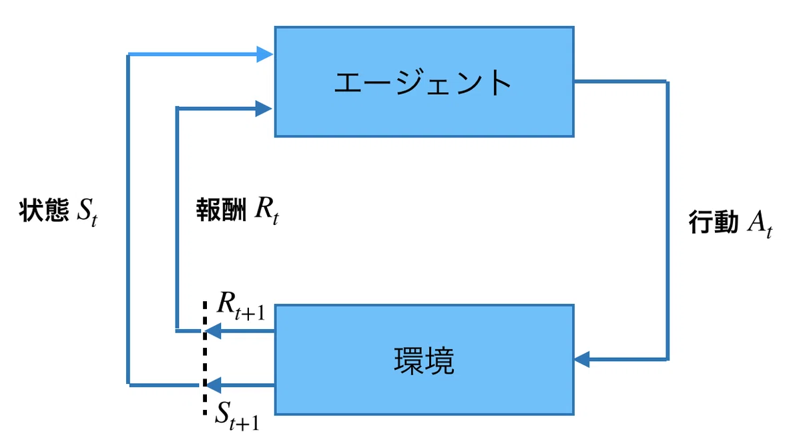

# 参考論文

# 質問

# CD-CATとは？

## 1.認知診断モデルとは

例）DINAモデル

## 2.Computer Adaptive testing(CAT)とは

CAT : コンピュータ適応型テスト

推定された能力をもとに、効率よく問題を選択することが目的

重要なアルゴリズム：逐次型問題選択アルゴリズム

## 3.CD-CATとは？

# 従来手法

情報量基準の問題選択アルゴリズムが主だった。

このアルゴリズムでは、次に選ぶ項目だけに注目する。初期の局所最適な選択はテスト全体としては最適でない可能性がある。

近年、CD-CATに、強化学習、深層ネットワークの枠組みを適用することで、残りのテスト全体にわたる情報をより広く活用して項目を選択できることが示された。

# 強化学習とは？

強化学習では，エージェント（学習者）が **環境** の中で行動し，その結果に応じて環境から報酬を受け取ります．エージェントは受け取る報酬の総和が最大となるような方策（最適方策）を獲得できるように学習していきます．

## 環境を表す数理モデル

1.マルコフ決定過程(MDP)

MDPは「状態」「行動」「遷移確率」「報酬」の4つの構成要素で構成される。

環境は次のように表される。

$$
\mathcal{M} = (\mathcal{S}, \mathcal{A}, P, R, \gamma, \rho_0)
$$

それぞれの意味は次の通りです。

- $\mathcal{S}$：状態集合  
  例：盤面の配置、ロボットの位置、受験者の潜在状態など

- $\mathcal{A}$：行動集合  
  例：上下左右に動く、問題を1問選ぶ、アクセルを踏む

- $P(s' \mid s, a)$：状態遷移確率  
  状態 $s$ で行動 $a$ を取ったとき、次の状態が $s'$ になる確率

- $R$：報酬関数  
  行動の結果としてどれだけ良かったかを数値で返すもの  
  たとえば

  $$
  r(s, a), \quad r(s, a, s')
  $$

  や、確率的に

  $$
  p(r \mid s, a, s')
  $$

  のように書きます

- $\gamma \in [0,1)$：割引率  
  将来の報酬をどれだけ重視するか

- $\rho_0$：初期状態分布  
  エピソード開始時にどの状態から始まるか

エージェントは、将来にわたる報酬和

$$
G_t = \sum_{k=0}^{\infty} \gamma^k r_{t+k}
$$

の期待値を最大化するような方策 $\pi$ を学びます。

2.部分観測マルコフ決定仮定(POMDP)

真の状態が見えないときは 部分観測マルコフ決定過程（POMDP） を使います。

# DQN(Deep Q-Network)

## 1.強化学習

# 提案手法

# 研究計画
