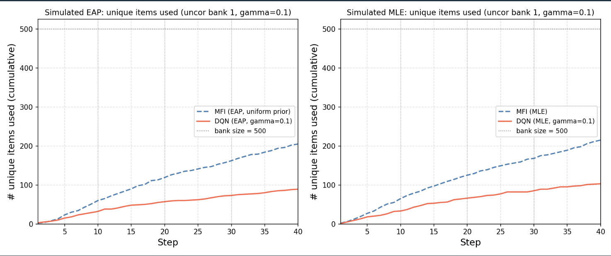

<!--
headingDivider: 1
-->

## シミュレーション実験の現状

- EAP推定では、MFIの方がDQNよりも優れていた(先週の実験、事前分布を標準正規分布に固定した場合)
- EAP推定の事前分布を標準正規分布から一様分布や、分散の異なる正規分布に変えても、MFIの方がDQNよりも優れていた
= 「事前分布がMFIの弱点を補ってしまっている」ということはなかった

- MLE推定では、DQNの方がMFIよりも優れていた(先週の実験)。しかし、実装をPythonで統一したところ、MLE推定でもMFIの方がDQNよりも優れていた。

結論：シミュレーション実験では、MFIの方がDQNよりも優れていた。(EAP推定でもMLE推定でも)

---

## シミュレーション実験の分析

- 横軸：ステップ数
- 縦軸：そのステップまでに選択された項目の種類数（ユニーク項目数）

---

θを動かしたとき、Q関数の値が大きな項目がどのようなものかを可視化してみた。

一応、θに応じてQ関数の値が大きい項目が変化していることは確認できた。

これのMFIバージョンも作ってみる。

学習に使う学習者の特性値を一様分布から生成されるようにしてみる。

---

次に、スピアマン相関を計算してみた。

|  | θ=-3↔+3 の順位相関 (Spearman) | 意味 |
|---|---:|---|
| MFI(FI) | -0.814 | 順位が反転＝低θと高θで良い項目が入れ替わる（適応的） |
| DQN(Q) MLE | +0.578 | 順位がほぼ保存＝θが変わっても良い/悪い項目がだいたい同じ（非適応的） |
| DQN(Q) EAP | +0.314 | 順位がほぼ保存＝θが変わっても良い/悪い項目がだいたい同じ（非適応的） |

---

## 実データ実験の現状

- MLE推定ではDQNの方がMFIよりも優れていた(EAP推定はまだ未実施)

