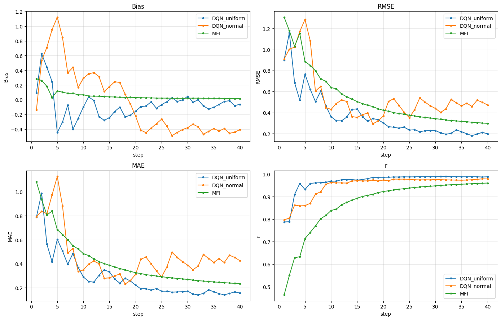
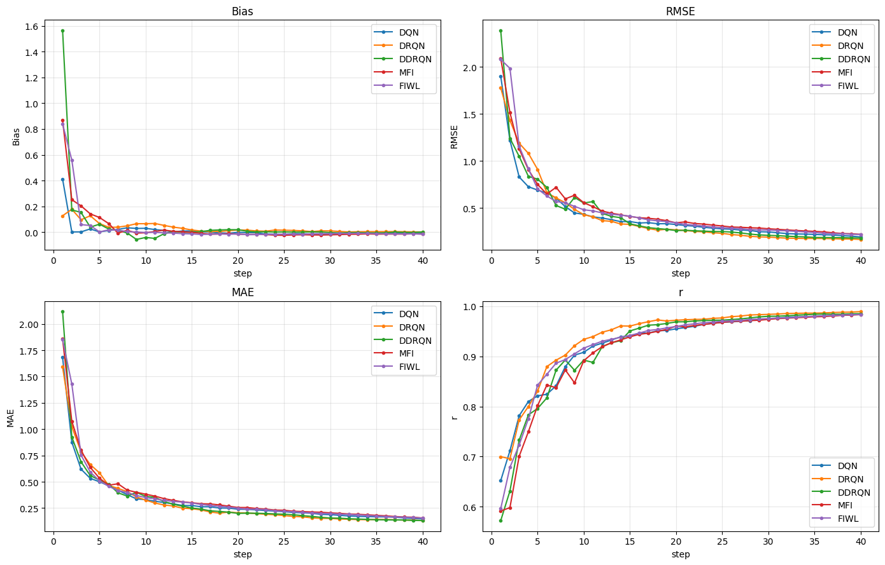
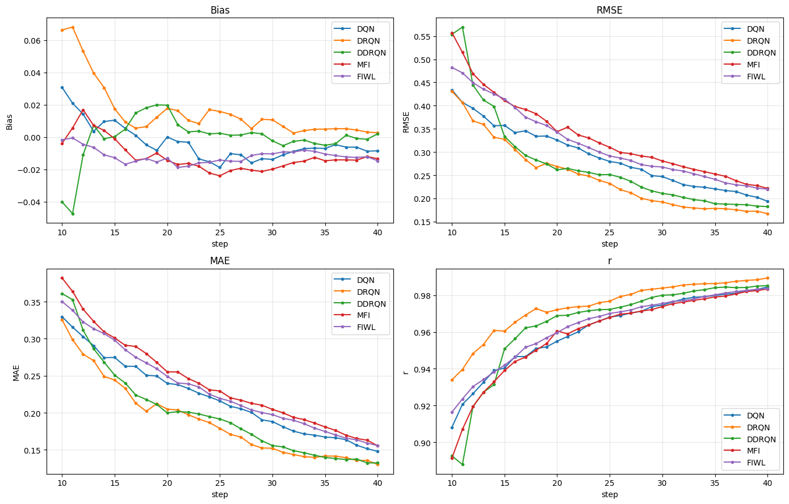
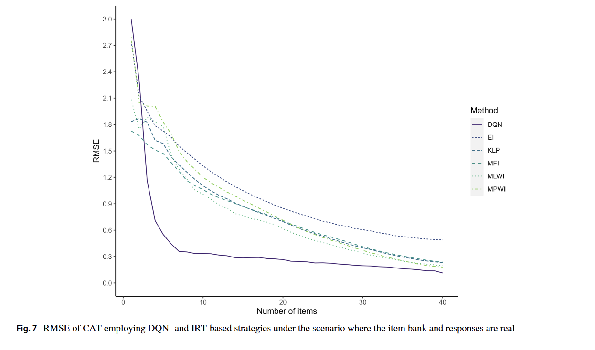

# やったこと

- 論文の再現実験：シミュレーションデータを用いて、情報量基準の項目選択アルゴリズムとDQNアルゴリズムを比較する実験を行った

  

本当はMFIのほかにも、FIWL、FIWL、MPWI、KLP、MEIを検討すべきだが、手元PCでは何時間まっても終わらないため、MFIのみを検討した。

元論文でも、情報量ベースのアルゴリズム間では大きな差は見られなかったため、MFIのみを検討することにした。

MFI、DQN、DRQN、DDRQNの4つのアルゴリズムを比較した。

- MFIは、情報量基準の項目選択アルゴリズムである。
- DQNは、現在の推定された特性値を入力として、項目選択を行うように実装した。
- DRQNは、QネットワークをLSTMで拡張したアルゴリズムで、受験者の回答履歴を入力として、項目選択を行うように実装した。
- DDRQNは、QネットワークをLSTMで拡張したアルゴリズムで、受験者の回答履歴と選択された項目を入力として、項目選択を行うように実装した。

上の図だと見にくいので、下の図のようにステップ10以降に拡大した。

元論文におけるMFI、FIWL、DQNの性能比較の図は以下の通りである。

今回使ったデータ代替データセットは、元論文で使用されたものに比べて、受験者数、項目数ともに少ない。

| 比較 | 論文の実データ | 今回の代替データ |
|---|---:|---:|
| 項目数 | 371項目 | 100項目 |
| 学習人数 | 5,000人 | 1,913人 |
| 評価人数 | 5,000人 | 479人 |
| 出典 | 中国の大規模医療テスト | Rパッケージ付属の dataMedical |
| 公開性 | 要問い合わせ | パッケージから取得可能 |
| 真値扱い | 全項目回答から推定した能力値 | 100項目に3PLを当てたEAP推定値 |

# 今後の予定

今回実装できなかったDBQNとARDQNを実装して性能を比較。

また、元論文により近い代替データセットで性能比較を行う。
