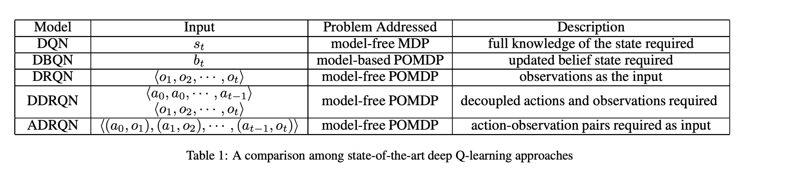
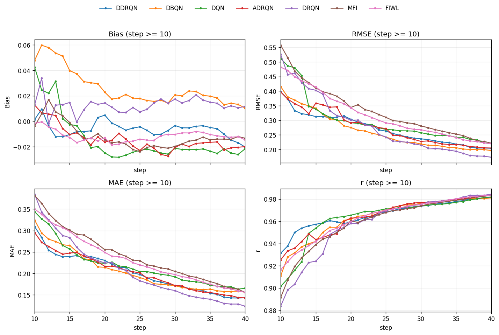

# やったこと

先週実装できていなかったDBQN、ARDQNを実装+プログラムの修正を行った。

## DBQNの実装

DBQNでは、能力の事後分布 $p(\theta \mid \text{回答履歴})$ である belief をQネットワークの入力とする。

=> belief を離散化してベクトルにした。

$$
\theta \in [-4,4]
$$

をK点に分割します。

$$
\theta_1, \theta_2, \ldots, \theta_K
$$

このとき belief は、

$$
b_t =
\begin{bmatrix}
p(\theta_1 \mid H_t) \\
p(\theta_2 \mid H_t) \\
\vdots \\
p(\theta_K \mid H_t)
\end{bmatrix}
$$

という $K$ 次元ベクトルになる。

ここで $H_t$ は、それまでの出題・回答履歴。

$$
H_t = \{(i_1,u_1), (i_2,u_2), \ldots, (i_t,u_t)\}
$$

初期belief $b_0(\theta)$ は

$$
b_0(\theta_k)
=
\frac{
\mathcal{N}(\theta_k;0,1)
}{
\sum_{j=1}^{K} \mathcal{N}(\theta_j;0,1)
}
$$

項目 $i_t$ を出題し、回答 $u_t$ が得られたら、Bayes更新します。

$$
b_{t+1}(\theta_k)
=
\frac{
P(u_t \mid \theta_k,i_t)b_t(\theta_k)
}{
\sum_{j=1}^{K} P(u_t \mid \theta_j,i_t)b_t(\theta_j)
}
$$

このとき、報酬は、**事後分散減少を報酬**　に用いた

$$
r_t
=
\mathrm{Var}_{b_t}(\theta)
-
\mathrm{Var}_{b_{t+1}}(\theta \mid u_t)
$$

すなわち、

$$
r_t
=
\sum_{k=1}^{K}
b_t(\theta_k)
\left(
\theta_k - \mu_t
\right)^2
-
\sum_{k=1}^{K}
b_{t+1}(\theta_k \mid u_t)
\left(
\theta_k - \mu_{t+1}(u_t)
\right)^2
$$

である。

## 性能比較

