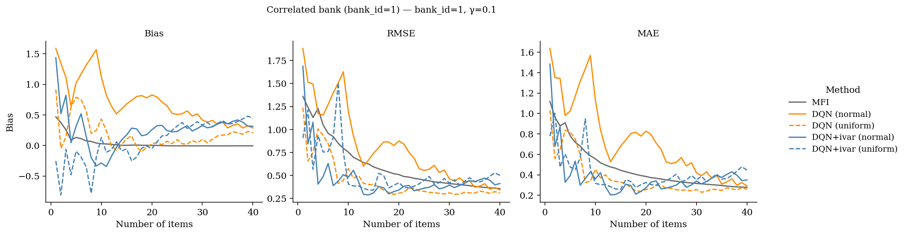
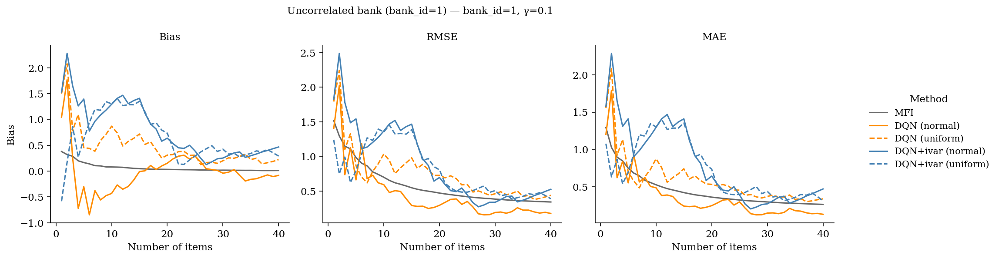
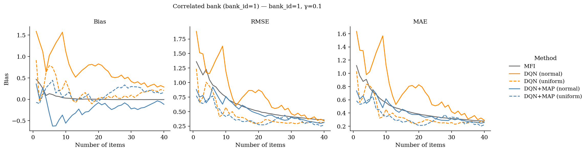
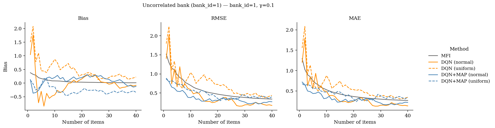

# 状態に事後分散を加えてみた

## 方法

次の2通り試した

### 1.MLE推定 + 漸近分散(フィッシャー情報量から近似)

出題済み項目の情報量の合計を $I(\hat{\theta})$ とすると、

$$
\widehat{\mathrm{Var}}(\hat{\theta})
\approx \frac{1}{I(\hat{\theta})}
$$

### 2.MAP推定 + 事後分散のラプラス近似(負の対数事後分布の2階微分の逆数で近似)

$$
\frac{\partial^2}{\partial \theta^2}
\left[
-\log p(\theta \mid \boldsymbol{u})
\right]
\approx
\frac{
f(\theta + h) - 2f(\theta) + f(\theta - h)
}{h^2}
$$

ここで、$\theta$ はMAP推定値、$h$ は微小量である。

$$
f(\theta)
=
-\left\{
\log p(\boldsymbol{u}\mid \theta)
+
\log p(\theta)
\right\}
$$

$f(\theta)$ は能力値 $\theta$ における負の対数事後分布を表し、$p(\theta)$ は事前分布を表す。ここでは、標準正規分布を仮定する。

$$
p(\theta)
=
\frac{1}{\sqrt{2\pi}}
\exp\left(
-\frac{\theta^2}{2}
\right)
$$

また、$p(\boldsymbol{u}\mid \theta)$ は，3PLMに基づく各項目の回答確率の積として計算する。

## 結果

### 1.MLE推定 + 漸近分散

相関アイテムバンク

非相関アイテムバンク

### 2.MAP推定 + 事後分散のラプラス近似

相関アイテムバンク

非相関アイテムバンク

