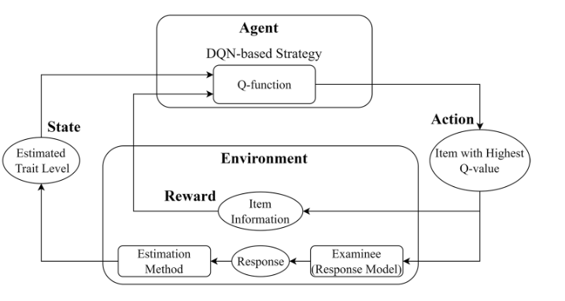
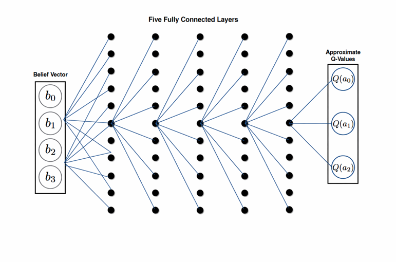

<!--
headingDivider: 1
-->

# An adaptive testing item selection strategy via a deep reinforcement learning approach

シンプルな１次元IRTに対して強化学習の枠組みを取り入れた論文。DQNを用いてQ関数を学習することで、次に出題する問題の選択を行う。

---

## 1.マルコフ決定過程(MDP)の定義

MDPは次の要素から構成される。

$$
(S, A, p(s' \mid s,a), r(s,a,s'))
$$

- $s$：状態
- $a$：アクション
- $S = \{s_1, s_2, \ldots, s_N\}$：状態の有限集合
- $A = \{a_1, a_2, \ldots, a_M\}$：アクションの有限集合
- $p(s' \mid s, a)$：状態 $s$ にてアクション $a$ を選んだ後に $s'$ に遷移する確率
- $r(s, a, s')$：即時報酬

---

## 2.1次元IRTに対してMDPを定義する

状態 $\hat{\theta}$：現在推定されている特性値(スカラー) 

行動 $i$：次に出題する問題のインデックス 

報酬：フィッシャー情報量 $I(\hat{\theta})$

遷移確率 $p(\hat{\theta}_{l+1} \mid \hat{\theta}_l, i_l)$：未定義。DQNはモデルフリーな手法であるため、遷移確率を明示的に定義する必要はない。

即時報酬 $r(\hat{\theta}_l, i_l, \hat{\theta}_{l+1})$：フィッシャー情報量 $I(\hat{\theta}_l)$

---

## 3. DQNの学習目標

Q関数：

$$
Q_{\pi}(\hat{\theta}_l, i_l)
=
\mathbb{E}_{\pi}
\left[
I_{i_l}(\hat{\theta}_l)
+
\gamma \cdot \max_{i \in B_{l+1}} Q_{\pi}(\hat{\theta}_{l+1}, i)
\;\middle|\;
\hat{\theta}_l, i_l
\right]
$$

- $\gamma$：割引率
- $B_{l+1}$：次のステップで選択可能な項目の集合
- $I_{i_l}(\hat{\theta}_l)$：項目 $i_l$ のフィッシャー情報量
- 入力: 現在の推定特性値 $\hat{\theta}_l$ と候補項目 $i_l$
- 出力: その項目を今選んだ場合に、**今後のテスト全体でどれだけ情報を稼げるか**の期待値

---

このQ関数を近似するための損失関数：

$$
\mathcal{L}=
\begin{cases}
\left[I_{i_l}(\hat{\theta}_l)-Q(\hat{\theta}_l,i_l)\right]^2, & l=L \\[0.8em]
\left[I_{i_l}(\hat{\theta}_l)+\gamma \max_{i\in B_{l+1}}Q(\hat{\theta}_{l+1},i)-Q(\hat{\theta}_l,i_l)\right]^2, & l<L
\end{cases}
$$

---

# 1次元IRTに対してPOMDPを導入する

## 1.使用するデータセット

元の論文An adaptive testing item selection strategy via a deep reinforcement learning approachで使われたデータセットは、**2種類**です。

---

### 1. シミュレーションデータ

論文ではまず、3PLM に基づく**人工生成データ**で比較実験をしています。具体的には、

- **20個の item bank**
  - 10個: $a$ と $b$ が無相関
  - 10個: $a$ と $b$ が相関あり（$r_{ab}=0.5$）
- 各 item bank は **500項目**
- 項目母数は  

---

  - $a \sim N(1.2, 0.25)$  
  - $b \sim N(0, 1)$  
  - $c \sim N(0.25, 0.02)$
- 各 item bank について **5000人の受験者**を生成
- 真の能力値は **$N(0,1)$** から生成
- 応答は **3PLM** により生成しています。

---

### 2. 実データ（empirical study）

実証実験では、**中国の大規模医療テスト**のデータを使っています。ただし、**テスト名は論文中で明示されていません**。内容としては、

- **371問**の多肢選択式項目
- 各項目は **4択**
- 項目バンクは **3PLM で校正**
- **全項目に回答している受験者**のみを使用
  - ただし **全問正解**または**全問不正解**の受験者は除外
- **DQN学習用に5000人**
- **評価用に別の5000人**
- 「真の能力値」は、**全371項目への応答から推定した能力値**を用いています。

---

### 3.代替データセット

ShinyItemAnalysisというRパッケージに付属するデータセットがよさそう。

- 医学校入試 のデータ
- 2,392人・100項目 ある。

---

## 2.POMDPの定義

POMDPは次の要素から構成される。

$$
(S, A, O, H, p(s' \mid s,a), p(o \mid s',a), r(s,a,s'))
$$

- $s$：真の状態（ただしエージェントは直接観測できない）
- $a$：アクション
- $o$：観測
- $h_t$：時刻 $t$ までの履歴
- $p(s' \mid s, a)$：状態 $s$ にてアクション $a$ を選んだ後に $s'$ に遷移する確率
- $p(o \mid s', a)$：アクション $a$ の後で状態 $s'$ にいるときに観測 $o$ を得る確率
- $r(s, a, s')$：即時報酬

---

ここで、履歴 $h_t$ は例えば次のように表される。

$$
h_t = (o_1, a_1, o_2, a_2, \ldots, o_t)
$$

あるいは、時刻 $t-1$ までの行動も含めて

$$
h_t = (o_1, a_1, o_2, a_2, \ldots, a_{t-1}, o_t)
$$

と表すことができる。
  
---

## 3.1次元IRTに対するPOMDPの定義

- 隠れ状態：受験者の真の能力値 $s_t = \theta_t$
- 行動：未選択の項目の選択 $a_t = i_t \in B_t$
- 観測：$o_t = u_t \in \{0,1\}$
- 履歴：$h_t = (o_1, a_1, o_2, a_2, \ldots, o_t)$
- 観測モデル： $p(o_t \mid \theta_t, i_t)$ は3PLMに基づいて次のように定義される。

$$
p(o_t \mid \theta_t, i_t)
=
\bigl(P_{i_t}(\theta_t)\bigr)^{o_t}
\bigl(1 - P_{i_t}(\theta_t)\bigr)^{1-o_t}
$$

ただし、
$$
P_{i_t}(\theta_t)
=
c_{i_t}
+
(1-c_{i_t})
\frac{\exp\!\left[a_{i_t}(\theta_t-b_{i_t})\right]}
{1+\exp\!\left[a_{i_t}(\theta_t-b_{i_t})\right]}
$$

である。

---

- 状態遷移モデル： $p(\theta_{t+1} \mid \theta_t, i_t)$ は定義しない。DQNはモデルフリーな手法であるため、状態遷移モデルを明示的に定義する必要はない。
  
- belief state：$b_t(\theta) = p(\theta \mid h_t)$　は3PLMを用いた場合、次のように定義される。

$$
b_t(\theta)
=
\frac{
p(\theta)\displaystyle\prod_{k=1}^{t}\bigl(P_{i_k}(\theta)\bigr)^{o_k}\bigl(1-P_{i_k}(\theta)\bigr)^{1-o_k}
}{
\displaystyle\int p(\theta')\prod_{k=1}^{t}\bigl(P_{i_k}(\theta')\bigr)^{o_k}\bigl(1-P_{i_k}(\theta')\bigr)^{1-o_k}\,d\theta'
}
$$

---

- 報酬：
  
1.事後エントロピー減少

$$
r_t = H(b_t) - H(b_{t+1})
$$

ここで，

$$
H(b) = - \int b(\theta)\log b(\theta)\, d\theta
$$

かつ、$b_t$ は時刻 $t$ までの履歴 $h_t$ に基づく belief state である。

2.事後分散減少

$$
r_t = \operatorname{tr}(\Sigma_t) - \operatorname{tr}(\Sigma_{t+1})
$$

---

## 4.POMDPの実装比較

---

- **DBQN**: belief $b_t$ が計算できる model-based POMDP 向け。
  
belief state $b_t(\theta)=p(\theta \mid h_t)$ を状態として Q 関数を学習する方法。belief $b_t$ をどの様にしてQ関数の入力にするかがポイント。

---

- **DRQN**: belief を明示せず、観測列を RNN で要約する model-free POMDP 向け。

- **DDRQN**: 行動と観測を分離してRNNを組み込んだニューラルネットワークに入れる改良版。行動も belief 更新に重要だと考える場合に有効。
   
- **ADRQN**: 行動も belief 更新に重要だとして、行動-観測ペア列を RNNを組み込んだニューラルネットワーク に入れる改良版。

