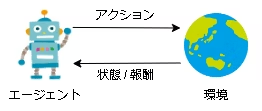
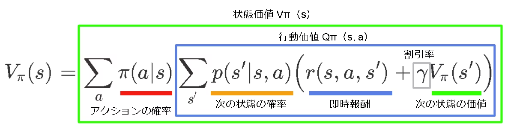

<!--
headingDivider: 1
paginate: true
-->

# 卒業研究テーマ

CD-CAT に強化学習を導入し、
**認知構造の推定に有効な問題系列**を学習する

- キーワード：`CD-CAT`、`認知診断モデル`、`強化学習`、`POMDP`
- 目標：少ない出題数で、より正確に学習者のアトリビュートプロフィールを推定する

# 背景

コンピュータ適応型テスト（CAT）は、受験者の回答に応じて次に出題する問題を変えるテスト方式である。

その中でも認知診断的コンピュータ適応型テスト（CD-CAT）は、
**能力を 1 次元の連続値で測るのではなく、複数の認知要素の習得・未習得を推定する**点に特徴がある。

つまり CD-CAT では、

- どの認知要素をすでに習得しているか
- どの認知要素がまだ不十分か

をできるだけ少ない問題数で見極めることが重要になる。

# CD-CAT の目的

CD-CAT の目的は、学習者の**アトリビュートプロフィール**を効率よく推定することである。

アトリビュートプロフィール：
認知要素（アトリビュート）の習得・未習得の組み合わせを表すもの。

例えば、分数計算の学習では、

- 通分はできる
- 約分はできる
- 四則計算は一部苦手

のように、学習者ごとの認知構造を細かく表現できる。

---

**図の出典**：山口一大・岡田謙介（2017）「近年の認知診断モデルの展開」『行動計量学』44巻2号, 181–198, 表2「分数の計算におけるアトリビュート習得パタン」。

# なぜ適応的に出題するのか

学習者に合わない問題を出しても、認知構造の推定にはあまり役立たない場合がある。

例えば、

- 基本的な分数計算が未習得の学習者に複雑な文章題を出す
- すでに十分理解している内容を繰り返し出題する

といった出題は、推定効率の低下につながる。

したがって、
**その時点の推定結果に応じて、最も情報を与える問題を選ぶ**ことが CD-CAT の中心課題となる。

# 既存手法

CD-CAT における古典的な項目選択法として、情報量基準がよく用いられる。

代表例：

- KL 情報量
- シャノン情報量

これらは「今この瞬間」に最も有益そうな項目を選ぶ方法であり、計算しやすく実用的である。

# Xu et al.（2003）の KL アルゴリズム

現在の潜在状態推定値 $\hat{\boldsymbol{\alpha}}_i^{(t)}$ が与えられたときの
$f(U_{ih}\mid \hat{\boldsymbol{\alpha}}_i^{(t)})$ と、
別の潜在状態 $\boldsymbol{\alpha}_c$ における条件付き分布
$f(U_{ih}\mid \boldsymbol{\alpha}_c)$ の KL 距離は次で表される。

$$
D_h\!\left(\hat{\boldsymbol{\alpha}}_i^{(t)} \parallel \boldsymbol{\alpha}_c\right)
:=
\sum_{q=0}^{1}
\log \left(
\frac{P\!\left(U_{ih}=q \mid \hat{\boldsymbol{\alpha}}_i^{(t)}\right)}
{P\!\left(U_{ih}=q \mid \boldsymbol{\alpha}_c\right)}
\right)
P\!\left(U_{ih}=q \mid \hat{\boldsymbol{\alpha}}_i^{(t)}\right).
$$

---

Xu et al.（2003）では、すべての潜在認知状態 $\boldsymbol{\alpha}_c$
（属性数が $K$ 個のとき $2^K$ 通り）に対する KL 距離の総和

$$
KL_h\!\left(\hat{\boldsymbol{\alpha}}_i^{(t)}\right)
:=
\sum_{c=1}^{2^K}
D_h\!\left(\hat{\boldsymbol{\alpha}}_i^{(t)} \parallel \boldsymbol{\alpha}_c\right)
$$

を最大化する項目を選択することが提案されている。

この方法は、
**現在の推定値を他の潜在状態から最もよく識別できる項目を選ぶ**
という意味を持つ。

# 既存手法の限界

情報量基準に基づく手法は有効である一方で、
**逐次的・近視眼的な選択になりやすい**という問題がある。

つまり、

- 今得られる情報は大きいが、その後の分岐が悪い項目
- 今は情報量が中程度でも、次以降の推定を大きく改善する項目

を区別しにくい。

本来は、将来の出題系列まで含めて
**最終的な推定精度が高くなるように項目を選ぶ**ことが望ましい。

# 着想

強化学習では、エージェントは
**将来にわたる報酬和の期待値**を最大化するように方策を学習する。

この考え方を CD-CAT に導入すれば、

- 1 問先だけではなく
- テスト全体を見据えて
- 推定精度を高める問題系列

を学習できる可能性がある。

# 強化学習とは

強化学習は、環境との相互作用を通じて最適な行動を学ぶ枠組みである。

CD-CAT で対応づけると、

- エージェント：項目選択アルゴリズム
- 行動：次に出題する問題を選ぶこと
- 環境：受験者とその反応生成過程
- 報酬：推定精度の改善量

となる。

# マルコフ決定過程（MDP）

一般に強化学習では、環境をマルコフ決定過程（MDP）として定式化する。

MDP では、
「次の状態は現在の状態と行動だけで決まる」
というマルコフ性を仮定する。

構成要素は以下の通りである。

- $s$：状態
- $a$：行動
- $r$：報酬
- $S = \{s_1, s_2, \ldots, s_N\}$：状態集合
- $A = \{a_1, a_2, \ldots, a_M\}$：行動集合
- $p(s' \mid s, a)$：状態遷移確率
- $r(s, a, s')$：即時報酬

# 強化学習における目的

強化学習では、時刻 $t$ 以降に得られる割引報酬和

$$
G_t = r_{t+1} + \gamma r_{t+2} + \gamma^2 r_{t+3} + \cdots + \gamma^{T-t-1} r_T
$$

の期待値を最大化する方策を学習する。

状態価値関数は

$$
V_{\pi}(s_t) = E_{\pi}[G_t]
= E_{\pi}\left[r_{t+1} + \gamma V_{\pi}(s_{t+1})\right]
$$

で表される。

---

Q 関数や価値関数を厳密に求めるのが難しい場合には、
ニューラルネットワークを用いて近似する方法が用いられる。

# 先行研究

IRT に基づく CAT では、強化学習を用いて項目選択を改善する研究が存在する。

例：
`An adaptive testing item selection strategy via a deep reinforcement learning approach`

この研究では、

- 状態：現在の推定能力値 $\hat{\theta}_l$
- 行動：未出題項目から 1 問選択すること
- 報酬：選択した項目の情報量

として定式化し、DQN により方策を学習している。

# 先行研究の限界

IRT ベースの先行研究では、状態を現在の推定値だけで表すことが多い。

しかし、実際には同じ推定値でも履歴が異なれば不確実性は異なる。

例：

- 受験者 A：5 問解いて $\hat{\theta}=0.5$
- 受験者 B：20 問解いて $\hat{\theta}=0.5$

この 2 人は同じ推定値でも、

- A はまだ不確実性が大きい可能性がある
- B はかなり絞り込まれている可能性がある

したがって、**現在の推定値だけでは状態を十分に表現できない**。

# 本研究の提案

本研究では、CD-CAT の項目選択問題を
**部分観測マルコフ決定過程（POMDP）** として定式化することを提案する。

狙いは、

- 回答履歴
- 過去の項目選択
- 推定の不確実性

を考慮した上で、より適切な項目選択を実現することである。

# なぜ POMDP なのか

CD-CAT では、エージェントは受験者の真の認知状態を直接観測できない。

観測できるのは、

- 出題した項目
- その正誤反応
- そこから更新された推定結果

のみである。

したがって、
「真の状態は見えず、観測を通して間接的に状態を推測する」
という POMDP の枠組みが自然である。

# POMDP の定式化

部分観測マルコフ決定過程は、MDP に観測の概念を導入したもので、

$$
P \doteq \{\mathcal{S}, \mathcal{A}, p_{s_0}, p_T, g, \mathcal{O}, p_o\}
$$

で表される。

各要素は以下の通りである。

- $\mathcal{S}$：有限状態集合
- $\mathcal{A}$：有限行動集合
- $p_{s_0}$：初期状態分布
- $p_T$：状態遷移確率
- $g$：報酬関数
- $\mathcal{O}$：有限観測集合
- $p_o$：観測確率

---

観測集合と観測確率は、

$$
\mathcal{O} \doteq \{o^1, \ldots, o^{|\mathcal{O}|}\} \ni o
$$

$$
p_o : \mathcal{O} \times \mathcal{A} \times \mathcal{S} \to [0,1]
$$

$$
p_o(o \mid a, s) \doteq \Pr(O_t = o \mid A_{t-1} = a, S_t = s)
$$

と表される。

エージェントは真の状態 $s$ を直接は観測できず、
行動後に得られる観測 $o$ を通して状態に関する情報を得る。

# 本研究での対応づけ（案）

CD-CAT を POMDP として見ると、例えば次のように対応づけられる。

- 真の状態：受験者の真のアトリビュートプロフィール
- 行動：未出題項目から次の 1 問を選ぶこと
- 観測：受験者の回答（正誤）や更新後の推定結果
- 報酬：事後エントロピーの減少、あるいは推定精度の改善量

特に報酬として
**アトリビュートプロフィールの事後分布のエントロピー減少**
を使うことで、
「どれだけ不確実性が減ったか」を直接最適化できる可能性がある。

# 実装方針

POMDP に対して強化学習を適用する方法として、現時点では次の 2 案を考えている。

1. RNN / LSTM を用いた Q 関数近似
過去の観測と行動履歴を内部状態に保持しながら、Q 値を推定する。

2. belief MDP に変換して学習
POMDP を belief state 上の MDP に変換し、その上で DQN 系手法を適用する。

現時点では、
**まず実装容易性の高い RNN ベースの方法から着手する**のが現実的だと考えている。

# 研究の新規性

本研究の新規性は、主に次の 3 点にある。

1. CD-CAT の項目選択を強化学習の枠組みで扱う点
2. 現在の推定値だけでなく履歴情報を考慮するために POMDP を導入する点
3. 情報量そのものではなく、認知構造推定の不確実性減少を報酬に用いる点

# 評価の観点

提案手法を評価する際には、少なくとも次の観点が必要だと考えている。

- アトリビュートプロフィール推定の正答率
- テスト長に対する推定精度の推移
- 既存手法（KL、シャノン情報量など）との比較
- 受験者集団や Q 行列条件を変えたときの頑健性

可能であれば、
「同じ精度に到達するまでに必要な問題数」を比較すると、
提案法の有効性が伝わりやすい。

# 当面の課題

現在の課題は、数理モデルと学習アルゴリズムの具体化である。

特に未整理な点は以下の通り。

- 状態を何で表現するか
- 観測をどこまでモデルに入れるか
- 報酬関数をどう定義するか
- 状態遷移・観測確率をどう記述するか
- Q 関数近似ネットワークの入力設計をどうするか

# 今後の進め方

今後は次の順で進めたい。

1. CD-CAT を MDP と POMDP の両方で定式化する
2. 先行研究の DQN ベース実装を再現または簡略化して基準法を作る
3. 事後エントロピー減少を用いた報酬関数を設計する
4. RNN ベースの Q 関数近似モデルを構築する
5. シミュレーションで既存手法と比較する

# まとめ

本研究では、
CD-CAT における項目選択を「逐次的な情報量最大化」ではなく、
**将来の推定改善まで含めた逐次意思決定問題**として捉える。

そのために、強化学習、特に POMDP の枠組みを導入し、
履歴情報と不確実性を活用した項目選択法の構築を目指す。

最終的には、
**より少ない問題数で、より正確に認知構造を推定できる CD-CAT**
の実現につなげたい。
