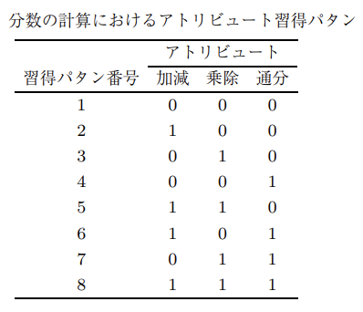

<!--
headingDivider: 1
-->

# 目次

- 1.研究目的
- 2.背景: CD-CAT の目的
- 3.課題: 既存の項目選択は逐次的
- 4.強化学習とは？
- 5.先行研究: IRT-CAT では RL がある
- 6.研究ギャップ: CD-CAT × RL は少ない
- 7.核心仮説: 履歴依存を扱うため POMDP が自然
- 8.本研究の定式化
- 9.報酬設計
- 10.学習アルゴリズム候補

---

## 1.研究目的

CD-CATに対して強化学習の枠組みを取りいえることで、認知構造の推定に最も有効な問題系列を学習する

---

## 2.背景：CD-CATの目的

コンピュータ適応型テスト(CAT)：主にIRTの枠組みを利用して行われるテストの形式。受験者の能力に応じて、出題される問題が変わる。受験者の能力を推定するために、受験者の回答を元に次に出す問題を選択する。

認知診断モデル(CDM)：受験者の認知構造を推定するためのモデル。受験者がどの認知要素を習得しているかを推定することができる。

CD-CAT：認知診断的コンピュータ適応型テスト。コンピュータ適応型テストに認知診断モデルを組み合わせたテスト。

---

CD-CATの目的：学習者のアトリビュートプロフィール(認知構造)を効率よく推定すること。

アトリビュートプロフィール：認知要素(アトリビュート)の習得・未習得の組み合わせ。アトリビュート習得パタン，アトリビュートパタンなどとも呼ばれる

どの様に効率よく？

- コンピュータテストにおいて、その人にあった問題を今までの回答を元に選ぶ

- 掛け算、割り算を出来ていない人に二次方程式の問題を出しても意味がないかも。。。

---

**図の出典**：山口一大・岡田謙介（2017）「近年の認知診断モデルの展開」『行動計量学』44巻2号, 181–198, 表2「分数の計算におけるアトリビュート習得パタン」。

---

## 3.課題: 既存の項目選択は逐次的

どうやって効率よく問題を選択するのか？次のような情報量を用いた手法が取られてきた

- KL情報量
- シャノン情報量

---

## 3.1.Xu et al.（2003）で検討された KL アルゴリズム

現在の潜在状態推定値 $\hat{\boldsymbol{\alpha}}_i^{(t)}$ が与えられたときの $f(U_{ih}\mid \hat{\boldsymbol{\alpha}}_i^{(t)})$ と、別の潜在状態 $\boldsymbol{\alpha}_c$ が与えられたときの $U_{ih}$ の条件付き分布、すなわち $f(U_{ih}\mid \boldsymbol{\alpha}_c)$ との KL 距離は、次のように計算できる。

$$
D_h\!\left(\hat{\boldsymbol{\alpha}}_i^{(t)} \parallel \boldsymbol{\alpha}_c\right)
=
\sum_{q=0}^{1}
\log \left(
\frac{P\!\left(U_{ih}=q \mid \hat{\boldsymbol{\alpha}}_i^{(t)}\right)}
{P\!\left(U_{ih}=q \mid \boldsymbol{\alpha}_c\right)}
\right)
P\!\left(U_{ih}=q \mid \hat{\boldsymbol{\alpha}}_i^{(t)}\right).
$$

---

Xu et al.（2003）は、$f(U_{ih}\mid \hat{\boldsymbol{\alpha}}_i^{(t)})$ と、すべての $f(U_{ih}\mid \boldsymbol{\alpha}_c)$（$c=1,2,\ldots,2^K$。属性が $K$ 個あるとき、潜在認知状態は $2^K$ 通り存在する）の間の KL 距離を、そのまま単純に総和した量を用いることを提案した。

$$
KL_h\!\left(\hat{\boldsymbol{\alpha}}_i^{(t)}\right)
=
\sum_{c=1}^{2^K}
D_h\!\left(\hat{\boldsymbol{\alpha}}_i^{(t)} \parallel \boldsymbol{\alpha}_c\right).
$$

すると、受験者 $i$ に対する第 $(t+1)$ 項目は、$R^{(t)}$ の中で $KL_h\!\left(\hat{\boldsymbol{\alpha}}_i^{(t)}\right)$ を最大化する項目となる。これを **KL アルゴリズム** と呼ぶ。このアルゴリズムによって選択される項目は、平均的に見て、**現在の潜在クラス推定値を他のすべての可能な潜在クラスから最も強く識別できる項目**である。

---

## 3.2.古典的な手法の問題点

古典的な情報量基準の手法選択が逐次的であること = 先を見据えた選択ができない。

本来は、推定されたアトリビュートプロフィールの変動や後に起こりうる項目選択系列を考慮しつつ、後続のテストで得られる情報を最大化するように各項目を選ぶべきである。

強化学習においてエージェント(モデル)は、将来にわたる報酬和の期待値を最大化するような方策を学習する。

強化学習の枠組みを取り入れることで、先を見据えた選択ができるようになるのではないか？

---

## 4.強化学習とは？

---

## 4.先行研究： IRT-CAT では RL がある

例）