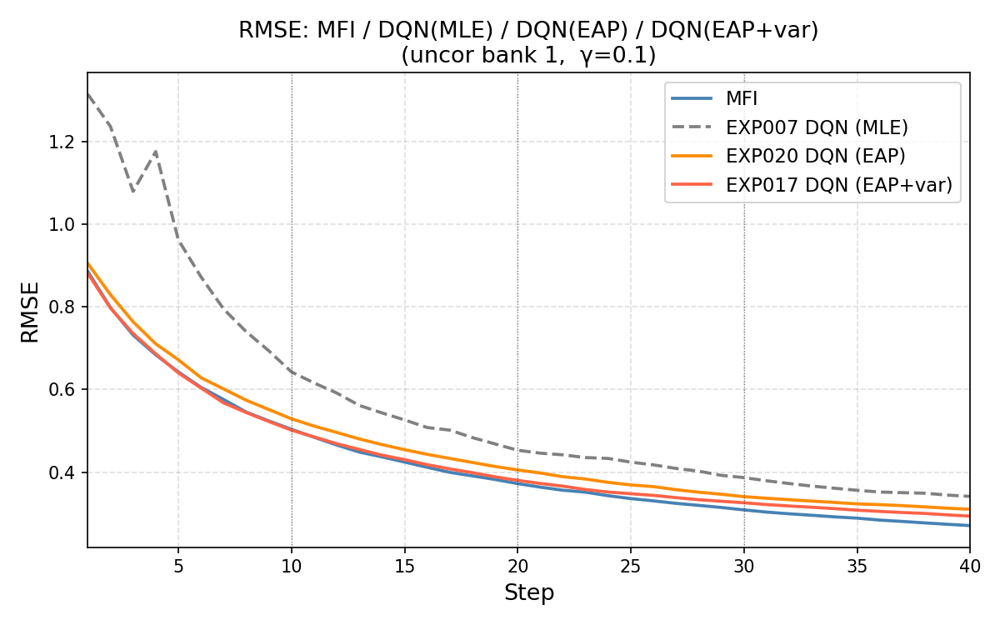
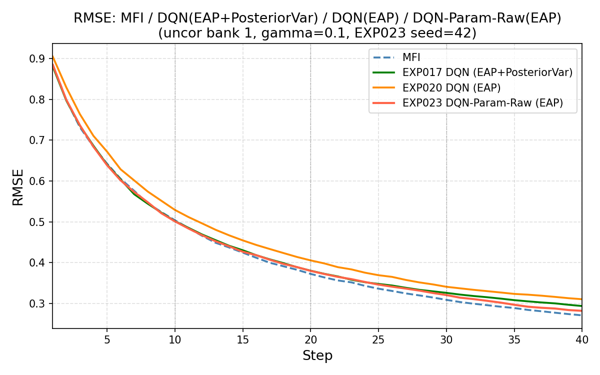

<!--
headingDivider: 1
-->

# 今週の進捗

- MFIにおける推定方法を最尤推定からEAP推定に変更

---

- 報酬を事後分散の減少量に変更：うまくいかなかった

- 現在の推定された能力値と項目パラメータを入力として、Q値を近似するニューラルネットワークを構築 = DQN-Param

元論文のQネットワークは項目バンクの項目数を $J$ とすると、Qネットワークは能力推定値を入力し、全項目のQ値を一括して出力する。

$$
f_{\psi}(\hat{\theta}_t)
=
\left[
Q_{\psi}(\hat{\theta}_t,1),
Q_{\psi}(\hat{\theta}_t,2),
\dots,
Q_{\psi}(\hat{\theta}_t,J)
\right]
$$

項目数500のときは次のようになる。

$$
1
\rightarrow
50
\rightarrow
30
\rightarrow
500
$$

---

## DQN-Param

状態：$\boldsymbol{s}_t=\hat{\theta}_t$

候補項目 $i$ の特徴量： $\boldsymbol{x}_i=\left[a_i,b_i,c_i\right]$

Qネットワーク：受検者の状態と候補項目の特徴を結合し、候補項目 $i$ のQ値を計算する。

$$
Q_{\psi}
\left(
\boldsymbol{s}_t,\boldsymbol{x}_i
\right)
=
f_{\psi}
\left(
\left[
\hat{\theta}_t,
a_i,
b_i,
c_i
\right]
\right)
$$

元論文では全項目のQ値を固定長ベクトルとして出力するのに対し、DQN-Paramでは各候補項目に同一のQネットワークを適用し、項目ごとに1つのQ値を出力する。

Qネットワークは次のような構造にできる。

$$
4
\rightarrow
64
\rightarrow
64
\rightarrow
1
$$

---

## 結果

状態に事後分散を加えて見ても良い結果は得られなかった。

- 選ばれる問題を確認してみる。
- 真の θ で Fisher 情報量を計算（EXP007）」vs「推定 θ̂ で計算（論文 Algorithm 1 準拠）」の比較モデルにおいて、どのようなパラメータを持つ項目が選ばれるかを確認する。
事後分散を変えてみて、選ばれる問題の項目パラメータの変化をみてみる。